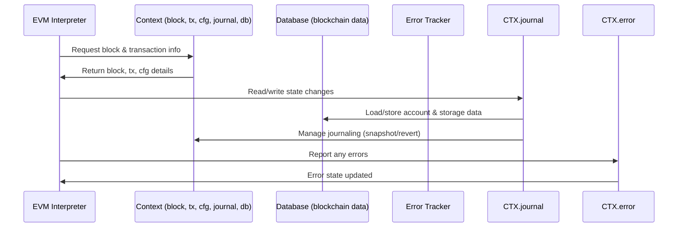

# Chapter 1: Context & Environment

Welcome to the first chapter of this tutorial on `revm`! Here, we will explore an important concept called **Context & Environment** — the foundation that lets the EVM ("Ethereum Virtual Machine") understand what’s happening around it while running your smart contracts.

---

## Why do we need Context & Environment?

Imagine you’re watching a movie. To understand the story, you need to know where it takes place, who’s in it, and what’s going on at the moment. Similarly, the EVM needs to know:

- Which block it’s working on (block number, gas limits, timestamp, etc.)
- Details about the current transaction (sender, value, gas, data)
- What configuration rules to apply (like gas rules, chain id)
- The current state of accounts and storage (like balances, code, storage values)
- Any errors or changes that happen as the contract runs

All of this information is wrapped up in something called the **Context**.

### Real-world example:  

Suppose you want to run a smart contract call that transfers some Ether from one account to another. The EVM needs to:

1. Check the current block’s gas limit.
2. Access the sender’s balance.
3. Access the receiver's account.
4. Deduct gas fees according to the current rules.
5. Apply the state changes if everything is valid.

How can it access all this smoothly? This is where the **Context** steps in — acting like the "window" that the EVM uses to see what's happening on the blockchain during execution.

---

## Breaking down the Context

Think of the Context as a **big toolbox** with some essential parts inside:

### 1. Block Information

- Contains info about the current block:
  - Block number (height)
  - Beneficiary (miner/coinbase)
  - Timestamp
  - Gas limit
  - Base fee per gas
  - Special Ethereum upgrades data (like randomness, blob gas info)

This info affects how transactions execute because gas limits and fees vary per block.

### 2. Transaction Details

- Info about the transaction currently being executed:
  - Sender/receiver addresses
  - Value sent
  - Input data
  - Gas provided
  
Knowing this helps check funds, replay protection, and other transaction-specific rules.

### 3. Configuration (Cfg)

- Contains parameters about chain rules and behavior:
  - Which Ethereum hardfork rules are active (i.e., London, Cancun upgrades).
  - Chain ID
  - Gas checking toggles
  
This controls what rules are in effect for execution.

### 4. Journaled State (Journal)

- The journaled state is **an advanced way to track changes** made during execution but not commit immediately.
- It keeps a record ("journal") of all state changes like account balances and storage so that they can be reverted if needed (for instance, if the contract reverts).

### 5. Database (DB)

- This is the **underlying storage backend** that holds permanent blockchain state (accounts, storage, code).
- The Journal reads from and writes changes to this database through the context.

### 6. Errors

- The Context also keeps track of any errors occurring during execution, like missing account data or database issues.

### 7. Memory Buffer

- A reusable buffer to optimize memory allocations during execution (mostly internal optimization).

---

## How to use the Context in `revm`?

Let's look at how you might **create a simple context** for EVM execution, step-by-step.

### Step 1: Create a database (for example, an empty one)

```rust
use revm::primitives::SpecId; // Ethereum hardfork spec IDs
use revm::context::{Context, EmptyDB};

// Create an empty database — no existing chain data
let db = EmptyDB;
```

*Here, `EmptyDB` means we have no existing blockchain data yet.*

### Step 2: Create a Context with this database and a spec

```rust
let spec = SpecId::LATEST;  // Use latest Ethereum rules
let mut ctx = Context::new(db, spec);
```

*This initializes Context with default empty block, transaction, and configuration info.*

### Step 3: Update the transaction and block info

```rust
ctx.modify_tx(|tx| {
    tx.gas_limit = 10_000_000;
    tx.caller = "0x1234...".parse().unwrap();
    tx.value = 1000.into();
});

ctx.modify_block(|block| {
    block.number = 12_345;
    block.timestamp = 1_676_000_000;
    block.gas_limit = 15_000_000;
});
```

*Here, we set a fake transaction and block to make the context more real.*

### Result?

When you run your EVM interpreter using this context, it will:

- Access the transaction info through `ctx.tx()`
- Access the block info through `ctx.block()`
- Use config rules from `ctx.cfg()`
- Read/write state safely via the `ctx.journal()`
- Track errors via `ctx.error()`

So, this context acts like the environment your smart contract runs inside.

---

## What happens inside Context step-by-step?

To imagine this, think of the EVM as a chef baking a cake (executing smart contract code). The Context is the **kitchen with all ingredients and recipes**:



**Step explanation:**

1. The EVM asks the Context for block and transaction info so it knows the current environment.
2. When the contract modifies states (like balance or storage), it goes through the journal to safely track these changes.
3. The journal interacts with the actual database to get or update state.
4. If something goes wrong (like insufficient funds), the error state is updated in Context.
5. The EVM reads error status from Context to decide what to do (continue, revert, abort).

---

## Peek under the hood: Context Struct in Code

Look at the simplified structure of `Context` (from `crates/context/src/context.rs`):

```rust
pub struct Context<BLOCK, TX, CFG, DB, JOURNAL, CHAIN> {
    pub block: BLOCK,
    pub tx: TX,
    pub cfg: CFG,
    pub journaled_state: JOURNAL,
    pub chain: CHAIN,
    pub memory_buffer: Rc<RefCell<Vec<u8>>>,
    pub error: Result<(), ContextError<DB::Error>>,
}
```

- `block`: holds the current block info.
- `tx`: holds the current transaction info.
- `cfg`: holds the chain configuration.
- `journaled_state`: the journaling layer managing state changes.
- `chain`: represents chain-specific data.
- `memory_buffer`: reusable buffer for memory between calls.
- `error`: holds the current error (if any).

### Implementation of trait `ContextTr`

The trait defines how to get/set these parts:

```rust
impl<BLOCK, TX, CFG, DB, JOURNAL, CHAIN> ContextTr for Context<BLOCK, TX, CFG, DB, JOURNAL, CHAIN> {
    // Returns current transaction
    fn tx(&self) -> &Self::Tx {
        &self.tx
    }

    // Returns current block
    fn block(&self) -> &Self::Block {
        &self.block
    }

    // Returns configuration
    fn cfg(&self) -> &Self::Cfg {
        &self.cfg
    }

    // Returns mutable reference to journal for state changes
    fn journal(&mut self) -> &mut Self::Journal {
        &mut self.journaled_state
    }

    // Returns error status
    fn error(&mut self) -> &mut Result<(), ContextError<<Self::Db as Database>::Error>> {
        &mut self.error
    }
}
```

This trait is how all parts talk to each other, keeping the Context clean and modular.

---

## Summary

In this chapter, you learned:

- **What is Context & Environment?**  
  It is the collection of all relevant blockchain info EVM needs while running code.

- **Why is it important?**  
  It lets the EVM safely access block, transaction, config, and the current state, while also being able to track any execution errors.

- **What key parts does Context include?**  
  Block info, transaction info, configuration, journaled state, database, errors, and some internal buffers.

- **How does Context help EVM execution?**  
  It acts like a "window" for the EVM into the blockchain at execution time.

- **How to create and update a Context?**  
  Using the `Context::new` method, plus `modify_tx`, `modify_block`, and so on.

- **What happens inside Context?**  
  It fetches data from the database, keeps track of state changes via journaling, and reports errors back to the EVM.

---

Next, we will explore how the EVM uses this Context to interact with the host and lower-level blockchain interfaces. Check out [Chapter 2: Host Interface](02_host_interface_.md) to dive into that!

---

Thank you for following along! The Context is your first step into understanding how revm manages the intricacies of blockchain execution. Keep up the great work!

---

Generated by [AI Codebase Knowledge Builder](https://github.com/The-Pocket/Tutorial-Codebase-Knowledge)