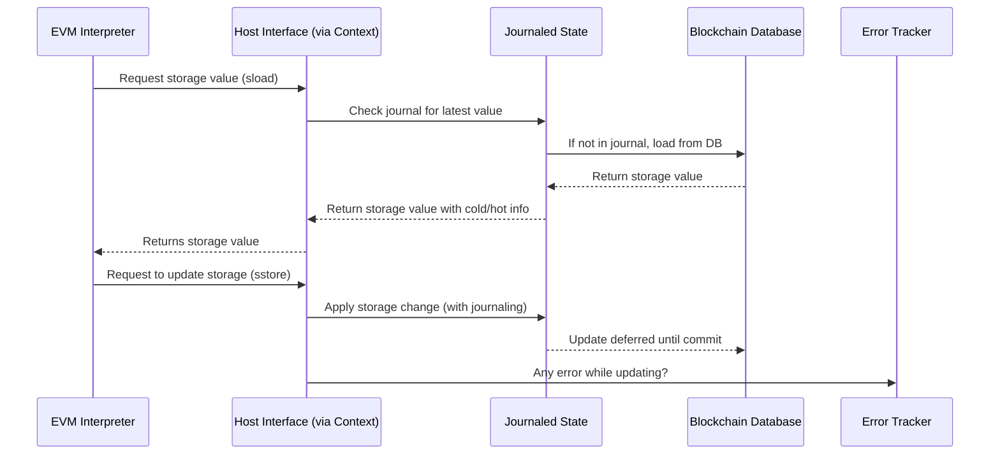

# Chapter 2: Host Interface

Welcome back! In [Chapter 1: Context & Environment](01_context___environment_.md), we explored how the EVM understands the blockchain world around it with block info, transaction details, configuration, and state. Now, we dive deeper into the **Host Interface** — the bridge that connects the EVM interpreter to this external blockchain environment.

---

## Why do we need a Host Interface?

Imagine you’re trying to run a smart contract — like a digital vending machine. When someone sends an order (a transaction), your vending machine needs to check several things:

- How much money does the buyer have?
- What items are in stock?
- What’s the current price for an item? (which might depend on block info)
- If the buyer pays, deduct money and add items to their inventory.
- Create a log or event that says “Item sold”.

The EVM itself only understands how to run contract code step-by-step. It doesn’t know anything about your blockchain's accounts, balances, or logs — it only sees the code and data you feed it.

**The Host Interface is the "operating system" for the EVM**, answering its "system calls" to get or change blockchain data like accounts, storage, balance, block info, and logs.

---

## A Concrete Use Case: Running a Contract Call That Changes Storage

Let’s break down what happens when a smart contract updates a storage value during execution:

1. The EVM reads the current storage value at a certain key for an address.
2. The EVM modifies the storage with a new value.
3. The EVM may write logs for events or handle self-destruct (contract deletion).
4. The Host Interface takes care of reading/writing all this to keep the blockchain state correct.

The Host Interface provides a clean set of functions to access and modify this information. Instead of the EVM talking directly to the blockchain database, it uses the Host trait that **knows how to safely interact with the blockchain state via the Context**.

---

## What Does the Host Interface Provide?

The host can be thought of as a **service desk** that the EVM talks to with requests, such as:

- **Get block information:** What’s the block number? What’s the base fee?
- **Get transaction information:** Who sent this transaction?
- **Access blockchain state:**
  - Account balances
  - Contract code and code hash
  - Storage values
  - Self-destruct accounts (deletion)
- **Handle logs:** Record events emitted by contracts
- **Manage transient storage:** Temporary storage used during execution
- **Deal with gas-related data and configuration**

---

## Host Interface – Key Functions at a Glance

Let's see some key operations that the host supports, in beginner-friendly terms:

| Operation                  | What it does                                    |
|----------------------------|------------------------------------------------|
| `basefee()`                | Returns current block’s base gas fee            |
| `caller()`                 | Returns the address that called the contract    |
| `balance(address)`         | Returns the balance of an account                |
| `sload(address, key)`      | Reads a storage value at a specific location     |
| `sstore(address, key, val)`| Writes a new storage value                        |
| `log(log)`                 | Emits a log/event                                |
| `selfdestruct(address, target)` | Marks a contract for deletion, funds sent to target |

These functions enable the EVM to read and write the blockchain state without knowing how the underlying data is stored or managed.

---

## How to Use the Host Interface in Practice?

The `Host` trait is implemented for any type that has a `ContextTr` (which we learned about in Chapter 1).

Here's a very minimal example showing how the host can be used through this trait:

```rust
// Assume `ctx` is our initialized Context from Chapter 1
let base_fee = ctx.basefee();
println!("Current block basefee: {}", base_fee);

// Get caller (transaction sender)
let caller = ctx.caller();
println!("Transaction caller: {:?}", caller);

// Read a storage value from contract at address zero (simplified example)
let key = U256::ZERO;
if let Some(storage_val) = ctx.sload(Address::ZERO, key) {
    println!("Storage value at key 0: {}", storage_val.value);
} else {
    println!("No storage value found.");
}

// Store a new value in contract storage
let _ = ctx.sstore(Address::ZERO, key, U256::from(42));
```

> **Explanation:**  
> - `basefee()` gets the current base fee for the block.  
> - `caller()` shows who sent the transaction.  
> - `sload()` reads a value from the contract's storage.  
> - `sstore()` writes a new value into the contract's storage.

Behind these scenes, the host safely manages reads and writes using the journaled state and the underlying database, handling errors if things go wrong.

---

## What Happens Inside the Host Interface? (Step-by-Step)

Let's visualize how the EVM uses the Host interface when it needs data:



### Explanation:

- The EVM asks the Host for storage data.
- The Host checks if the value is already in the journal (recently read/modified during this execution).
- If not, the journal asks the database for the data.
- The journal returns the value to the Host, which returns it to the EVM.
- When the EVM writes new storage values, the Host ensures the change is recorded in the journal with the ability to revert later if needed.
- Any errors (like permission denied or missing data) are tracked and reported to the EVM via the Host.

---

## Under the Hood: How Is Host Implemented?

The central piece is the `Host` trait defined around the `ContextTr` abstraction we met earlier.

Here's a simplified overview showing how `Host` methods delegate to the parts inside `Context`:

```rust
pub trait Host {
    // Block info
    fn basefee(&self) -> U256;

    // Transaction info
    fn caller(&self) -> Address;

    // State access
    fn sload(&mut self, address: Address, key: U256) -> Option<StateLoad<U256>>;
    fn sstore(&mut self, address: Address, key: U256, value: U256) -> Option<StateLoad<SStoreResult>>;

    // Logs & selfdestruct
    fn log(&mut self, log: Log);
    fn selfdestruct(&mut self, address: Address, target: Address) -> Option<StateLoad<SelfDestructResult>>;
}

// Implementation for any ContextTr type
impl<CTX: ContextTr> Host for CTX {
    fn basefee(&self) -> U256 {
        U256::from(self.block().basefee())
    }

    fn caller(&self) -> Address {
        self.tx().caller()
    }

    fn sload(&mut self, address: Address, key: U256) -> Option<StateLoad<U256>> {
        self.journal()
            .sload(address, key)
            .ok()
    }

    fn sstore(&mut self, address: Address, key: U256, value: U256) -> Option<StateLoad<SStoreResult>> {
        self.journal()
            .sstore(address, key, value)
            .ok()
    }

    fn log(&mut self, log: Log) {
        self.journal().log(log);
    }

    fn selfdestruct(&mut self, address: Address, target: Address) -> Option<StateLoad<SelfDestructResult>> {
        self.journal().selfdestruct(address, target).ok()
    }
}
```

### Explanation:

- The Host trait reads block info and transaction info directly from the `Context`’s block and transaction.
- Storage reads and writes go through the journal (`self.journal()`), which wraps interaction with the underlying database and state tracking.
- Logging and contract self-destruction are also handled by the journal layer.
- Errors during any of these operations update the error state inside the Context.

---

## A Dummy Host: The Simplest Possible Host

For testing or simple cases, there's a `DummyHost` that fulfills the host interface with no actual data:

```rust
pub struct DummyHost;

impl Host for DummyHost {
    fn basefee(&self) -> U256 { U256::ZERO }
    fn caller(&self) -> Address { Address::ZERO }
    fn sload(&mut self, _address: Address, _key: U256) -> Option<StateLoad<U256>> { None }
    fn sstore(&mut self, _address: Address, _key: U256, _value: U256) -> Option<StateLoad<SStoreResult>> { None }
    fn log(&mut self, _log: Log) {}
    fn selfdestruct(&mut self, _address: Address, _target: Address) -> Option<StateLoad<SelfDestructResult>> { None }
}
```

> This dummy host returns zero values or none for all calls, which helps in unit tests or understanding the interface without real blockchain data.

---

## Summary

In this chapter, you learned:

- **What is the Host Interface?**  
  The bridge between the EVM interpreter and the external blockchain environment, handling all requests to blockchain data and state.

- **Why is it important?**  
  It abstracts the complexity of reading/writing blockchain state safely and consistently during contract execution.

- **What key features does it provide?**  
  Access to block info, transaction info, contract storage, balances, self-destructs, logs, and configuration.

- **How is it used?**  
  The EVM calls Host methods like `sload`, `sstore`, `balance`, etc., without needing to know internal blockchain data structures.

- **What happens internally?**  
  The Host delegates calls to the journaled state and the underlying database, tracks errors, and ensures state consistency during execution.

- **The Host is implemented as a Rust trait for the Context, making it highly modular and flexible.**

---

Next, we will go deeper into how `revm` manages blockchain state using various layers with journaling and databases. If you're curious about how the state is organized and tracked internally, continue with [Chapter 3: State & Database Layers](03_state___database_layers_.md).

---

Thank you for sticking with me! The Host Interface is the essential connection that powers safe and smooth smart contract execution. Keep exploring!

---

Generated by [AI Codebase Knowledge Builder](https://github.com/The-Pocket/Tutorial-Codebase-Knowledge)