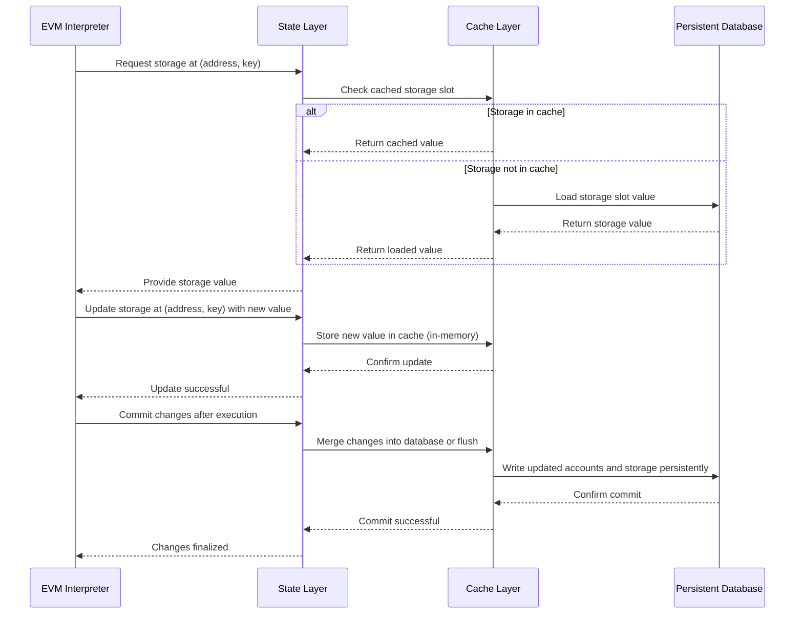

# Chapter 3: State & Database Layers

Welcome back! In [Chapter 2: Host Interface](02_host_interface_.md), we learned how the EVM talks to the blockchain environment to read account balances, storage, and block info. Now, we’ll dig deeper into **how the blockchain state is actually stored, organized, and updated inside revm**.

---

## Why do we need State & Database Layers?

Imagine you’re managing a huge library. Visitors can borrow books, return them, or add new ones. You need a system that:

- Remembers who owns what book.
- Keeps track of books available on the shelves.
- Allows you to update records in real-time.
- Lets you rollback changes if a mistake happens.

In Ethereum (and thus in EVM), the "library" is the **blockchain state**: all accounts, their balances, nonces, smart contract code, and storage (key-value data inside contracts).

The **State & Database Layers** in revm handle:

- Loading this data from some permanent storage (database).
- Caching it while the EVM is executing (so repeated reads are fast).
- Managing changes safely, so they can be committed or reverted.
- Organizing account details, storage slots, and bytecode in structures that are efficient and easy to update.

In short: **This is the persistent storage backend for the EVM**, where everything that smart contracts read/write really “lives.”

---

## A Concrete Scenario: Reading and Updating Account Storage

Let’s say a smart contract running in the EVM wants to:

1. Read the current value stored at a specific key in its storage.
2. Modify that value to a new number.
3. Deduct some balance from the sender account.
4. Update the nonce to prevent replay.
5. Eventually commit all these changes to make them permanent.

How do we organize this flow so the EVM can do all those steps efficiently and safely?

The State & Database Layers provide this solution.

---

## Key Concepts in State & Database Layers

Let’s break down the building blocks of this system in simple terms:

### 1. **Database**

- Think of this as the **permanent filing cabinet**.
- It holds *all* the accounts and their data before any new transaction runs.
- It stores:
  - Account information: balances, nonces, code hash.
  - Contract bytecode.
  - Storage key-value pairs for each account.
  - Block hashes by block number.
- Usually, it is slow to access because it might be on disk or remote.

**Example:** `EmptyDB` is a built-in simple database that acts like an empty filing cabinet with default empty data. It is mostly used for testing.

---

### 2. **Cache Layer**

- Think of this as your **desktop where you keep frequently used files**.
- The cache stores data that has been loaded from the database.
- It allows fast repeated reads and quick writes *before committing* changes.
- It holds accounts and storage slots that the EVM reads or modifies during execution.
- It also keeps track of logs and modified contract bytecode.

**Example:** `CacheDB` is a cache implementation that wraps a database. It will first check cache entries before asking the database.

---

### 3. **State**

- The **“state”** is the interface exposed to the EVM to **read and write blockchain data**.
- It hides the complexity of caching and persistent storage behind simple calls.
- State manages:
  - Loading accounts when needed.
  - Reading/writing storage slots.
  - Committing or reverting changes after execution.
- It supports transitions, which are the changes during a transaction or block.

---

### 4. **Transition State & Bundle**

- To support rollbacks, the system stores **“transitions”** — changes made during transaction execution that are *not* yet final.
- If the transaction fails or reverts, these can be discarded.
- Completed transitions are merged into a **“bundle”**, which represents a finalized snapshot of state changes after a block.
- This approach ensures history and safety in state updates.

---

## What Does This Layer Look Like in Code?

Here’s a minimal snippet creating an empty cache wrapping an empty database and reading an account info:

```rust
use revm::database::{CacheDB, EmptyDB};
use primitives::Address;

// Create an empty database — no data yet
let db = EmptyDB::default();

// Wrap it with a cache for faster access
let mut cache_db = CacheDB::new(db);

// Pick an address (all zeros here for example)
let address = Address::zero();

// Try to get account data (balance, nonce)
let account_info = cache_db.basic(address).unwrap();

println!("Account info for {:?}: {:?}", address, account_info);
```

> **Explanation:**  
> - We create an empty database with no accounts.  
> - Wrap it in a cache so if we add data later it will be stored in-memory first.  
> - Query account basic info. For an empty database this will be `None`.  
> - This shows reading from the database with caching.

---

## Reading and Updating Storage Example

Let’s simulate loading a storage slot and then updating it.

```rust
use primitives::{Address, U256};

// The address and storage slot key we want to access
let address = Address::zero();
let storage_key = U256::zero();

// Read from storage (returns U256::ZERO if missing)
let value_before = cache_db.storage(address, storage_key).unwrap();
println!("Old storage value: {}", value_before);

// Update the storage value — say setting it to 42
cache_db.insert_account_storage(address, storage_key, U256::from(42)).unwrap();

// Read again, now it should return 42
let value_after = cache_db.storage(address, storage_key).unwrap();
println!("New storage value: {}", value_after);
```

> **Explanation:**  
> - We read storage key `0` for `address 0x0`. It returns the stored value or zero if not present.  
> - We then insert a new storage value (`42`) to the in-memory cache.  
> - Reading again shows the updated value.  
>  
> **Note:** These changes are in-memory only until committed.

---

## Committing State Changes

After all updates are done (e.g., EVM execution succeeded), the cache can be committed or merged with the underlying database.

```rust
use primitives::HashMap;
use state::Account;

// Prepare changes to commit
let mut changes = HashMap::new();

// Here suppose we create a simple account change for address
let account_change = Account {
    info: /* updated AccountInfo */,
    storage: /* updated storage HashMap */,
};

changes.insert(address, account_change);

// Commit changes to cache_db
cache_db.commit(changes);
```

> **Explanation:**  
> - This example shows you can batch changes into a `HashMap` of updated accounts.  
> - Committing will update the cache with the latest info, preparing it for final persistence.  
> - Typically the database commit happens after the full block/transaction batch.

---

## What Happens Internally? Step-by-step Flow

Imagine the EVM requests a storage value or updates account balance during execution:



---

## Under the Hood: How Does revm Implement This?

Let’s peek inside the main pieces with simplified code excerpts and explanations.

---

### 1. **Database Trait**

The `Database` trait defines the low-level interface any database must provide:

```rust
pub trait Database {
    type Error;

    fn basic(&mut self, address: Address) -> Result<Option<AccountInfo>, Self::Error>;
    fn code_by_hash(&mut self, code_hash: B256) -> Result<Bytecode, Self::Error>;
    fn storage(&mut self, address: Address, index: U256) -> Result<U256, Self::Error>;
    fn block_hash(&mut self, number: u64) -> Result<B256, Self::Error>;
}
```

- `basic` returns basic info about an account (balance, nonce, etc.).
- `code_by_hash` returns the contract bytecode for a hash.
- `storage` returns the value stored at a particular slot.
- `block_hash` returns historic block hash.

---

### 2. **EmptyDB: A Minimal Implementation**

Here's how `EmptyDB` behaves: all queries return empty/default values.

```rust
impl Database for EmptyDB {
    type Error = Infallible;

    fn basic(&mut self, _address: Address) -> Result<Option<AccountInfo>, Self::Error> {
        Ok(None) // No accounts exist
    }

    fn code_by_hash(&mut self, _code_hash: B256) -> Result<Bytecode, Self::Error> {
        Ok(Bytecode::default()) // Empty code
    }

    fn storage(&mut self, _address: Address, _index: U256) -> Result<U256, Self::Error> {
        Ok(U256::ZERO) // Storage empty by default
    }

    fn block_hash(&mut self, number: u64) -> Result<B256, Self::Error> {
        // Deterministic hash of block number (for tests)
        Ok(keccak256(number.to_string().as_bytes()))
    }
}
```

> **Why is this useful?**  
> It can be used for testing without any real blockchain data.

---

### 3. **CacheDB: The Cache Layer**

`CacheDB` sits on top of any database and stores in-memory copies of accounts and storage.

Example of loading an account or filling cache if missing:

```rust
impl<ExtDB: DatabaseRef> CacheDB<ExtDB> {
    pub fn load_account(&mut self, address: Address) -> Result<&mut DbAccount, ExtDB::Error> {
        if let Some(account) = self.cache.accounts.get_mut(&address) {
            return Ok(account);
        }
        // Load from database if not cached
        let info = self.db.basic_ref(address)?;
        let db_account = info.map(DbAccount::from).unwrap_or_else(DbAccount::new_not_existing);
        self.cache.accounts.insert(address, db_account);
        self.cache.accounts.get_mut(&address).unwrap()
    }
}
```

- Checks if the account is cached; if not, loads from the underlying database.
- Stores it in the cache for faster future access.
- Storage slots inside accounts are also cached similarly.

---

### 4. **Reading Storage in Cache**

```rust
impl<ExtDB: DatabaseRef> CacheDB<ExtDB> {
    pub fn storage(&mut self, address: Address, index: U256) -> Result<U256, ExtDB::Error> {
        let account = self.load_account(address)?;
        if let Some(value) = account.storage.get(&index) {
            Ok(*value)
        } else {
            // If storage is unknown, fetch from DB and cache it
            let value = self.db.storage_ref(address, index)?;
            account.storage.insert(index, value);
            Ok(value)
        }
    }
}
```

- Looks up storage key in the cached account.
- If missing, loads from database and caches for later.

---

### 5. **Inserting or Updating Storage**

```rust
impl<ExtDB> CacheDB<ExtDB> {
    pub fn insert_account_storage(&mut self, address: Address, slot: U256, value: U256) -> Result<(), ExtDB::Error> {
        let account = self.load_account(address)?;
        account.storage.insert(slot, value);
        Ok(())
    }
}
```

- Updates the storage slot directly in the cache.
- Changes are kept in memory, not persisted immediately.

---

### 6. **Commit Changes**

```rust
impl<ExtDB: DatabaseCommit> DatabaseCommit for CacheDB<ExtDB> {
    fn commit(&mut self, changes: HashMap<Address, Account>) {
        for (address, account) in changes {
            if account.is_selfdestructed() {
                // Clear account and storage
                let db_account = self.cache.accounts.entry(address).or_default();
                db_account.storage.clear();
                db_account.info = AccountInfo::default();
                continue;
            }

            self.insert_contract(&mut account.info);

            // Update cached account
            self.cache.accounts.insert(address, DbAccount::from(account.info));
            // Update storage slots as well
            // Simplified here for brevity
        }
    }
}
```

- Applies a batch of account changes to the cache.
- Handles contract creation, deletion, and storage update.
- Commit to the underlying database happens after merging bundles or finalization.

---

## Summary

In this chapter you learned:

- **Why State & Database Layers exist:**  
  They provide the persistent storage backend that holds account balances, nonces, contract code, and storage slots.

- **Key components:**  
  - `Database`: permanent storage interface  
  - `CacheDB`: in-memory cache wrapping the database for fast reads/writes  
  - `State`: manages cached data, transitions, and bundling changes  
  - Transitions & Bundles: for supporting rollbacks and batching block changes

- **How EVM reads and writes data:**  
  State tries to read from cache, then falls back on the database. Writes go to cache and are merged before committing.

- **How the commit process works:**  
  Changes are batched and committed, enabling safe state transitions during blocks.

Understanding these layers helps you grasp how revm efficiently manages the "world state" your contracts interact with!

---

Up next, we will explore how the EVM manages gas during execution — from simple counting to advanced rules. Stay tuned for [Chapter 4: Gas Management](04_gas_management_.md)!

---

Thank you for following along! You’re getting deeper into the inner workings of revm, and with this, you now know where the blockchain state really lives and how it changes safely. Keep going!

---

Generated by [AI Codebase Knowledge Builder](https://github.com/The-Pocket/Tutorial-Codebase-Knowledge)