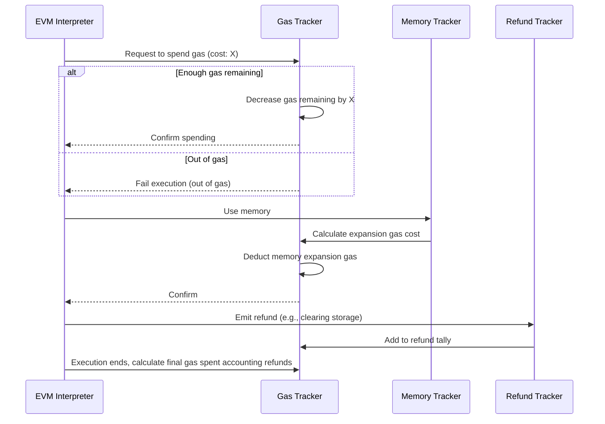

# Chapter 4: Gas Management

Welcome back! In the previous chapter, [State & Database Layers](03_state___database_layers_.md), we uncovered how the blockchain state is stored and managed safely inside `revm`. Now, let's explore another crucial part that powers Ethereum smart contracts: **Gas Management**.

---

## Why do we need Gas Management?

Imagine you're driving a car. Your car has a fuel gauge to measure how much fuel (gas) you have left. If you run out of fuel, you’ll stall and wouldn’t be able to continue your journey.

The **Ethereum Virtual Machine (EVM)** works similarly but instead of fuel, it uses **gas**. Gas is the “payment” and “measurement” unit for computational steps and resource usage when running contract code.

### A simple use case:

Suppose you want to execute a smart contract function that transfers tokens:

- Every operation (like a transfer, storage write, or calculation) **costs gas**.
- You send a transaction with a **gas limit** — the maximum gas you’re willing to pay.
- As instructions are executed, the gas is **spent**.
- If gas runs out **before** the contract finishes, the transaction will **fail**.
- Some operations can **refund** gas, like freeing storage.
- At the end, leftover gas is returned, and the sender only pays for gas actually used.

**Gas Management** is the part of `revm` that tracks gas usage, refunds, and checks that you do not overspend your gas limit. It’s the fuel gauge of the EVM ensuring proper payment for execution.

---

## Breaking down Gas Management: Key Concepts

To understand Gas Management, let's break it down into simple pieces:

### 1. Gas Limit

- The **total amount of gas** allowed at the start of execution.
- This comes from the transaction parameters.
- Think of it as the **full fuel tank** before the journey.

### 2. Gas Remaining

- How much gas is **left** as instructions execute.
- Every EVM instruction subtracts some gas.
- If it hits zero or goes below, the transaction **runs out of gas**.

### 3. Gas Refunded

- Some special actions, like freeing storage space, **refund gas** back.
- Refunds are collected during execution but applied only **after** it finishes.

### 4. Gas Spent

- The total gas actually used (gas limit - gas remaining).

### 5. Memory Gas

- Expanding EVM memory costs gas.
- Gas Management tracks how memory usage grows and charges accordingly.

---

## Using Gas Management: A Simple Example

Let’s see how we can create and manage gas inside `revm` with minimal code.

```rust
use revm::interpreter::Gas;

// Create gas tracker with a limit of 1,000,000 gas units
let mut gas = Gas::new(1_000_000);

// Check starting gas
println!("Gas limit: {}", gas.limit());          // 1000000
println!("Gas remaining: {}", gas.remaining());  // 1000000

// Spend 21000 gas for a transaction base cost (example)
let success = gas.record_cost(21_000);
println!("Spent 21000 gas: {}", success);
println!("Gas remaining now: {}", gas.remaining());  // 979000

// Attempt to spend 1,000,000 gas - should fail (out of gas)
let success = gas.record_cost(1_000_000);
println!("Spend 1,000,000 gas success? {}", success);  // false

// Record a gas refund of 5,000
gas.record_refund(5_000);
println!("Refunded gas: {}", gas.refunded());  // 5000

// Calculate total gas spent minus refund
println!("Net gas spent: {}", gas.spent_sub_refunded());  // 21000 - 5000 = 16000
```

> **What happens here?**  
> - We create a gas tracker with a 1 million unit limit.  
> - Spend 21,000 gas (typical intrinsic cost).  
> - Trying to spend beyond gas limit fails safely.  
> - Gas refunds are recorded but applied later.  
> - Final net gas spent accounts for refunds.

---

## What happens behind the scenes? (Step-by-step)

When the EVM executes operations, it calls Gas Management like this:



### Explanation:

- Every instruction asks the gas tracker if it can spend X gas.
- The gas tracker checks if enough gas remains.
- For memory usage increases, gas is additionally charged.
- Some operations refund gas, which are tracked separately.
- At the end of execution, total refunds reduce the gas cost, but with limits (some refunds are capped).

---

## Peek Under the Hood: Gas Struct and Its Methods

The heart of gas management is the `Gas` struct (in `crates/interpreter/src/gas.rs`).

Here’s a simplified look:

```rust
#[derive(Default)]
pub struct Gas {
    limit: u64,
    remaining: u64,
    refunded: i64,
}

impl Gas {
    // Create new Gas tracker with limit and remaining gas set to limit
    pub fn new(limit: u64) -> Self {
        Self {
            limit,
            remaining: limit,
            refunded: 0,
        }
    }

    // Record spending gas
    // Returns false if not enough gas remains
    pub fn record_cost(&mut self, cost: u64) -> bool {
        if let Some(new_remaining) = self.remaining.checked_sub(cost) {
            self.remaining = new_remaining;
            true
        } else {
            false
        }
    }

    // Record a gas refund (can be negative sometimes)
    pub fn record_refund(&mut self, refund: i64) {
        self.refunded += refund;
    }

    // Calculate gas spent minus refunded (refund capped internally)
    pub fn spent_sub_refunded(&self) -> u64 {
        let spent = self.limit.saturating_sub(self.remaining);
        spent.saturating_sub(self.refunded as u64)
    }
}
```

> **Meaning:**  
> - `limit`: Total gas allowed.  
> - `remaining`: Gas left to spend.  
> - `refunded`: Gas to give back after execution.  
> - The `record_cost` function tries to spend gas and returns if it succeeded or not.  
> - Refunds accumulate during execution and adjust net gas spent.

---

## Memory Gas Tracking

EVM memory expansion also costs gas. This is handled inside the `Gas` struct with a helper called `MemoryGas`.

```rust
pub struct MemoryGas {
    words_num: usize,
    expansion_cost: u64,
}

impl MemoryGas {
    pub fn new() -> Self {
        Self {
            words_num: 0,
            expansion_cost: 0,
        }
    }

    /// Records an expansion in memory length (number of 32-byte words)
    /// Returns additional gas cost of the expansion, if any
    pub fn record_new_len(&mut self, new_num: usize) -> Option<u64> {
        if new_num <= self.words_num {
            None // No expansion, no added cost
        } else {
            self.words_num = new_num;
            // Calculate new expansion cost (simplified)
            let new_cost = new_num as u64 * 3 + (new_num as u64).pow(2) / 512;
            let cost_diff = new_cost.saturating_sub(self.expansion_cost);
            self.expansion_cost = new_cost;
            Some(cost_diff)
        }
    }
}
```

The `Gas` struct calls `record_new_len` when memory grows and charges the added cost.

---

## How Gas Management Helps with Errors

If gas runs out:

- `record_cost` returns `false`.
- The system knows that an **OutOfGas error** occurred.
- Execution halts and the transaction reverts.
- This prevents overspending or denial-of-service abuse.

```rust
if !gas.record_cost(opcode_gas_cost) {
    return Err("OutOfGas");
}
```

---

## Summary

In this chapter, you learned:

- **Why Gas Management is vital:**  
  It tracks gas usage, refunds, and prevents overspending during EVM execution.

- **How gas is tracked:**  
  Gas limit, gas remaining, and refunds make up the gas state.

- **Memory expansion costs:**  
  Gas management also tracks memory growth costs.

- **Basic usage:**  
  Creating a Gas struct, spending gas, recording refunds, and checking for out-of-gas errors.

- **What happens inside:**  
  The gas tracker updates gas remaining, calculates net gas spent, and reports failures if gas runs out.

- **How it integrates with EVM:**  
  The EVM calls `Gas::record_cost` every time an instruction needs gas, ensuring execution stays within the gas limit.

---

Next, we will dive into how the EVM handles **Bytecode & Opcodes** — the actual code the EVM runs, instruction by instruction. Explore [Chapter 5: Bytecode & Opcodes](05_bytecode___opcodes_.md) to continue your journey!

---

Thank you for learning about gas management! This understanding is key to grasping how Ethereum charges for computation and resources. Keep going—you’re making great progress!

---

Generated by [AI Codebase Knowledge Builder](https://github.com/The-Pocket/Tutorial-Codebase-Knowledge)