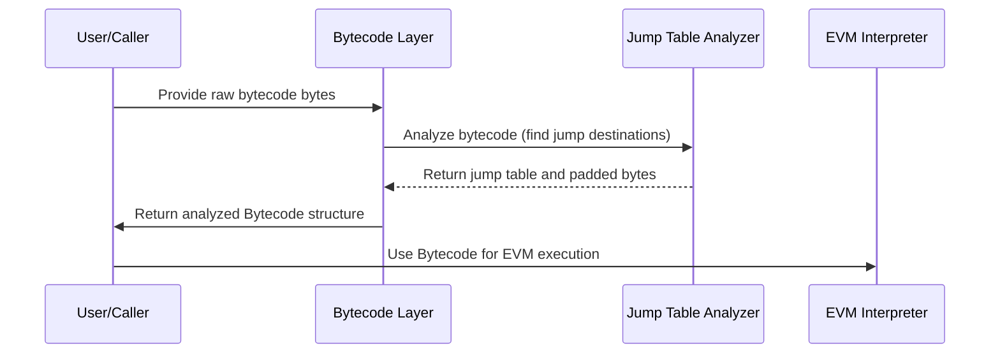

# Chapter 5: Bytecode & Opcodes

Welcome back! In the previous chapter, [Chapter 4: Gas Management](04_gas_management_.md), we learned how the EVM tracks and manages gas — the fuel that powers Ethereum smart contracts. Now, it's time to explore the **actual code the EVM runs**: the **Bytecode** and its building blocks, the **Opcodes**.

---

## Why is Bytecode & Opcodes Important?

Imagine you want to bake a cake, but all you have is a recipe written in a secret code. To bake the cake, you must first understand that code: what each instruction means and how it tells you to mix, bake, and serve.

In Ethereum, **smart contracts are compiled into low-level instructions** called **bytecode**, which the Ethereum Virtual Machine (EVM) executes. This bytecode is a sequence of **opcodes** — think of them as the cooking steps from the recipe.

The `revm` project's Bytecode & Opcodes abstraction manages:

- How this bytecode is represented.
- How EVM instructions (opcodes) are defined and classified.
- Different formats of bytecode Ethereum supports.
- Analyzing the bytecode to prepare it for execution (like verifying jump locations).
- Validating bytecode correctness.

This layer is, essentially, the **instruction set architecture** and **program loader** for the EVM.

---

## Use Case: Running a Simple Smart Contract Bytecode

Suppose you have a simple smart contract compiled into bytecode, for example:

```text
0x60 0x01  // PUSH1 0x01  (push the number 1 to the stack)
0x60 0x02  // PUSH1 0x02  (push the number 2 to the stack)
0x01       // ADD         (add the two numbers on the stack)
0x00       // STOP        (halt execution)
```

To prepare the EVM interpreter to run this, we need to:

1. Represent this bytecode in a form `revm` understands.
2. Know what each opcode means (PUSH1, ADD, STOP).
3. Analyze it so jumps and other features work correctly.
4. Validate it to ensure it’s safe to run.

This chapter will show you how to do all that!

---

## Breaking Down the Concepts: Bytecode & Opcodes

Let's explain the key ideas behind this abstraction.

### 1. Bytecode

A **bytecode** is a sequence of bytes that the EVM executes. Each byte corresponds to an **opcode**—an instruction for the EVM, optionally followed by immediate data bytes. For example, the `PUSH1` opcode is followed by 1 byte that says what to push onto the stack.

Ethereum supports different **bytecode formats**:

- **Legacy Bytecode**: The original simple sequence of opcodes and immediate data.
  
- **EOF (Ethereum Object Format)**: A newer, modular bytecode format introduced for better tooling and efficiency.
  
- **EIP-7702 Delegated Bytecode**: A format for delegating code execution to other addresses.

`revm` supports all these formats as variants of a `Bytecode` type.

### 2. Opcodes

**Opcodes** (operation codes) are the actual EVM instructions, like `ADD` for addition, `PUSH1` for pushing a byte, `JUMP` for jumping to a location, and many more.

Each opcode has:

- An **opcode byte value** (e.g., `0x01` for `ADD`, `0x60` for `PUSH1`).
- **Stack input and output counts** (how many items it takes and puts on the stack).
- An optional **immediate data size** (for `PUSH` instructions).
- Flags like whether it **terminates execution** (`STOP`, `RETURN`) or is a **jump destination**.

Opcodes are constants in the code and all known opcodes are listed with their properties.

---

## How to Represent and Analyze Bytecode in `revm`

Let's walk through a simple example step-by-step.

### Step 1: Define Your Bytecode Bytes

Here's the simple bytecode we introduced:

```rust
use primitives::Bytes;

let raw_bytecode: Bytes = Bytes::from_static(&[
    0x60, 0x01, // PUSH1 1
    0x60, 0x02, // PUSH1 2
    0x01,       // ADD
    0x00,       // STOP
]);
```

*We create a byte slice representing our instructions.*

### Step 2: Create `Bytecode` from Raw Bytes

Use the `Bytecode` enum to wrap this raw bytecode:

```rust
use revm::bytecode::Bytecode;

// Convert raw bytes to Bytecode (legacy analyzed)
let bytecode = Bytecode::new_legacy(raw_bytecode);
```

This creates an analyzed bytecode variant by:

- Parsing the bytes.
- Building a **jump table** (a helper that marks valid jump destinations).
- Padding the bytecode if necessary (EVM requires the code to end properly).

### Step 3: Inspect the Bytecode and Jump Table

Let's look at the actual bytes and jump destinations:

```rust
println!("Bytecode length: {}", bytecode.len());
println!("Bytecode bytes: {:?}", bytecode.bytecode());

if let Some(jump_table) = bytecode.legacy_jump_table() {
    println!("Jump destinations:");
    for (idx, is_jumpdest) in jump_table.iter().enumerate() {
        if *is_jumpdest {
            println!(" - Byte offset: {}", idx);
        }
    }
} else {
    println!("No jump table available");
}
```

*This will print the byte offsets that are valid jump destinations, which helps ensure `JUMP` instructions go to allowed places.*

---

## What Happens Internally When Creating Bytecode?

Let's visualize the process of taking raw bytes and analyzing for execution:



### Explanation:

- **User** supplies the raw bytecode.
- The Bytecode layer analyzes it, marking jump destinations so jumps don't land in invalid spots.
- If needed, the bytecode is padded to ensure proper termination.
- The analyzed bytecode is then ready to be run by the EVM.

---

## Peeking Under the Hood: Bytecode Implementation

### The `Bytecode` Enum

Located in `crates/bytecode/src/bytecode.rs`, the `Bytecode` enum represents different bytecode formats:

```rust
pub enum Bytecode {
    LegacyAnalyzed(LegacyAnalyzedBytecode), // Classic bytecode w/ jump table
    Eof(Arc<Eof>),                          // New EOF bytecode format
    Eip7702(Eip7702Bytecode),               // Delegated bytecode from EIP-7702
}
```

### LegacyAnalyzedBytecode

This variant contains analyzed legacy bytecode. It includes:

- The raw bytecode bytes.
- The **jump table** — a bitmap marking valid jump destinations.

This jump table is created by scanning the code and:

- Marking all `JUMPDEST` opcodes as valid destinations.
- Skipping `PUSH` immediate data to avoid misinterpreting data as instructions.

### Jump Table Analysis

This is done in the file `crates/bytecode/src/legacy/analysis.rs`.

A simplified snippet:

```rust
fn analyze_legacy(bytecode: Bytes) -> (JumpTable, Bytes) {
    let mut jumps = BitVec::new(bytecode.len()); // All false initially

    let mut i = 0;
    while i < bytecode.len() {
        let op = bytecode[i];
        if op == opcode::JUMPDEST {
            jumps.set(i, true); // Mark jumpdest valid
            i += 1;
        } else if op >= opcode::PUSH1 && op <= opcode::PUSH32 {
            let push_len = (op - opcode::PUSH1 + 1) as usize;
            i += 1 + push_len;  // Skip immediate bytes
        } else {
            i += 1;             // Move to next opcode
        }
    }

    // Possibly pad if last opcode isn't STOP
    // ...

    (JumpTable(Arc::new(jumps)), bytecode)
}
```

*It scans every byte, marks jump destinations, and correctly skips push data.*

---

## Understanding Opcodes in `revm`

### What is an Opcode?

An `Opcode` is a wrapper around a `u8` that represents a single EVM instruction byte.

You can create an opcode like this:

```rust
use revm::bytecode::opcode::OpCode;

let add_opcode = OpCode::new(0x01).unwrap(); // ADD opcode
println!("Opcode name: {}", add_opcode);
println!("Inputs: {}", add_opcode.inputs());
println!("Outputs: {}", add_opcode.outputs());
println!("Is jump: {}", add_opcode.is_jump());
```

**Output explanation:**

- Opcode name: `ADD`
- Inputs: `2` (needs 2 items from the stack)
- Outputs: `1` (produces 1 item on the stack)
- Is jump: `false`

### Opcode Properties

Each opcode knows:

- How many stack items it consumes (`inputs()`).
- How many stack items it produces (`outputs()`).
- If it is a jump or jump destination.
- How many immediate bytes it has (e.g., `PUSH1` has 1 immediate byte).

---

## How Are Opcodes Organized?

All opcode constants and their metadata are generated in a macro in `crates/bytecode/src/opcode.rs`. Here’s a tiny snippet for illustration:

```rust
pub const ADD: u8 = 0x01;
pub const PUSH1: u8 = 0x60;
pub const STOP: u8 = 0x00;

// Create Opcode structs for convenience
impl OpCode {
    pub const ADD: Self = Self(0x01);
    pub const PUSH1: Self = Self(0x60);
    pub const STOP: Self = Self(0x00);
}
```

Each opcode comes with `OpCodeInfo` describing its behavior (inputs, outputs, whether it terminates).

---

## Summary and What's Next?

In this chapter, you learned:

- **What is bytecode and opcode?**  
  Bytecode is the raw instruction data for the EVM, composed of opcodes which represent operations like `ADD`, `PUSH1`, and `STOP`.

- **Different bytecode formats:**  
  Legacy (classic), EOF (new modular), and EIP-7702 (delegated bytecode) are supported.

- **How bytecode is analyzed:**  
  The jump table is computed to mark valid jump destinations for safe jumps.

- **What information each opcode holds:**  
  Their opcode byte, stack inputs/outputs, immediate data size, and execution flags.

- **How to create and inspect bytecode and opcodes in `revm`.**

Now that you understand the fundamental building blocks of contracts' code, the next step is to explore **Precompiles** — special built-in contracts that `revm` supports for common operations. Check out [Chapter 6: Precompiles](06_precompiles_.md) to continue!

---

Thank you for following along! Bytecode and opcodes are the instruction language of Ethereum contracts, and mastering them is a big step toward understanding how smart contracts really work inside the EVM. Keep up the great progress!

---

Generated by [AI Codebase Knowledge Builder](https://github.com/The-Pocket/Tutorial-Codebase-Knowledge)