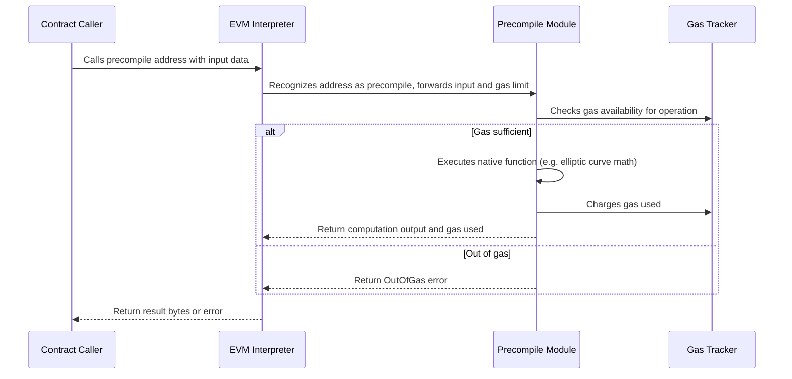

# Chapter 6: Precompiles

Welcome back! In the previous chapter, [Chapter 5: Bytecode & Opcodes](05_bytecode___opcodes_.md), we learned about the raw code that the EVM executes: smart contract bytecode and the individual opcodes that make up programs. Now, let's explore a very special feature of the Ethereum Virtual Machine called **Precompiles**.

---

## What are Precompiles and Why Do They Matter?

Imagine you're baking a fancy cake. Some steps might be really complicated — say, decorating with delicate sugar flowers. Instead of doing it by hand each time, you get a special tool that does this tricky part super fast and perfectly.

In the world of Ethereum, **Precompiles are like those special tools**. They are built-in, highly optimized “mini-programs” that the EVM can run by just calling certain special addresses — instead of running complex smart contract code instruction by instruction.

Why is this useful?

- Some cryptographic or mathematical operations are very complex and slow if done purely in EVM bytecode.
- Precompiles offer **native, efficient implementations** of these operations.
- This saves gas, execution time, and memory.

For example, operations on elliptic curves (used for cryptography), or special hash functions, are exposed through precompiles.

---

## Central Use Case: Verify a Cryptographic Signature Efficiently

Suppose you want your smart contract to **verify a signature** using the secp256k1 elliptic curve (the same one Bitcoin uses).

- You *could* write the signature verification code fully in Solidity and compile it.
- However, this would be very expensive and slow in gas since elliptic curve math is complex.
- Instead, Ethereum provides a **precompile contract** at a fixed address that does this efficiently.
- Your contract calls that address with the right input, and gets the verification result instantly.

This is the power of precompiles — complex cryptography and other functions can be done easily and cheaply.

---

## Key Concepts in Precompiles

Let’s understand how precompiles work in revm.

### 1. **Precompile Contracts**

- Special contracts at fixed addresses (like `0x01`, `0x06`, etc.).
- They don’t have bytecode; instead, they run native Rust code inside revm.
- Examples include: `ECRECOVER` (secp256k1 signature recovery), `BN128_ADD` (elliptic curve addition), `BLAKE2` hash, and others.

### 2. **Precompile Address**

- Each precompile lives at a **known, unique address**.
- To call a precompile, the EVM executes a call instruction to that address.
- revm recognizes these addresses and runs the special native code instead of bytecode.

### 3. **Precompile Input and Output**

- The input is a byte slice (`&[u8]`) representing parameters.
- The output is a slice of bytes representing the result.
- The exact format of input/output depends on the precompile’s specification.
- revm precompiles handle input parsing, computation, gas charging, and output formatting.

### 4. **Gas Cost**

- Each precompile requires some amount of gas to run.
- revm enforces gas limits — if insufficient gas, it returns an OutOfGas error.
- Gas cost can depend on input size or complexity of the operation.

---

## How to Use Precompiles in revm?

Here’s a very simple example of *calling* a precompile in revm. Imagine we want to run the `ecrecover` precompile (at address `0x01`) with some input.

```rust
use revm::precompile::secp256k1::ECRECOVER;
use primitives::{Address, Bytes};

fn main() {
    // The address of the ecrecover precompile contract
    let precompile_address: Address = revm::precompile::u64_to_address(1);

    // Example input (usually message hash + signature + recovery id) as bytes
    let input: Bytes = Bytes::from_static(&[
        // 32 bytes message hash (simplified example)
        0; 32,
        // 64 bytes signature (r and s components, simplified zeroes)
        0; 64,
        // 1 byte recovery id (27 or 28)
        27,
    ]);

    // Example gas limit
    let gas_limit: u64 = 10_000;

    // Run the precompile function
    match ECRECOVER.precompile()(&input, gas_limit) {
        Ok(output) => {
            println!("Precompile succeeded!");
            println!("Gas used: {}", output.gas_used);
            println!("Output bytes: {:?}", output.bytes);
        }
        Err(e) => {
            println!("Precompile failed with error: {}", e);
        }
    }
}
```

**Explanation:**

- We specify the input bytes to the function.
- We pick a gas limit for this call.
- We call the precompile function, which executes the native code.
- On success, we get gas used and output bytes.
- On failure, for example due to out-of-gas or bad input, we get an error.

---

## What Happens Inside a Precompile Call? (Step-by-Step)



---

## Internal Implementation Details in revm

### Where Are Precompiles Defined?

- Located in the crate `crates/precompile/src`
- Each precompile typically lives in its own module, like:  
  - `bn128.rs` (alt_bn128 elliptic curve operations)  
  - `secp256k1.rs` (`ecrecover`)  
  - `bls12_381.rs` (BLS signatures)  
  - `kzg_point_evaluation.rs` (KZG polynomial commitments)  
  - `modexp.rs` (big modular exponentiation)  
  - `blake2.rs` (blake2 hash function)  
  - and more.

### How Are Precompiles Registered?

- The `Precompiles` struct stores a **map of address → precompile function**.
- Different Ethereum hardforks enable different sets of precompiles (e.g., Byzantium adds bn128).
- You can get the set of precompiles for a spec like `Precompiles::latest()`.

### Precompile Function Signature

Each precompile exposes a function:

```rust
fn precompile(input: &Bytes, gas_limit: u64) -> Result<PrecompileOutput, PrecompileError>
```

- Takes input data and the gas limit.
- Returns either a successful output (gas used + output bytes) or an error.

### Example: Simple `ecrecover` Implementation Snippet (from `secp256k1.rs`)

```rust
pub fn ec_recover_run(input: &Bytes, gas_limit: u64) -> PrecompileResult {
    const BASE_GAS: u64 = 3_000;

    if BASE_GAS > gas_limit {
        return Err(PrecompileError::OutOfGas);
    }

    let input = right_pad::<128>(input);

    // Validate the 'v' parameter and parse input...

    // Do the actual ecrecover logic (using a crypto library)...

    Ok(PrecompileOutput::new(BASE_GAS, recovered_address_bytes))
}
```

- First, it checks if gas limit is enough.
- Pads input to expected length.
- Parses input parameters.
- Calls underlying cryptographic verification.
- Returns fixed gas used and output bytes.

---

## Example: The BN128 Addition Precompile

This precompile takes two elliptic curve points as input and outputs their sum.

Minimal flow:

```rust
pub fn run_add(input: &[u8], gas_cost: u64, gas_limit: u64) -> PrecompileResult {
    if gas_cost > gas_limit {
        return Err(PrecompileError::OutOfGas);
    }

    // Pad or truncate input to expected length
    let input = right_pad::<ADD_INPUT_LEN>(input);

    // Deserialize two points from input bytes
    let p1 = read_g1_point(&input[..G1_LEN])?;
    let p2 = read_g1_point(&input[G1_LEN..])?;

    // Compute sum of points
    let result = g1_point_add(p1, p2);

    // Encode result back to bytes
    let output = encode_g1_point(result);

    Ok(PrecompileOutput::new(gas_cost, output.into()))
}
```

- Inputs are two fixed-length byte arrays.
- The function checks gas, deserializes, performs addition, and returns results.
- Error handling is done with proper `PrecompileError` variants.

---

## Summary: What Did We Learn?

- **Precompiles are special built-in contracts that provide native implementations of complex operations** like cryptographic functions or big integer math.
- They run much faster and cheaper than equivalent EVM bytecode.
- revm exposes them as functions callable by the EVM at fixed addresses.
- Precompiles handle input parsing, gas charging, computation, and output formatting.
- Different Ethereum upgrades add or change precompiles, which revm tracks via the `Precompiles` struct.
- Using precompiles is as simple as calling their address during contract execution.

---

## What’s Next?

You have now seen how revm handles special native contracts that speed up complex tasks. Next, you will learn how the **Interpreter** actually runs smart contract bytecode step by step, using all the tools we've covered:

Check out [Chapter 7: Interpreter](07_interpreter_.md) to dive in!

---

Thank you for your attention! Precompiles might seem magical at first, but understanding their purpose and implementation gives you powerful insight into Ethereum's efficiency tricks. Keep exploring!

---

Generated by [AI Codebase Knowledge Builder](https://github.com/The-Pocket/Tutorial-Codebase-Knowledge)