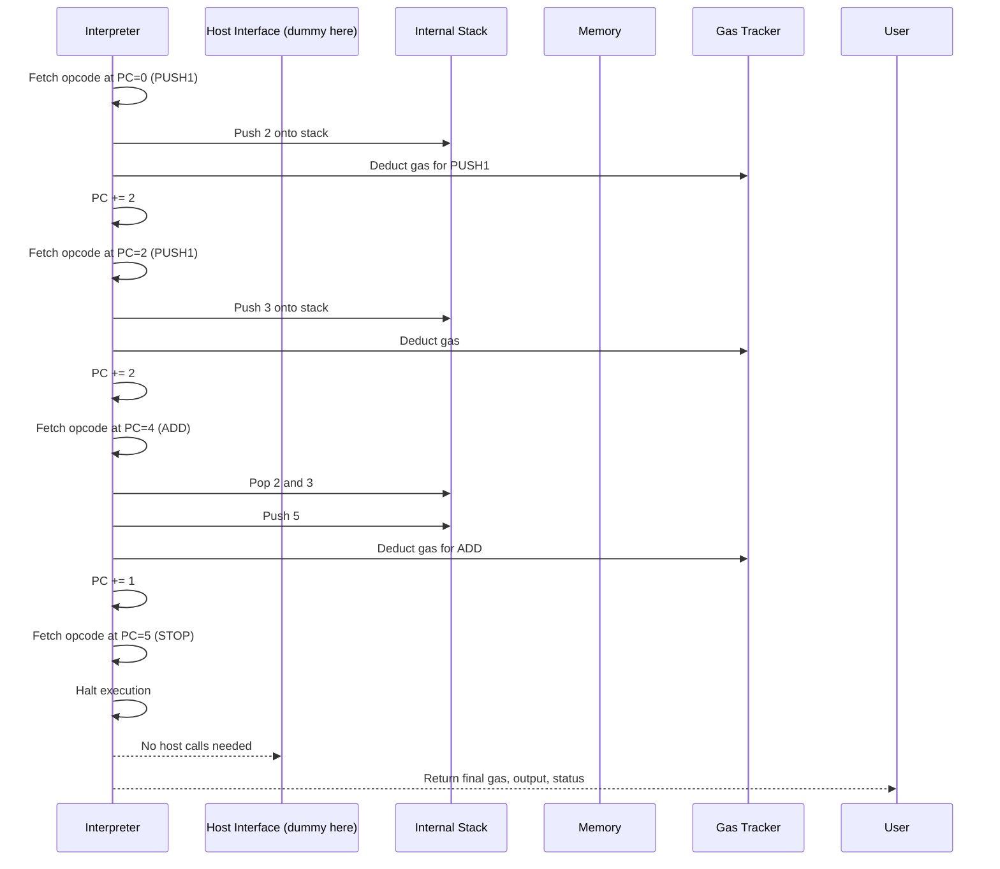

# Chapter 7: Interpreter

Welcome back! In the previous chapter, we explored [Precompiles](06_precompiles_.md) — those special native contracts that do heavy lifting like cryptography outside of the regular EVM bytecode. Now, let's dive into the heart of the `revm` project: the **Interpreter**.

---

## What is the Interpreter and Why Do We Need It?

Think of the **Interpreter** as the **engine** or the **virtual CPU** of the Ethereum Virtual Machine (EVM). Its job is to:

- **Read** smart contract bytecode instruction-by-instruction.
- **Execute** each instruction in the correct order.
- **Manage** the EVM stack, memory, and program counter (the pointer to the current instruction).
- Keep track of **gas** usage for each operation.
- Handle operations such as arithmetic, data loading, contract calls, and control flow (jumps, conditionals).
- Manage interactions with the **host** (the blockchain environment).
- Control when execution stops or returns results/errors.

Put simply: **the Interpreter makes your smart contract code come to life!**

---

## Central Use Case: Running a Simple Smart Contract Function

Imagine you deployed a smart contract with bytecode that just:

1. Pushes the number 2 onto the stack.
2. Pushes the number 3 onto the stack.
3. Adds these two numbers.
4. Stops execution and returns the result.

The Interpreter reads these instructions one by one and executes them:

- Stack after first instruction: [2]
- Stack after second instruction: [2, 3]
- After `ADD`: pops 3 and 2, pushes 5 → stack is now [5]
- `STOP` ends execution, output is 5

The Interpreter handles all of this automatically by interpreting the bytecode.

---

## Breaking Down the Interpreter: Key Concepts

Let's explore the core parts the Interpreter manages:

### 1. **Bytecode & Program Counter**

- The Interpreter holds the smart contract's bytecode.
- A **program counter (PC)** points to the current instruction's byte offset.
- After executing each instruction, PC moves forward (or jumps elsewhere for control flow).

### 2. **Stack**

- EVM uses a **stack machine**: operations push and pop values on an internal stack.
- Stack size is limited (max 1024 entries).
- Instructions consume (pop) some values and produce (push) new ones.

### 3. **Memory**

- Temporary memory for contracts during execution.
- Supports reading and writing 32-byte words.
- Memory can grow dynamically but costs gas (tracked by Gas).

### 4. **Gas Management**

- Every instruction consumes gas.
- Interpreter consults gas tracker to check if there's enough gas.
- Stops execution if gas runs out.

### 5. **Host Interaction**

- Some instructions (like `SLOAD` or `CALL`) need to interact with the blockchain state.
- Interpreter calls the **Host Interface** to perform these operations safely.

### 6. **Instruction Table**

- Interpreter uses a lookup table mapping opcode bytes to functions.
- Each instruction function implements the behavior of one opcode.

### 7. **Control Flags & Execution Flow**

- Handles stopping, reverting, errors.
- Can manage subroutine calls (`CALL`, `CREATE`).

---

## How to Use the Interpreter: A Simple Example

Here’s a beginner-friendly Rust snippet that creates an interpreter and runs simple bytecode.

```rust
use revm::interpreter::{Interpreter, instruction_table};
use bytecode::Bytecode;
use primitives::{Bytes, Address, U256};

fn main() {
    // Simple bytecode: PUSH1 2, PUSH1 3, ADD, STOP
    let code: Bytes = Bytes::from_static(&[0x60, 0x02, 0x60, 0x03, 0x01, 0x00]);

    // Wrap bytes into Bytecode (legacy format)
    let bytecode = Bytecode::new_legacy(code);

    // Initialize the interpreter
    let mut interpreter = Interpreter::new(
        revm::interpreter::SharedMemory::new(), // memory buffer
        revm::interpreter::ExtBytecode::new(bytecode),
        revm::interpreter::InputsImpl {
            target_address: Address::ZERO,
            caller_address: Address::ZERO,
            input: Bytes::new(),
            call_value: U256::ZERO,
        },
        false,          // is_static
        false,          // is_eof_init
        revm::primitives::hardfork::SpecId::LATEST,
        1_000_000,      // gas limit
    );

    // Prepare instruction table
    let instr_table = instruction_table::<revm::interpreter::EthInterpreter, _>();

    // Run interpreter until halt
    let result = interpreter.run_plain(&instr_table, &mut revm::interpreter::DummyHost);

    // Output gas used and the top stack value (5 expected)
    println!("Gas left: {}", result.gas.remaining());
    println!("Execution result success: {}", result.is_ok());
    // Note: output bytes are empty here since no RETURN opcode
}
```

**What happens here?**

- We provide some bytecode pushing `2` and `3`, adds them, and stops.
- Create the Interpreter instance.
- Run it with the instruction table (which has all opcode implementations).
- Finally print gas left and execution success.

---

## What Happens Inside the Interpreter? Step-by-Step

Let's visualize what happens during execution of this bytecode:



### Explanation:

- The Interpreter reads each opcode sequentially.
- Executes the corresponding instruction function.
- Manages stack and gas accordingly.
- Stops when it reads a `STOP` (or other halting instruction).

---

## Diving Deeper: How Does the Interpreter Implement Each Opcode?

The `revm` interpreter uses an **instruction table** — an array indexed by opcode numbers — where each entry points to the function handling that opcode.

Here is a small simplified example from `crates/interpreter/src/instructions.rs`:

```rust
pub type Instruction<W, H> = for<'a> fn(&'a mut Interpreter<W>, &'a mut H);

// Instruction function for ADD opcode (0x01)
fn add<W: InterpreterTypes, H: Host + ?Sized>(
    interp: &mut Interpreter<W>,
    _host: &mut H,
) {
    // Pop two values from stack
    let a = interp.stack.pop().expect("stack underflow");
    let b = interp.stack.pop().expect("stack underflow");

    // Add and push result
    interp.stack.push(a + b);

    // Deduct gas (simplified)
    interp.control.gas_mut().record_cost(3);
}

// The instruction table filling example
let mut table = [control::unknown as Instruction<W, H>; 256];
table[0x01] = add;
```

- Each instruction function receives a mutable interpreter and host.
- Executes the opcode logic (stack ops, memory, host calls).
- Updates gas.
- Updates program counter implicitly by the interpreter’s run loop.

This approach makes the interpreter **fast and modular**.

---

## How Does the Interpreter Handle Control Flow?

Some instructions alter the program counter directly:

- `JUMP` sets PC to a new location learned from stack.
- `JUMPI` conditionally jumps.
- `CALL` and `CREATE` trigger sub-interpreters for nested contract calls.

Here is a very tiny look at `JUMP` instruction handler simplified:

```rust
fn jump<W: InterpreterTypes, H: Host + ?Sized>(interp: &mut Interpreter<W>, _host: &mut H) {
    let dest = interp.stack.pop().expect("stack underflow");
    let dest_usize = dest.as_usize();

    // Check if jumpdest is valid (jump table)
    if !interp.bytecode.legacy_jump_table().map_or(false, |table| table[dest_usize]) {
        interp.control.set_next_action(
            InterpreterAction::Return {
                result: InstructionResult::InvalidJump,
                output: Bytes::new(),
                gas: interp.control.gas().clone(),
            },
            InstructionResult::InvalidJump,
        );
        return;
    }

    // Move PC to jump destination
    interp.bytecode.set_pc(dest_usize);
}
```

This shows how the interpreter validates jump destinations and moves the PC accordingly.

---

## Summary

In this chapter, you learned:

- **What the Interpreter is:**  
  It's the virtual CPU of the EVM that reads, decodes, and executes smart contract bytecode.

- **Key responsibilities:**  
  Managing the stack, memory, gas, program counter, executing instructions step by step.

- **Core components:**  
  Bytecode with program counter, stack, memory, gas management, host interface, instruction lookup table.

- **How to use it:**  
  Create an interpreter instance with bytecode, then run it using the instruction table.

- **Internal workings:**  
  The interpreter fetches opcodes sequentially, executes their handlers, manages flow and gas, and halts on `STOP` or error.

- **Control flow handled via jumps and calls with validation.**

The Interpreter is the beating heart of `revm` that brings smart contract code execution to reality!

---

Next up, we will explore how the EVM uses this Interpreter when managing **frames and call handling** — how contracts call each other and manage execution contexts. Let’s continue with [Chapter 8: Frame & Call Handling](08_frame___call_handling_.md).

---

Thank you for following along! You’re now equipped with a solid understanding of how the EVM executes smart contracts step-by-step using the Interpreter. Keep exploring!

---

Generated by [AI Codebase Knowledge Builder](https://github.com/The-Pocket/Tutorial-Codebase-Knowledge)