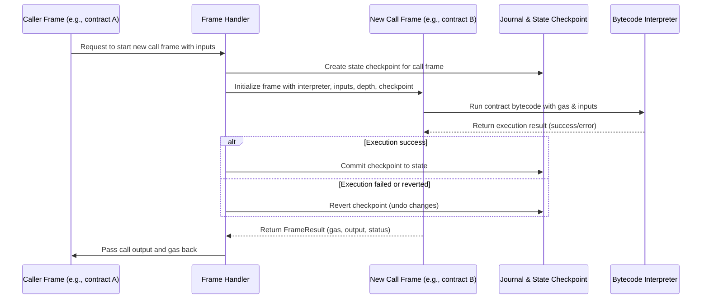

# Chapter 8: Frame & Call Handling

Welcome back! In the previous chapter, [Interpreter](07_interpreter_.md), we learned how the EVM reads and executes smart contract bytecode step-by-step. Now, we're going one level *above* the interpreter to understand **how the EVM manages multiple nested calls and contract creations during execution**.

This chapter covers the important concept of **Frames & Call Handling** — the way `revm` organizes execution contexts, manages nested calls, tracks local states, and returns results smoothly.

---

## Why Do We Need Frames & Call Handling?

Imagine you're watching a TV series where characters frequently call each other on the phone. Each conversation is a **call**. Some calls may involve another call inside them (like a conference call), and each call has its own context: who's talking, what was said before, what will happen next.

In the EVM:

- Smart contracts *call* other contracts.
- Contracts *create* new contracts.
- Calls can be nested many layers deep.
- Each call has its own execution environment — stack, memory, gas limits.
- We need to keep track of these **execution contexts** so that when a nested call finishes, its result comes back correctly to the original caller.
- We must manage gas usage, state changes, and errors per call.
- Sometimes calls revert, and we need to revert state changes only in that sub-call.

This is the job of **Frames & Call Handling**. They act like **"context managers"** that keep track of:

- The current executing contract (frame).
- Parent and child execution frames (call stack).
- Memory and gas per call.
- Checkpoints for safe state reverting.
- Propagating results back up after calls.

---

## A Central Use Case: A Contract Calls Another Contract

Suppose contract A calls contract B:

- Contract A starts executing (Frame A).
- It runs an instruction `CALL` to contract B.
- Frame B is created, executing contract B’s code with its own gas and memory.
- Contract B finishes and returns some data.
- Frame B ends, popping from the call stack and letting Frame A resume.
- Contract A uses the result and continues execution.

During this process, we want to:

- Manage separate `Gas` for contract B’s execution.
- Track state changes in Frame B, but only commit them if B succeeds. If B reverts, revert those changes without affecting A.
- Pass the output data of Frame B back to Frame A.

How does `revm` handle this? Through a combination of **frames**, **call stacks**, and **state checkpointing**.

---

## Key Concepts of Frame & Call Handling

Let's break this complex idea into simple pieces:

### 1. **Frame**

- A **frame** is an execution context for a single call or contract creation.
- It includes:
  - The contract code being run.
  - Memory and stack for this execution.
  - Gas allocated for this call.
  - State checkpoint for rollback.
  - Information about call depth.
  - Input data and values transferred.

### 2. **Call Stack**

- The call stack tracks **all active frames**, like a stack of trays in a kitchen.
- When a new call or creation happens, a new frame is *pushed* onto the stack.
- When the call finishes, that frame is *popped* off.
- The stack limit prevents too deep nesting (usually max 1024 calls).

### 3. **Checkpointing**

- Before starting a new call frame, revm creates a **checkpoint** of the blockchain state using "journaling".
- If the call succeeds, the checkpoint is **committed**, making changes permanent.
- If the call reverts, the checkpoint is **reverted**, undoing all changes during that call.

### 4. **Call Inputs and Outputs**

- **Inputs** include:
  - Target address
  - Caller address
  - Input calldata
  - Gas allocated for this call
  - Transfer value (ETH)
  - Call scheme (CALL, DELEGATECALL, CREATE, etc.)

- **Outputs** include:
  - Result (success, revert, or error)
  - Gas remaining
  - Output data (return or revert data)
  - Any created address (for creations)

### 5. **Frame Data and Frame Result**

- Frames carry internal data: like return memory range (for calls) or created address (for creations).
- When execution ends, frames produce a **frame result** which wraps the outputs in a uniform way.

---

## How to Use Frames & Call Handling in `revm`

Let's look at a beginner-friendly example simulating a simple call frame creation and running it.

### Step 1: Define Inputs for a Call

```rust
use revm::interpreter::{CallInputs, CallScheme, CallValue};
use primitives::{Address, Bytes, U256};

let target_address = "0x0000000000000000000000000000000000000001".parse().unwrap();
let caller_address = "0x0000000000000000000000000000000000000002".parse().unwrap();

let call_inputs = CallInputs {
    target_address,
    caller: caller_address,
    input: Bytes::from_static(b"hello"),  // input data to the call
    value: CallValue::Transfer(U256::zero()), // no ETH transferred
    gas_limit: 1_000_000,
    scheme: CallScheme::Call,
    is_static: false,
    ..Default::default()
};
```

*Here we prepare all the parameters needed to make a call frame.*

### Step 2: Create a Call Frame

```rust
use revm::handler::EthFrame;
use revm::interpreter::SharedMemory;

let mut evm = /* create and initialize your EVM runtime with context and precompiles */;
let depth = 0;
let memory = SharedMemory::new();

let result = EthFrame::make_call_frame(&mut evm, depth, memory, Box::new(call_inputs));

match result {
    Ok(revm::handler::ItemOrResult::Item(frame)) => {
        println!("Successfully created call frame at depth {}", depth);
        // You can now run the frame interpreter (see next step)
    }
    Ok(revm::handler::ItemOrResult::Result(res)) => {
        println!("Call failed immediately with result: {:?}", res.instruction_result());
    }
    Err(e) => {
        println!("Failed to create call frame: {:?}", e);
    }
}
```

*This attempts to create a call frame with the given inputs. If call stack depth exceeds limit or funds are insufficient, it returns error.*

### Step 3: Running the Frame

You would then run the `Interpreter` associated with this frame, which runs contract B’s code step by step as explained in [Chapter 7: Interpreter](07_interpreter_.md).

When the frame execution is complete, you get a `FrameResult`, which you can then process to:

- Commit or revert the state checkpoint.
- Return gas and output to the caller.
- Pop the frame from the call stack.

---

## What Happens Internally? Step-by-Step Call Frame Flow



### Explanation:

- Each new call creates a **frame** with isolated execution environment.
- A **checkpoint** snapshot of state is used to manage changes safely.
- The `Interpreter` runs the code inside the frame.
- On success, changes are committed; on revert, all changes are undone.
- The outcome (success/fail, gas, output data) propagates back up through the call stack.

---

## Peeking Under the Hood: How Frame Handling Is Implemented

### The Frame Trait & `EthFrame` Struct

In `crates/handler/src/frame.rs`, the core `Frame` trait defines operations for frames like initializing, running, and returning results:

```rust
pub trait Frame: Sized {
    type Evm;
    type FrameInit;
    type FrameResult;
    type Error;

    fn init_first(evm: &mut Self::Evm, frame_input: Self::FrameInit)
        -> Result<FrameOrResult<Self>, Self::Error>;

    fn run(&mut self, evm: &mut Self::Evm) -> Result<FrameInitOrResult<Self>, Self::Error>;

    fn return_result(&mut self, evm: &mut Self::Evm, result: Self::FrameResult)
        -> Result<(), Self::Error>;
}
```

- `init_first`: creates the first frame.
- `run`: runs the frame (runs the interpreter until stop).
- `return_result`: handles returning the frame's output to the caller.

The concrete implementation for Ethereum is in `EthFrame`, which holds:

- Frame data (`CallFrame`, `CreateFrame`, etc.)
- Input parameters
- The interpreter instance for executing code
- Checkpoint from the journal for state rollback

### Using Checkpoints

The journal (see [Chapter 1: Context & Environment](01_context___environment_.md)) supports **checkpoints**:

- When a frame starts, a checkpoint is saved.
- If the frame finishes successfully, checkpoint commits.
- Otherwise, checkpoint reverts changes.

Simple example of checkpoint usage:

```rust
let checkpoint = context.journal().checkpoint();

// Execute something
let result = interpreter.run();

if result.is_success() {
    context.journal().checkpoint_commit();
} else {
    context.journal().checkpoint_revert(checkpoint);
}
```

### Call Depth & Limits

Frames track `depth`, which is checked to ensure call stacks do not grow beyond allowed limits (`CALL_STACK_LIMIT`). Exceeding the limit immediately fails the call.

### Returning Results to Caller

Return data and gas are carefully passed back to the caller frame so it can continue execution, pushing return values to the stack and refunding unused gas.

---

## Summary

In this chapter, you learned:

- **What are frames?**  
  Execution contexts for single calls or contract creations, encapsulating interpreter state, gas, memory, and checkpoints.

- **Why are frames important?**  
  They let `revm` support nested contract calls safely with proper state management and gas tracking.

- **How the call stack works:**  
  Frames are pushed on calls and popped on returns. Depth limits prevent abuse.

- **Checkpointing state:**  
  Frames create snapshots of the state before execution, allowing revert on call failure and commit on success.

- **How inputs and outputs flow:**  
  Calls supply gas, input data, value, and get back gas remaining and return data.

- **Basic API usage to create and run frames:**

```rust
EthFrame::make_call_frame(...) -> Result<ItemOrResult<EthFrame>, Error>
// run interpreter and process result
```

- **Internal flow:**  
  The handler calls frame initialization, then runs the interpreter inside frames, manages state with checkpoints, and correctly returns results.

This layered approach cleanly separates execution of nested calls, making it easy to understand, manage, and debug complex contract interactions!

---

Next, we'll learn how the **Handler & Execution Loop** uses frames to manage the entire EVM call stack and keep your contracts running smoothly. Head over to [Chapter 9: Handler & Execution Loop](09_handler___execution_loop_.md) to continue the journey!

---

Thank you for following along! Frames and call handling are the backbone of smart contract execution, enabling nested calls and safe context switching inside the EVM. You're doing fantastic—keep going!

---

Generated by [AI Codebase Knowledge Builder](https://github.com/The-Pocket/Tutorial-Codebase-Knowledge)