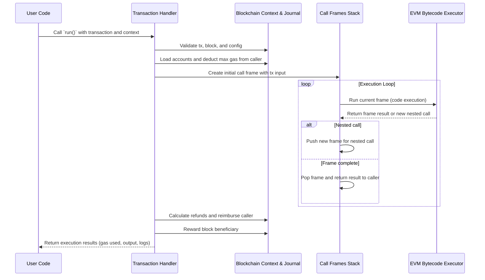

# Chapter 9: Handler & Execution Loop

Welcome back! In the previous chapter, [Frame & Call Handling](08_frame___call_handling_.md), we learned how the EVM manages individual execution contexts called **frames** to run nested calls and contract creations safely. Now, we’re going to zoom out and look at the **Handler & Execution Loop** — the high-level controller that orchestrates the full lifecycle of a transaction inside `revm`.

---

## Why Do We Need a Handler & Execution Loop?

Imagine you're the director of a busy kitchen during dinner rush. Your job is to:

- Check if all the ingredients are ready (validation),
- Deduct ingredients when cooking starts (pre-processing),
- Tell the chefs (interpreters) exactly what to cook step-by-step (execution),
- Keep track of time and materials used,
- Handle refunds if some dishes get canceled,
- Reward the waiters or cleaners (post-processing),
- And make sure everything finishes smoothly.

Similarly, the **Handler** in `revm` acts as the **EVM’s transaction controller**. It:

- Orchestrates **validation** of transactions and environment,
- Performs **pre-execution setup** like loading accounts and deducting gas upfront,
- Manages the **execution loop** by creating and running frames,
- Handles **post-execution tasks** like gas refunds, rewards, and finalizing state,
- Wraps all this with error handling to keep the system robust.

Simply put, if you think of the EVM as a factory, the **Handler is the factory manager**, keeping everything running from start to finish for a transaction.

---

## Central Use Case: Executing a Simple Transaction

Suppose someone sends a transaction calling a smart contract to transfer tokens:

1. The Handler first **validates** the transaction against the current blockchain state (e.g., does the sender have enough balance? Is the nonce correct?).
2. It then **loads accounts** involved and deducts gas fees up front.
3. It **creates the first call frame** representing this call and starts running it.
4. If during execution, the contract calls another contract, the Handler manages those nested frames.
5. When execution completes or fails, the Handler:
   - Calculates **final gas refunds**,
   - Gives **unused gas back to the sender**,
   - Transfers fees to the block beneficiary,
   - Collects **logs** and final output,
   - And **cleans up** internal resources.

Let's learn how the Handler achieves all this step-by-step!

---

## Breaking Down the Handler & Execution Loop

To understand how the Handler works, let's look at the key concepts and phases in order.

### 1. Validation

Before execution begins, the Handler checks:

- Is the transaction properly structured?
- Is the gas limit within the block’s gas limits?
- Does the caller have enough balance to cover gas and value transfers?
- Is the nonce correct (to prevent replay attacks)?
- Are things like chain ID and config compatible?

This step prevents invalid transactions from even starting.

### 2. Pre-Execution

Here the Handler:

- Loads the **beneficiary** account (miner/coinbase),
- Loads all **accounts/storage** in the access list to warm them for faster access,
- Deducts the **maximum gas cost** upfront from the caller's balance to avoid double spending,
- Applies any protocol-specific preparations (like EIP-7702 authorization lists).

### 3. Execution Loop

This is the heart of the Handler:

- It creates the **initial call frame** based on the transaction input.
- It runs the **execution loop**, which:
  - Repeatedly executes frames using nested calls.
  - Manages creation and completion of each frame.
  - Handles results, propagates output and gas back to callers.
- Uses a **frame stack** to handle nested calls safely (see [Chapter 8](08_frame___call_handling_.md)).

### 4. Post-Execution

After execution finishes (successfully or not):

- Calculates **gas refunds** and applies limits (EIP-7623 ensures minimal gas spent).
- Returns unused gas value to the caller.
- Sends fees to the beneficiary (miner).
- Finalizes logs and state changes.
- Clears internal buffers and prepares for next transaction.

### 5. Error Handling

If anything goes wrong anywhere:

- The Handler cleans up intermediate state.
- Reverts journals where needed.
- Returns proper error info.
- Ensures the environment is ready for the next transaction.

---

## How to Use the Handler: A Beginner-Friendly Walkthrough

Let’s simulate what it looks like to run a transaction with a Handler.

```rust
// Assume you have an EVM `evm` instance properly initialized.

struct MyHandler;

impl revm::handler::Handler for MyHandler {
    type Evm = /* Your EVM type */;
    type Error = /* Your Error type */;
    type Frame = /* Frame type, e.g., EthFrame */;
    type HaltReason = /* Halt reason type, e.g., HaltReason */;

    // Implement required trait methods here. For beginner use,
    // you can call the default implementations or simple wrappers.
}

let mut handler = MyHandler;

// Run the transaction via the handler with 'evm'
match handler.run(&mut evm) {
    Ok(result_and_state) => {
        println!("Execution success! Gas used: {}", result_and_state.result.gas_used());
        println!("Output data: {:?}", result_and_state.result.output());
    }
    Err(e) => {
        println!("Execution failed with error: {:?}", e);
    }
}
```

> **What happens here?**  
> - The Handler takes your `evm` instance (which contains Context, Interpreter, Precompiles, etc.).  
> - It automatically goes through validation, pre-execution, execution loop, and post-execution.  
> - You get a final result telling if the transaction succeeded, how much gas was used, and the contract output.  
> - If any error occurs, the Handler reports it properly.

---

## Internal Handler & Execution Loop: What Happens Step-by-Step?

Let’s picture internally how the Handler processes a transaction.



### Brief explanation:

- The Handler serves as the conductor, coordinating each step carefully.
- Context keeps track of blockchain and transaction state, managing accounts, balances, and journaling.
- The frame stack manages each call or contract creation, allowing nesting and proper gas tracking.
- The Interpreter runs the actual smart contract code instructions.
- The loop continues until no more frames are left (execution done).
- After execution, fees and refunds are finalized and rewards paid out.
- The final status and output are returned to the user.

---

## Peek Under the Hood: Core Handler Code Highlights

### The Run Method (Simplified)

This is the entry point to the Handler (from `crates/handler/src/handler.rs`):

```rust
fn run(
    &mut self,
    evm: &mut Self::Evm,
) -> Result<ResultAndState<Self::HaltReason>, Self::Error> {
    // Step 1: Validate the transaction environment
    let init_and_floor_gas = self.validate(evm)?;

    // Step 2: Pre-execution setup, loading accounts and deducting gas
    let eip7702_refund = self.pre_execution(evm)?;

    // Step 3: Execute the transaction
    let exec_result = self.execution(evm, &init_and_floor_gas)?;

    // Step 4: Post-execution tasks: refunds, reimbursements, rewards
    self.post_execution(evm, exec_result, init_and_floor_gas, eip7702_refund)
}
```

Each of these steps calls further internal functions that perform tasks described earlier.

### The Execution Loop

The `execution` method runs the main loop:

```rust
fn execution(
    &mut self,
    evm: &mut Self::Evm,
    init_and_floor_gas: &InitialAndFloorGas,
) -> Result<FrameResult, Self::Error> {
    let gas_limit = evm.ctx().tx().gas_limit() - init_and_floor_gas.initial_gas;

    // Create the first frame representing the transaction call
    let first_frame_input = self.first_frame_input(evm, gas_limit)?;
    let first_frame = self.first_frame_init(evm, first_frame_input)?;

    // Either start with a frame or have immediate result (like out of gas)
    let mut frame_result = match first_frame {
        ItemOrResult::Item(frame) => self.run_exec_loop(evm, frame)?,
        ItemOrResult::Result(result) => result,
    };

    // Process the last frame's result (manage gas, etc.)
    self.last_frame_result(evm, &mut frame_result)?;
    Ok(frame_result)
}
```

### The Frame Stack Loop (Simplified)

The `run_exec_loop` method holds the frame stack loop:

```rust
fn run_exec_loop(
    &mut self,
    evm: &mut Self::Evm,
    frame: Self::Frame,
) -> Result<FrameResult, Self::Error> {
    let mut frame_stack = vec![frame];

    loop {
        let current_frame = frame_stack.last_mut().unwrap();
        let call_or_result = self.frame_call(current_frame, evm)?;

        let result = match call_or_result {
            ItemOrResult::Item(new_frame_input) => {
                // Create new nested frame and push it on the stack
                match self.frame_init(current_frame, evm, new_frame_input)? {
                    ItemOrResult::Item(new_frame) => {
                        frame_stack.push(new_frame);
                        continue;
                    }
                    ItemOrResult::Result(res) => res,
                }
            }
            ItemOrResult::Result(res) => {
                // Frame finished, pop from stack and handle result
                frame_stack.pop();
                res
            }
        };

        if let Some(parent_frame) = frame_stack.last_mut() {
            // Send result back to parent frame
            self.frame_return_result(parent_frame, evm, result)?;
        } else {
            // No more frames, execution complete
            return Ok(result);
        }
    }
}
```

---

## Summary

In this chapter, you learned:

- **What is the Handler & Execution Loop?**  
  The high-level controller that manages the full lifecycle of a transaction inside the EVM runtime.

- **Why it’s important?**  
  It ensures transactions are validated, accounts are prepared, code executes correctly with nested calls, and gas fees/refunds are managed safely.

- **Key phases of the handler:**  
  Validation → Pre-execution → Execution loop → Post-execution → Error handling.

- **How the execution loop works:**  
  Creates call frames and manages a stack to handle nested calls and contract creations.

- **How to use the Handler:**  
  Call `handler.run(&mut evm)` to execute a transaction with everything managed automatically.

- **What happens internally:**  
  The handler verifies the transaction environment, preps accounts and gas, executes frames via the interpreter, processes nested calls, and finalizes results, refunds, and fees.

---

## What’s Next?

With the Handler & Execution Loop mastered, you're ready to explore how `revm` provides **Inspector & Tracing** capabilities, letting you debug, profile, and analyze EVM execution in detail:

Check out [Chapter 10: Inspector & Tracing](10_inspector___tracing_.md) to continue your learning journey!

---

Thank you for following this chapter! Understanding the Handler gives you a complete picture of how revm manages transactions from start to finish, tying everything together into a robust and flexible Ethereum Virtual Machine runtime. Keep it up!

---

Generated by [AI Codebase Knowledge Builder](https://github.com/The-Pocket/Tutorial-Codebase-Knowledge)