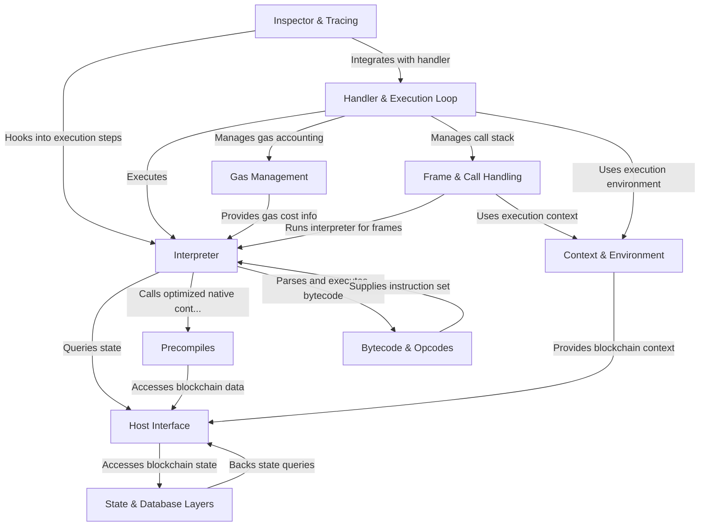

# Tutorial: revm

This project implements a full Ethereum Virtual Machine (EVM) environment with **modular abstractions** for executing and managing *smart contract* code.  
It includes an **Interpreter** that processes EVM bytecode step-by-step, a **Host Interface** that connects the EVM to blockchain state and external data,  
and **Precompiles**, which are highly optimized native contracts for complex operations.  
The system also manages **Gas Usage** to meter resource consumption, maintains a persistent **State & Database Layer** for account and storage data,  
and orchestrates **Frames & Call Handling** for nested contract executions.  
An **Execution Loop & Handler** coordinate transaction lifecycle from validation to finalization, while an **Inspector & Tracing** abstraction enables debugging and profiling.  
Finally, the **Context & Environment** encapsulate blockchain and transaction data, providing configuration and execution context throughout the EVM lifecycle.

**Source Repository:** [None](None)

## Chapters

1. [Context & Environment
](01_context___environment_.md)
2. [Host Interface
](02_host_interface_.md)
3. [State & Database Layers
](03_state___database_layers_.md)
4. [Gas Management
](04_gas_management_.md)
5. [Bytecode & Opcodes
](05_bytecode___opcodes_.md)
6. [Precompiles
](06_precompiles_.md)
7. [Interpreter
](07_interpreter_.md)
8. [Frame & Call Handling
](08_frame___call_handling_.md)
9. [Handler & Execution Loop
](09_handler___execution_loop_.md)
10. [Inspector & Tracing
](10_inspector___tracing_.md)

---

Generated by [AI Codebase Knowledge Builder](https://github.com/The-Pocket/Tutorial-Codebase-Knowledge)