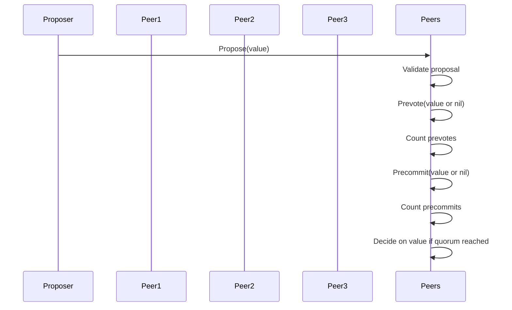

# Chapter 1: Core Tendermint Consensus Algorithm

Welcome to the first chapter of the Malachite tutorial! Here, we will dive into the **Core Tendermint Consensus Algorithm**, the powerful foundation that allows Malachite to help many peers agree on the same data, even when some of them misbehave or fail.

---

## Why Do We Need Consensus?

Imagine a group of friends trying to tell the same story. Each friend listens carefully and suggests changes or additions, but a few friends might lie or forget parts. How do they make sure everyone ends up agreeing on the exact same story?

This is the essence of what a **consensus algorithm** solves in decentralized applications. It lets a network of different computers (we call them **processes** or **peers**) agree on one version of data, such as the next block to add to a blockchain.

Malachite uses the **Tendermint consensus algorithm**, which guarantees that:

- All **correct** (well-behaving) peers agree on the same value.
- The system works as long as less than a third of peers are faulty or malicious (the *Byzantine Fault Tolerance* property).
- Decisions are made step-by-step, with careful voting and communication.

---

## The Core Idea of Tendermint Consensus

Tendermint organizes the consensus process by separating agreement into **heights** and **rounds**:

- **Height:** Think of this as the position in the blockchain (e.g., "block #5").
- **Rounds:** Multiple tries within the same height to agree on a block, like rounds of voting.

Within each round, peers go through three **steps**:

1. **Propose:** One peer, called the **proposer**, suggests a value (a block or story update).
2. **Prevote:** All peers vote whether they think the proposed value is valid or not.
3. **Precommit:** Based on the prevotes, peers decide whether to lock in their vote and move towards committing the value.

This structure is somewhat like a meeting:

- The leader proposes an idea.
- Everyone votes if they think the idea is good.
- If enough people agree, they commit to the decision.

If consensus isn’t reached in one round (maybe the proposer was faulty or network delays happened), the algorithm moves to the next round with a new proposer, trying again.

---

## Key Concepts Explained

Let's explore these pieces bit by bit.

### 1. **Heights**

Each height corresponds to a single "slot" in the sequence where a new value (like a block) will be decided.

- Height 0 is the first block.
- Height 1 is the second block.
- And so on...

Every height runs its own consensus, starting fresh. Once a value is **decided** for a height, the system moves to the next height.

### 2. **Rounds**

For a given height, the peers attempt to decide on a value through several rounds.

- Round 0 is the first attempt.
- Round 1, 2, 3, ... are retries if the earlier rounds fail.

Each round has a proposer (selected deterministically), and their proposal is put forward to the network.

### 3. **Proposer**

Who suggests values? Each round has one proposer.

- Think of a rotating chairperson who takes turns suggesting values.
- The proposer selection is deterministic: all peers agree on who the proposer is.
- The proposer proposes a value they believe should be decided.

### 4. **Votes: Prevote and Precommit**

Voting happens in two steps.

- **Prevote:** Peers vote *yes* (for the value) or *nil* (no value) based on the proposer’s suggestion and what they "trust."
- **Precommit:** After gathering enough prevotes, peers cast precommit votes to lock in their decision.

Only if enough **precommit** votes are collected can the value be **decided**.

### 5. **Safety and Liveness Guarantees**

- **Safety:** The algorithm guarantees that two correct peers never decide differently.
- **Liveness:** Eventually, the network will decide on a value, assuming less than one-third of peers are faulty and network delays are not forever.

---

## How Tendermint Consensus Works Step-by-Step

Below is a simple sequence diagram illustrating how a round of consensus works in Tendermint:



**Explanation:**

1. The Proposer broadcasts a proposed value to all peers.
2. Each peer checks if the value looks valid.
3. Peers broadcast their prevotes.
4. After collecting enough prevotes, peers broadcast precommits.
5. When precommits reach a super-majority (more than 2/3), peers finalize and decide on the value.

If at any step there's not enough agreement, the peers will move to the next round with a new proposer.

---

## Using Tendermint in Malachite: A Beginner’s View

#### Input Example: Starting a new round

When Malachite begins to decide on a new height and round, it triggers:

```rust
StartRound(round_number);
```

This tells the local peer to:

- Identify the proposer for the round.
- If the local peer is the proposer, prepare a proposal by calling `getValue()` asynchronously (this might be a block your app creates).
- Broadcast the proposal to other peers.
- Otherwise, start a timeout waiting for the proposal.

#### Expected output: Consensus messages

Peers exchange messages such as:

- `PROPOSAL` containing the proposed value.
- `PREVOTE` and `PRECOMMIT` votes for values or `nil`.

When enough votes are collected, Malachite informs the application that a decision has been made:

```rust
Decide(value);
```

At this point, your application can commit the decided value (e.g., add the block to the chain).

---

## What Happens Under the Hood? (High-Level Walkthrough)

Here is an overview of the internal flow when consensus is in progress for a specific height and round:

```mermaid
sequenceDiagram
    participant Driver as Malachite Driver
    participant VoteKeeper as Vote Keeper
    participant StateMachine as Round State Machine
    participant Application

    Application->>Driver: StartRound(round)
    Driver->>Application: getValue() // Asks application for a proposal if proposer
    Application-->>Driver: proposed_value
    Driver->>StateMachine: Receive proposal
    StateMachine->>Driver: Broadcast PROPOSAL
    All Peers: Broadcast PREVOTE messages
    VoteKeeper->>StateMachine: Detect quorum of PREVOTES
    StateMachine->>Driver: Broadcast PRECOMMIT messages
    VoteKeeper->>StateMachine: Detect quorum of PRECOMMITS
    StateMachine->>Application: Decide(value)
```

**Explanation:**

1. The **Driver** runs the consensus logic per round.
2. If the peer is the proposer, the Driver asks the application to provide a new value.
3. The proposal is sent to peers and processed by the **Round State Machine**.
4. Peers broadcast and collect votes using the **Vote Keeper**.
5. Once enough votes are collected, the system decides on a value.
6. The application is notified to commit the decision.

---

## Peeking Into the Code

The Tendermint algorithm is rooted in the [pseudo-code specification](specs/consensus/pseudo-code.md). Here is a simplified Rust-like excerpt showing how a proposer sends a proposal:

```rust
fn start_round(round: usize, is_proposer: bool, valid_value: Option<Value>) {
    if is_proposer {
        let proposal = if let Some(value) = valid_value {
            value // Re-propose previously valid value
        } else {
            get_value().await // Ask application for new value
        };
        broadcast(ProposalMessage {
            height,
            round,
            value: proposal,
        });
    } else {
        schedule_propose_timeout(round);
    }
}
```

- If the peer is the proposer, it either re-proposes a known valid value or gets a new value.
- Then it broadcasts the proposal.
- Other peers start a timeout in case the proposer fails to send a proposal.

The state machine reacts to incoming proposals and votes, transitions between steps (propose, prevote, precommit), and tracks votes using the Vote Keeper.

---

## Summary

In this chapter, you learned about:

- The problem that Tendermint consensus solves: safe, reliable agreement despite faulty or malicious peers.
- The key structure of Tendermint: heights, rounds, and three-step voting (propose, prevote, precommit).
- How Tendermint ensures safety and liveness under a Byzantine failure model.
- How Malachite uses Tendermint internally and interacts with the application.
- The overall message flow and internal components involved in consensus.

With this understanding, you are ready to explore how Malachite formalizes and tests these consensus mechanisms in the next chapter about [Model-Based Testing and Formal Specifications](02_model_based_testing_and_formal_specifications_.md).

---

Happy exploring! 🚀

---

Generated by [AI Codebase Knowledge Builder](https://github.com/The-Pocket/Tutorial-Codebase-Knowledge)