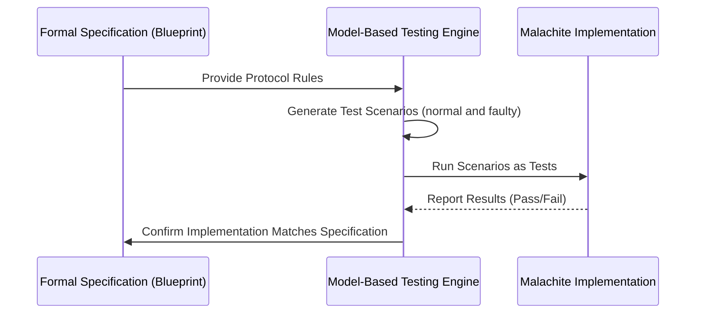

# Chapter 2: Model-Based Testing and Formal Specifications

Welcome back! In the previous chapter, we explored the [Core Tendermint Consensus Algorithm](01_core_tendermint_consensus_algorithm_.md) — the heartbeat of Malachite that helps network peers agree on the same data even when some misbehave.

Now, we’ll dive into something equally important: **how Malachite uses mathematical blueprints and tests to make sure everything works correctly**. This chapter introduces you to the concepts of **Model-Based Testing** and **Formal Specifications**.

---

## Why Do We Need Model-Based Testing and Formal Specifications?

Imagine you’re building a complex LEGO model — say, a castle. You have the instruction manual (blueprint) that guides you step-by-step. But what if the instructions had mistakes, or you accidentally skipped a step?

You want to **verify** the instructions are correct and that your model won't fall apart later, especially if you shake the table or take out a few pieces.

In Malachite, the **"building"** is the consensus system, which is complicated and distributed across many computers (nodes). To keep it reliable and safe, we:

- Write *formal specifications* — precise, mathematical descriptions of how the components should behave.
- Use *model-based testing* — automatically generating tests from these formal specs to check that the actual implementation follows the blueprint.

This approach helps verify not just normal behavior, but also how the system handles **misbehaving nodes or faults** — kind of like shaking the LEGO castle to ensure it doesn’t crumble.

---

## Key Concepts

Let's break down some important ideas:

### 1. **Formal Specifications**

Think of this as a very detailed, precise blueprint — but instead of pictures and words, it’s written in a formal mathematical language called **Quint** (and detailed English specs too).

- Specifies what each part *must* do.
- Covers how the system **should behave** step-by-step.
- Describes **correctness conditions** and also **misbehavior detection** (like catching cheaters).

### 2. **Model-Based Testing**

Imagine the blueprint and a LEGO model checker tool:

- It creates many possible scenarios (normal and faulty) from the formal specs.
- Runs these scenarios as tests against the real implementation.
- Checks if the implementation matches the blueprint in every case!

This helps spot bugs early, before deploying the system live, by **systematically exploring all interesting cases**.

### 3. **Consensus Protocol Verification**

Malachite doesn’t just specify the consensus algorithm (like Tendermint) informally.

- It models the entire behavior in **Quint**.
- Uses formal proofs and testing based on these models.
- Covers crucial properties like **safety**, **liveness**, and **handling failures**.

---

## How Malachite Uses These Concepts: A Simple Example

Let’s say we want to **test that Malachite never decides two different values at the same height — no matter what failures happen**.

### Step 1: Formal Specification (Blueprint)

Using Quint, we describe:

- The rules for proposing values, voting, and deciding.
- What it means for a node to misbehave.
- The exact conditions for safety and agreement.

### Step 2: Generating Test Scenarios

The model-based tester:

- Produces many different sequences of events: proposals, votes, delays, and faults.
- Simulates honest and faulty nodes.
- Checks if the safety property — "no two nodes decide differently" — always holds.

### Step 3: Running Tests on Implementation

- Each test scenario is run against the real Malachite core consensus code.
- If any test shows disagreement, Malachite can detect and report it.
- Otherwise, confidence grows that the system is correct.

---

## A Beginner-Friendly Look Into The Process



**Explanation:**

1. We start with a formal, mathematical description of the consensus rules.
2. Model-based testing engine generates many possible sequences of network events from the specification.
3. These scenarios run like “scripts” against the real Malachite code.
4. The implementation reports whether it behaves according to the rules.
5. If all tests pass, the implementation is verified for those scenarios; if not, the bugs are uncovered.

---

## Peek Under the Hood: How Does Malachite Specify Consensus?

Malachite’s consensus algorithm is specified in files like:

- `specs/consensus/quint/consensus.qnt`
- `specs/consensus/quint/statemachineAsync.qnt`
- `specs/consensus/misbehavior.md`

### What Do These Files Contain?

- **Functional layer:** The actual algorithm logic (proposals, votes, state transitions) written in Quint.
- **State machine:** Captures the consensus node behavior in a distributed setting.
- **Misbehavior detection:** Defines how to spot nodes violating rules.
- **Tests/runs:** Example traces that test interesting or tricky scenarios.

---

### An Example Snippet in Quint (Simplified)

```quint
type VoteType = Prevote | Precommit

type Vote = {
    voteType: VoteType,
    srcAddress: Address,
    height: Height,
    round: Round,
    valueId: ValueId,
}

state votes: Set[Vote]

function countVotes(vType: VoteType, h: Height, r: Round, vId: ValueId): Nat =
    votes.filter(v => v.voteType == vType && v.height == h && v.round == r && v.valueId == vId).size
```

*This tiny example defines a vote and a way to count votes of a certain type for a round.*

---

### What Happens When We Run Model-Based Tests?

1. The **Quint specification** simulates sending proposals, prevotes, and precommits by nodes.
2. It **records votes and decisions** at every step.
3. Checks if **invariants hold**, e.g., no conflicting decisions.
4. Generates **random scenarios including node failures and message delays**.
5. If a scenario violates safety, the test fails and we get a trace (a story of what happened) that helps fix the code.

---

## How Does This Help You as a Malachite User or Developer?

- You get strong **guarantees** that the core engine can tolerate faults.
- The formal specs provide a **clear understanding** of assumptions and behaviors.
- Model-based tests help ensure **bugs are caught early**, improving reliability.
- It gives peace of mind that Malachite’s complex consensus logic has been **thoroughly checked mathematically and practically**.

---

## Summary

In this chapter, you learned:

- What **Model-Based Testing** and **Formal Specifications** are, and why they matter.
- How Malachite uses **Quint** to write precise blueprints for the consensus algorithm.
- How model-based testing automatically generates tests to verify the implementation against the specification.
- Why this approach ensures Malachite is robust even when peers misbehave or failures happen.
- The relation of these formal methods to the actual Malachite code and testing framework.

---

Up next, we will explore the internal building blocks of Malachite’s consensus core libraries in the [Consensus Core Library (Driver, VoteKeeper, Round State Machine)](03_consensus_core_library__driver__votekeeper__round_state_machine__.md).

---

Happy learning! Keep building on solid ground! 🏗️💡

---

Generated by [AI Codebase Knowledge Builder](https://github.com/The-Pocket/Tutorial-Codebase-Knowledge)