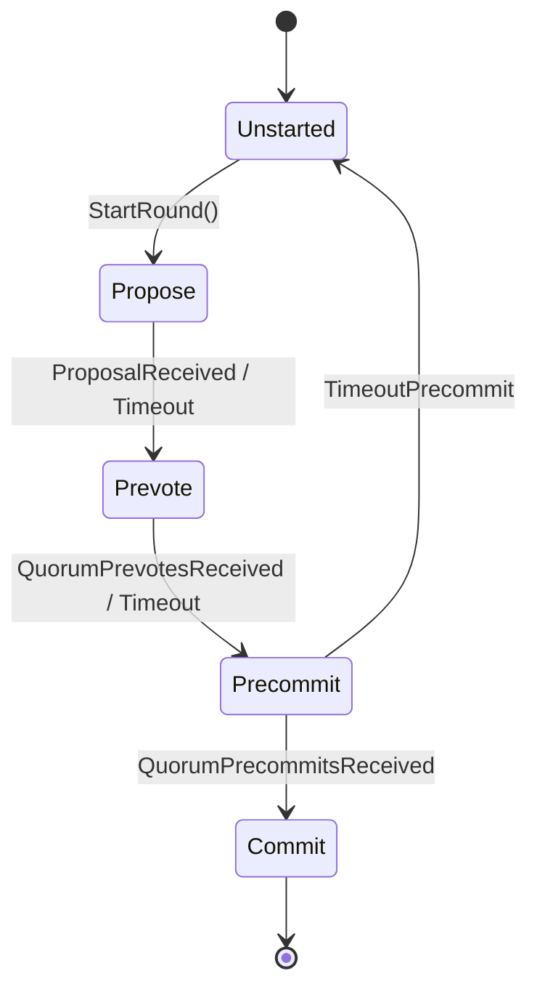
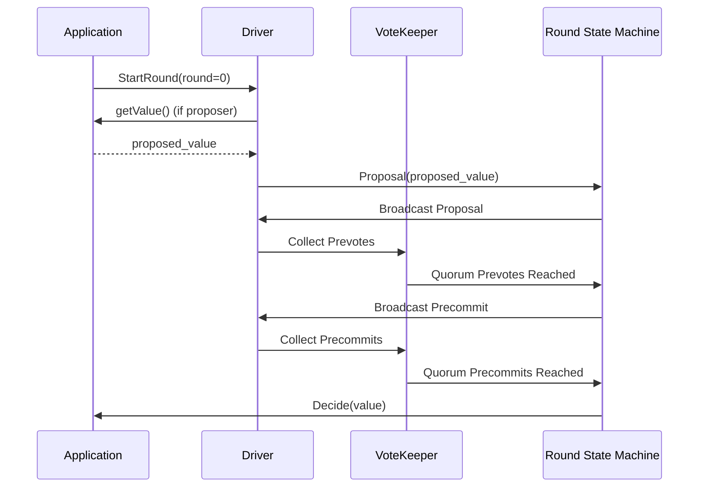
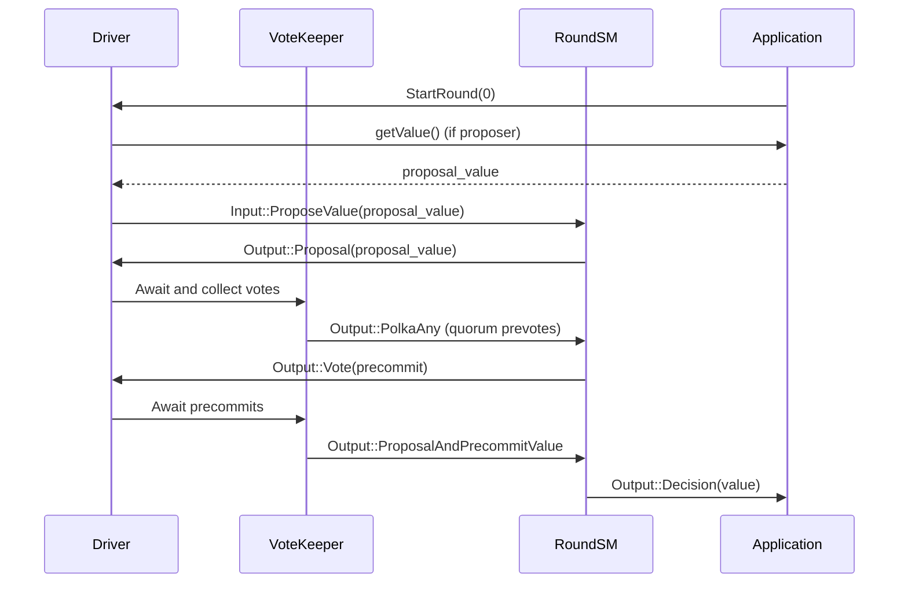

# Chapter 3: Consensus Core Library (Driver, VoteKeeper, Round State Machine)

Welcome back! In the previous chapter, we explored how Malachite uses [Model-Based Testing and Formal Specifications](02_model_based_testing_and_formal_specifications_.md) to ensure the consensus algorithm works correctly and reliably.

In this chapter, we'll take a close look at the **Consensus Core Library** — the heart of Malachite’s consensus logic. This library contains the "brains" that make the consensus algorithm actually work, without worrying about the outside world like network communication or storing data.

---

## Why Do We Need the Consensus Core Library?

Imagine you have a group of friends (peers) trying to agree on the same story (a value, like the next block in a blockchain). You don’t want this group to get confused or argue endlessly, especially if some friends might be confused or even trying to mislead.

Malachite’s **Consensus Core Library** is like the rulebook and referee for this group. It:

- Tracks **votes** from all friends (peers).
- Manages the **rounds of discussion and voting**.
- Decides when enough friends agree on a story to finalize it.

Best of all, it does this purely logically, without networking or storage; those parts happen outside in the application. This split allows the library to be very clean, flexible, and easy to understand and test.

---

## What Are the Main Pieces of This Library?

The Consensus Core Library in Malachite is built around **three main components**:

1. **Driver**  
   Acts as the orchestra conductor of the consensus process. It manages different **rounds** and drives the overall progress of deciding on values.

2. **VoteKeeper**  
   Keeps close track of all the **votes** received from peers. It knows when enough votes (a *quorum*) have been collected to move the process forward.

3. **Round State Machine**  
   Drives the internal state changes that happen inside a single round of consensus. It moves through the steps like “Propose”, “Prevote”, and “Precommit” according to the rules.

Let’s break these down one by one.

---

## 1. The Driver — The Conductor of Consensus Rounds

Think of the Driver as the main controller that runs consensus for a **single height** (like a single block position). It manages several rounds:

- It starts new rounds.
- Checks who the proposer is for the round.
- Asks the application for a **value** to propose.
- Listens for votes and external inputs.
- Talks to the Round State Machine and VoteKeeper to process progress.

### Simple Driver Code Example

```rust
struct Driver {
    current_round: usize,
    is_proposer: bool,
    // ... other state omitted
}

impl Driver {
    fn start_round(&mut self, round: usize) {
        self.current_round = round;
        self.is_proposer = self.check_if_proposer(round);
        if self.is_proposer {
            // Ask application asynchronously for a value to propose
            let proposal = self.get_value().await;
            self.broadcast_proposal(proposal);
        } else {
            // Just wait for proposal or timeout
            self.schedule_propose_timeout(round);
        }
    }
}
```

> **Explanation:**  
> The Driver starts a new round, figures out if it should propose, gets a value to propose (if it’s the proposer), or waits for others. It keeps the consensus moving forward round by round.

---

## 2. VoteKeeper — The Vote Counter

Votes are at the heart of consensus. But keeping track of votes from many peers and knowing when there’s a **quorum** can be tricky.

The VoteKeeper:

- Collects all votes for each round.
- Tracks voting weights or power.
- Detects when enough votes have been gathered (like 2/3 of peers) for prevotes or precommits.
- Emits events for the Driver that say, "Hey! We have enough votes to continue!"

### VoteKeeper Conceptual Example

```rust
struct VoteKeeper {
    votes: HashMap<Round, Vec<Vote>>,
    total_power: u64,
    quorum_threshold: u64,   // Usually > 2/3 of total_power
}

impl VoteKeeper {
    fn add_vote(&mut self, round: Round, vote: Vote) -> Option<QuorumEvent> {
        self.votes.entry(round).or_default().push(vote);
        let weight = self.calculate_total_weight(round);
        
        if weight >= self.quorum_threshold {
            Some(QuorumEvent::QuorumReached(round))
        } else {
            None
        }
    }
}
```

> **Explanation:**  
> When the VoteKeeper receives a vote, it updates its records. If the count reaches a quorum, it notifies the Driver to take the next step.

---

## 3. Round State Machine — The Step-by-Step Rule Follower

Each round in the consensus follows a series of steps:

- **Propose:** Wait for or send a proposal.
- **Prevote:** Vote to signal whether the proposal looks good.
- **Precommit:** Vote to lock in the proposal.

The Round State Machine keeps track of which step the round is in and moves the state accordingly when certain events happen (like receiving enough votes or timing out).

### High-Level State Machine Diagram



> **Explanation:**  
> This shows how a round starts unstarted, then moves to proposing, prevoting, precommitting, and finally commits or restarts the next round on timeout.

---

## How Do These Pieces Work Together?

Let’s walk through a simplified **consensus round** where peers decide on a value:



> **What’s happening?**  
> - The **Application** asks the Driver to start a round.  
> - If this peer is proposer, it gets the proposed value.  
> - The Driver tells the Round State Machine about the proposal, which broadcasts it.  
> - Peers send **prevotes**, VoteKeeper detects quorum, and informs the state machine.  
> - Then, peers send **precommits**, quorum is detected again, and finally the value is **decided** and passed back to the application.

---

## How Can You Use The Consensus Core Library?

If you are using the Malachite low-level consensus library, here’s a general way to interact with the three components:

```rust
// Initialize driver with context, vote keeper, and state machine...
let mut driver = Driver::new(/* ... */);

// Start the first round
driver.start_round(0);

// Application handles incoming messages (proposals, votes, timeouts) and passes them as inputs:
driver.handle_input(Input::Proposal(proposal));
driver.handle_input(Input::Vote(vote));
driver.handle_input(Input::Timeout(timeout));

// Driver processes inputs, updates vote keeper and state machine internally,
// outputs effects like broadcasting messages or deciding a value.

// Listen for decided values to proceed
if let Some(effect) = driver.next_effect() {
    // For example, if effect is Decide(value):
    // Application commits this value
}
```

> **Note:**  
> The Core Library doesn’t handle networking or storage — your application or higher layers must send inputs and handle outputs.

---

## Under the Hood: A Step-by-Step Walkthrough

To give you a clearer idea of the internals, here’s a simplified flow when a new round starts and a proposal is made:



At each stage:

- The **Driver** manages inputs and outputs, orchestrating communication.
- The **VoteKeeper** watches votes and signals when a quorum is reached.
- The **Round State Machine** updates its state and outputs the next action.
- The **Application** is asked for proposals and listens for decisions.

---

## Peek Into the Code: Simple Driver Start Round Function

Here is a beginner-friendly snippet showing how the Driver starts a round:

```rust
impl<Ctx> Driver<Ctx> {
    async fn start_round(&mut self, round: usize) {
        self.current_round = round;
        let is_proposer = self.is_proposer_for_round(round);

        if is_proposer {
            // Ask the host application for a value asynchronously
            let proposal_value = self.context.get_value().await;
            self.round_state.apply(Input::ProposeValue(proposal_value));
            self.broadcast_proposal();
        } else {
            self.schedule_timeout(Timeout::Propose(round));
        }
    }
}
```

> **Explanation:**  
> The Driver checks if we are the proposer for this round. If yes, it asks the application for the proposal value, sends it to the round state machine, and broadcasts it. Otherwise, it sets a timeout to wait for a proposal.

---

## Summary

In this chapter, you learned about Malachite’s **Consensus Core Library**, which contains three key components:

- **Driver:** Drives consensus progress across rounds.
- **VoteKeeper:** Tracks votes and knows when quorum thresholds are met.
- **Round State Machine:** Transitions between consensus steps like proposing, prevoting, and precommitting.

We saw how these components work together to coordinate consensus without side effects like networking or storage, letting your application handle those separately.

Understanding this core logic helps you appreciate how Malachite keeps peers in agreement reliably and efficiently.

---

Next, in [Context Trait and Application Abstractions](04_context_trait_and_application_abstractions_.md), we will explore how Malachite builds flexible application interfaces around the core consensus logic, allowing you to plug in your own data types and behavior.

---

Happy consensus building! 🚀

---

Generated by [AI Codebase Knowledge Builder](https://github.com/The-Pocket/Tutorial-Codebase-Knowledge)