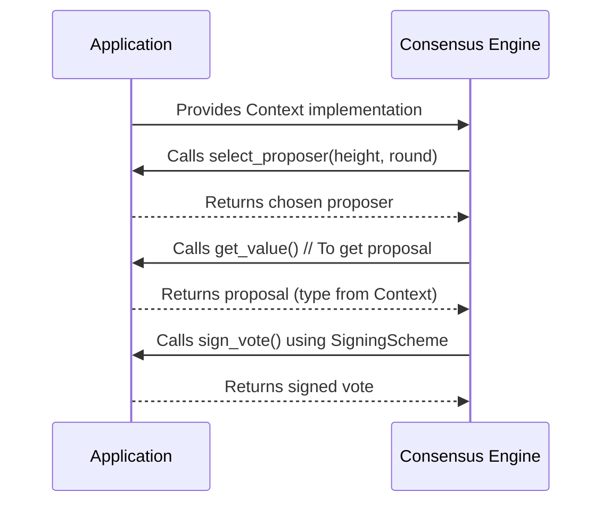
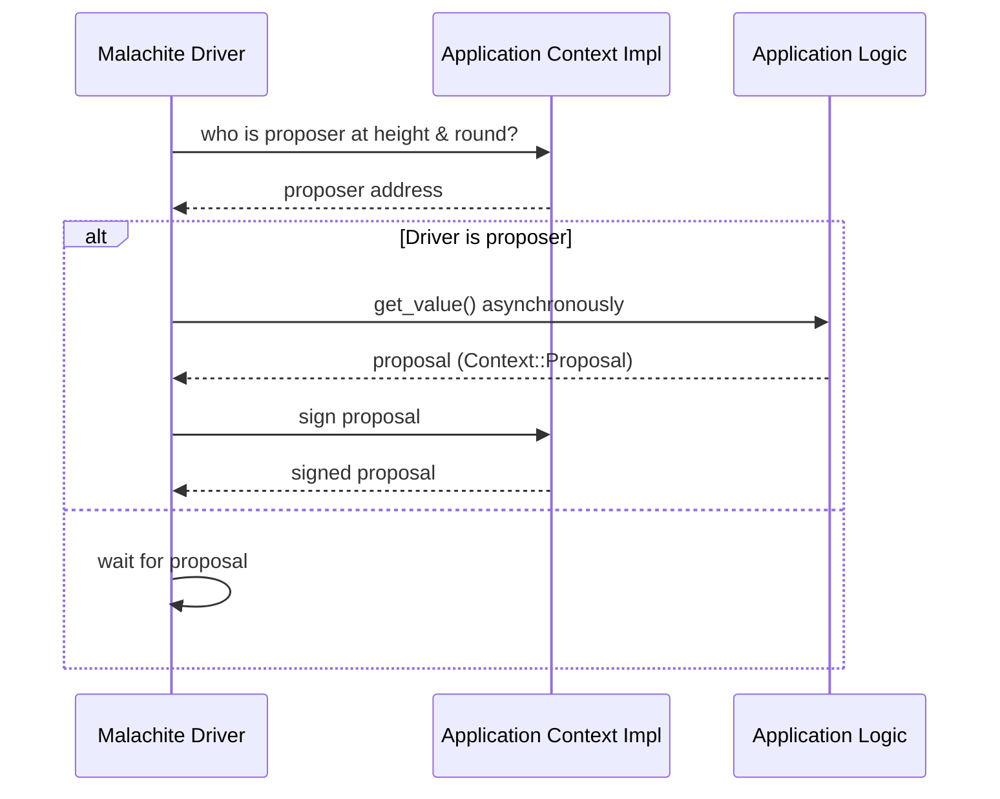

# Chapter 4: Context Trait and Application Abstractions

Welcome back! In the previous chapter, we explored the [Consensus Core Library (Driver, VoteKeeper, Round State Machine)](03_consensus_core_library__driver__votekeeper__round_state_machine__.md) — the heart of Malachite’s consensus logic.

Now, in this chapter, we'll talk about something very important to making Malachite flexible and usable in many different applications: **the Context trait and application abstractions**.

---

## Why Do We Need the Context Trait?

Imagine you want to build a decentralized application using Malachite — maybe a blockchain for tracking donations or a collaborative social network.

Each application has _its own_ types and data:

- Addresses of users or validators might look very different.
- What a "proposal" contains can vary — maybe a block, or a message.
- Votes might need different signatures or formats.
- Validators themselves might store different information.

How can Malachite support all these variations **without rewriting the core code**?

This is where the **Context trait** comes in. It lets you tell Malachite:

> "Here are the *concrete* types you should use when running consensus for my application."

By doing this, Malachite remains:

- **Flexible**: Works for many types of decentralized apps.
- **Type-safe**: Rust still checks everything at compile time.
- **Clear**: You know exactly what types are used inside your app.

---

## Key Idea: The Context Trait is a "Template" for Types

Think of **Context** as a blueprint or a plug-in interface that the application implements to provide all the specific types Malachite needs.

### What kinds of types?

- **Address** — What identifies a validator or account?
- **Height** — What type counts block heights?
- **Proposal** — What data does a proposal hold?
- **Validator** — How is a validator represented?
- **Vote** — What does a vote look like?
- **ValidatorSet** — How do you store the group of validators?
- **SigningScheme** — How do you sign messages and votes?

Malachite demands **trait implementations** on these types. So the application provides concrete types that meet those requirements.

---

# Breaking Down the Context Trait

Let's see a simplified, beginner-friendly example of what the Context trait looks like:

```rust
pub trait Context: Clone + Send + Sync + 'static {
    type Address: AddressTrait;
    type Height: HeightTrait;
    type Proposal: ProposalTrait<Self>;
    type Validator: ValidatorTrait<Self>;
    type ValidatorSet: ValidatorSetTrait<Self>;
    type Vote: VoteTrait<Self>;
    type SigningScheme: SigningSchemeTrait;

    // Methods applications must implement:
    fn select_proposer(
        validator_set: &Self::ValidatorSet,
        height: Self::Height,
        round: u32,
    ) -> &Self::Validator;

    // ... more methods for creating proposals and votes
}
```

> **Explanation:**  
> This trait lists a bunch of associated types (like `Address`, `Height`, `Proposal`, etc.). The application must supply concrete types for each and implement these other traits (`AddressTrait`, etc.) for them.

---

## What Does the Application Need to Do?

1. **Define concrete types!**  
   For example, your app could create a simple type like:

   ```rust
   #[derive(Clone)]
   struct MyAddress(String);

   impl AddressTrait for MyAddress {
       // Implement necessary methods here
       // ...
   }
   ```

2. **Implement supporting traits** for all key consensus types, like `Proposal`, `Validator`, and `Vote`.

3. **Implement the Context trait** that "wires" together all these types.

4. **Provide application-specific logic** for things like **selecting the proposer**.

---

## Example: How Would You Select a Proposer?

Malachite uses the Context trait method `select_proposer` to find who should propose a block at a given height and round.

Here’s a minimal example showing how an application might implement that:

```rust
impl Context for MyContext {
    // types declarations omitted for brevity...

    fn select_proposer(
        validator_set: &Self::ValidatorSet,
        height: Self::Height,
        round: u32,
    ) -> &Self::Validator {
        let index = (height.as_u64() + round as u64) % validator_set.len() as u64;
        &validator_set.validators[index as usize]
    }
}
```

> **Explanation:**  
> This code picks a proposer deterministically based on height and round, picking a validator from the set by computing an index.

---

## How Does Malachite Use the Context?

When running consensus, Malachite calls the methods of the `Context` trait to:

- Create proposals.
- Validate votes.
- Sign messages.
- Select which validator proposes next.

This means the **core consensus engine is generic** over the Context trait and so it never cares about your actual types, only that they meet the trait requirements.

---

# Using the Context Trait: Example Flow Overview

Let’s see at a high-level how Malachite uses this trait during consensus:



**Step-by-step explanation:**

1. The application implements the Context trait, defining types and methods.

2. Malachite asks through the trait who is the proposer for the current round.

3. The application returns the proposer.

4. If this node is the proposer, Malachite asks the application to provide the value to propose.

5. The application returns the typed proposal.

6. When voting or signing is needed, Malachite relies on the application’s signing scheme.

---

# How to Implement Your Own Context: A Simple Minimal Example

Here’s a very minimal and simplified example showing parts of a custom Context implementation:

```rust
#[derive(Clone)]
struct SimpleAddress(String);

impl AddressTrait for SimpleAddress {
    // dummy implementation
}

struct SimpleValidator {
    address: SimpleAddress,
}

impl ValidatorTrait<SimpleContext> for SimpleValidator {
    // dummy implementation
}

struct SimpleValidatorSet {
    validators: Vec<SimpleValidator>,
}

impl ValidatorSetTrait<SimpleContext> for SimpleValidatorSet {
    fn len(&self) -> usize {
        self.validators.len()
    }
}

struct SimpleProposal {
    data: String,
}

impl ProposalTrait<SimpleContext> for SimpleProposal {
    // dummy implementation
}

struct SimpleContext;

impl Context for SimpleContext {
    type Address = SimpleAddress;
    type Validator = SimpleValidator;
    type ValidatorSet = SimpleValidatorSet;
    type Proposal = SimpleProposal;
    // other types omitted...

    fn select_proposer(
        validator_set: &Self::ValidatorSet,
        height: Self::Height,
        round: u32,
    ) -> &Self::Validator {
        let idx = (height.as_u64() + round as u64) as usize % validator_set.len();
        &validator_set.validators[idx]
    }
}
```

---

# Internal Implementation: How Does the Context Trait Work Under the Hood?

At runtime:

- Malachite's **core consensus engine** is generic over the Context trait, written roughly as `Driver<C: Context>`, `VoteKeeper<C>`, etc.

- Whenever it needs to create a proposal or cast a vote, it calls methods on the types from the Context.

- This means all core libraries remain application-agnostic and reusable.

- Your application ties everything together by implementing Context and giving Malachite its own types.

---

### Simple Sequence Showing Context Usage During Proposal Creation



---

# Code Peek: Context in Core Consensus

You can find the full `Context` trait and related types in:

- [`malachitebft_app_channel::app::types::core::Context`](https://github.com/informalsystems/malachite/blob/main/code/crates/app-channel/src/app/types/core/context.rs)

Here is a very simplified excerpt of the Context trait from that file, showing how types are associated:

```rust
pub trait Context: Clone + Send + Sync + 'static {
    type Address: Address;
    type Height: Height;
    type Proposal: Proposal<Self>;
    type Validator: Validator<Self>;
    type ValidatorSet: ValidatorSet<Self>;
    type Vote: Vote<Self>;
    type SigningScheme: SigningScheme;

    // Choose proposer for height & round
    fn select_proposer(
        validator_set: &Self::ValidatorSet,
        height: Self::Height,
        round: Round,
    ) -> &Self::Validator;
}
```

---

# Wrapping Up: What Did We Learn?

In this chapter, you discovered:

- The **Context trait** is the mechanism Malachite uses to be **application-agnostic**.

- The **Context trait defines all the core types** used internally by consensus: addresses, proposals, voters, validators, votes, and signing schemes.

- Applications **provide their own concrete implementations** of these types and implement the required traits.

- This design allows Malachite to support **diverse applications** while keeping the core consensus logic **clean, reusable, and type-safe**.

- You saw a simple example of defining a custom `Context` and how Malachite calls it during consensus.

---

## What’s Next?

Now that you understand how Malachite adapts its core consensus engine to your application via **Context trait abstractions**, you are ready to explore **how Malachite manages application state and streams proposals**.

Head over to the next chapter: [Application State and Proposal Streaming](05_application_state_and_proposal_streaming_.md) to see how to handle application data in sync with consensus.

---

Happy coding and customizing Malachite for your decentralized application! 🚀

---

Generated by [AI Codebase Knowledge Builder](https://github.com/The-Pocket/Tutorial-Codebase-Knowledge)