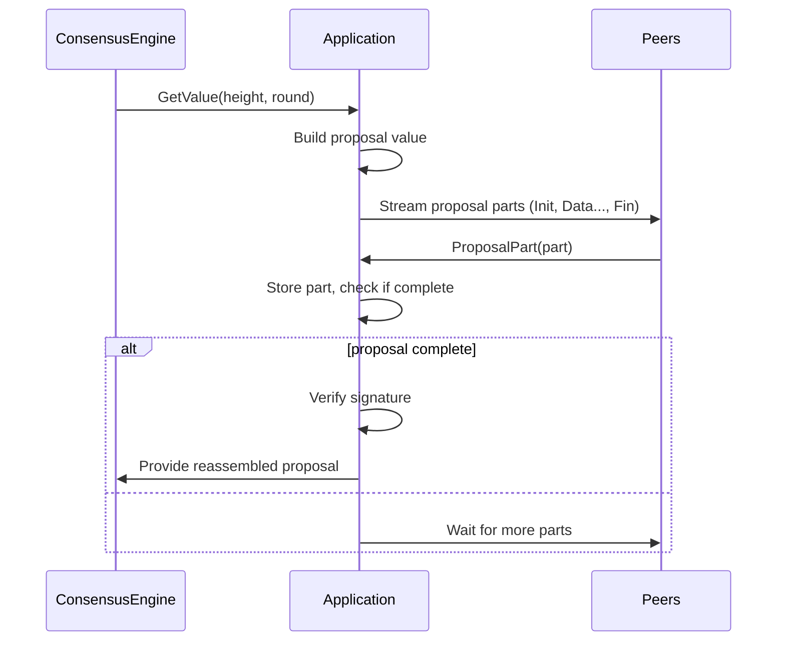
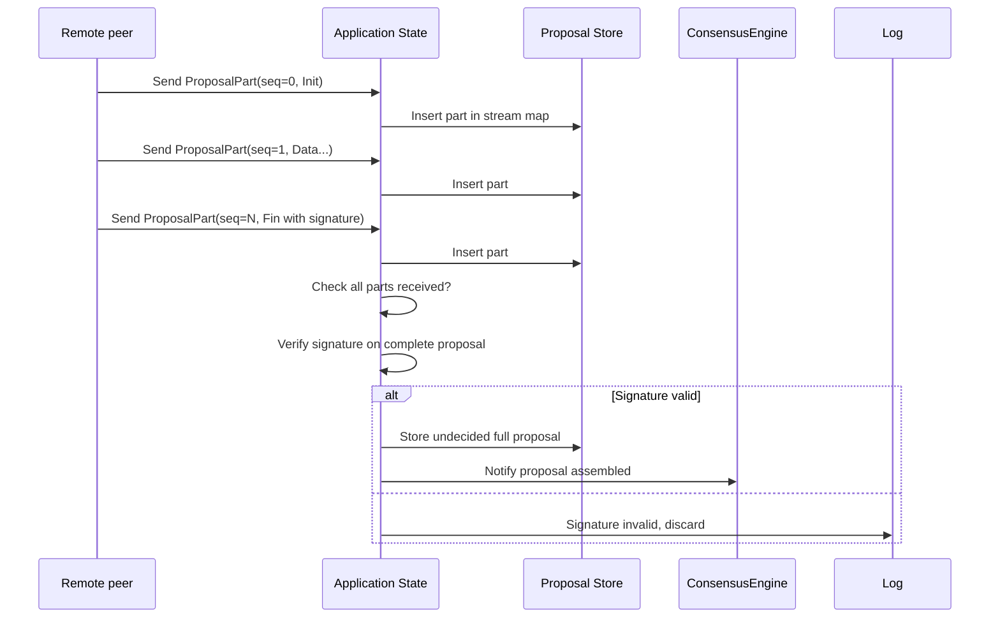

# Chapter 5: Application State and Proposal Streaming

Welcome back! In the previous chapter, we explored how Malachite uses the [Context Trait and Application Abstractions](04_context_trait_and_application_abstractions_.md) to **customize consensus for your own application's data types**.

Now, it’s time to learn about **how Malachite applications keep track of their internal state — especially the proposals they create and receive — and how they stream these proposals piece-by-piece over the network**.

This chapter will introduce the concept of **Application State and Proposal Streaming** — how your application acts as the “memory” and “postal worker” to manage proposals in-progress, assemble them correctly, and check their authenticity before consensus votes on them.

---

## Why Do We Need Application State and Proposal Streaming?

Imagine you and your friends are putting together a big puzzle:

- Instead of receiving the full picture at once, you get small pieces from different friends.
- You need to **collect all pieces**, **fit them together** to see the whole picture.
- You must **make sure the picture hasn’t been tampered with** before agreeing the puzzle is complete.

In a Malachite consensus app, this "puzzle" is a **proposal**, the value that the proposer node sends to other validators to vote on.

- **Proposals can be large!** For instance, a blockchain block contains many transactions.
- To avoid flooding the network with large messages, proposals are **split into smaller parts**.
- These parts arrive **at different times and from different peers**.
- Your application must **reassemble the full proposal correctly** before accepting it.
- Plus, you must **verify signatures** to ensure the proposal is authentic and untampered.

This all happens inside your application state, which stores:

- Locally built (proposer) proposals.
- Incoming partial proposals from peers.
- Validator sets.
- And more!

---

## Key Concepts in Application State and Proposal Streaming

Let’s break down the problem into simpler pieces:

### 1. **Application State**

This is your application’s memory during consensus.

- It stores things like:
  - The **current height and round**.
  - The **proposals it has built locally** (because it may be the proposer).
  - The **proposals it has received from others** but are incomplete (only some parts arrived).
  - The **validator set** for signing and verifying proposals.
  - Any **vote extensions** or metadata linked to votes.

- This state helps your app stay in sync with consensus progress and manage proposal assembly.

### 2. **Proposal Streaming**

Because proposals can be large, they are split into **proposal parts**:

- Each part is like a "parcel" that contains:
  - Some **metadata** (e.g., header info, indexes).
  - A **piece of the proposal’s data** (e.g., a chunk of transactions, or numeric data in a small example).
  - A **final part** that contains a **signature** proving the entire proposal’s authenticity.

- These parts are sent across the network one by one.
- Your app acts as a **postal worker**, collecting these parcels, ordering them via sequence numbers, and putting them together.
- Once all the parts arrive, the application **reassembles the complete proposal**.

### 3. **Signature Verification**

After assembling all parts, your app:

- Computes the **hash of all the parts' data**.
- Verifies the **signature** on this hash using the proposer’s public key.
- This guarantees the proposal is **genuine and unmodified**.

If the signature fails, the proposal is rejected.

---

## How Does This Look Like In Practice?

Imagine the consensus engine sends your application a **request to propose a value** for height 5, round 0.

- Your app **builds a proposal** (say, just a random number in our simple example).
- Your app **splits this proposal into small parts**.
- Your app **streams** these parts over the network to your peers.

Conversely, when your app receives **proposal parts** from another peer:

- It **stores the parts** as they arrive.
- Once **all parts are reached**, it **reassembles the proposal**.
- It then **verifies the signature** over the full proposal.
- If valid, it sends the **complete proposal back** to consensus for voting.

---

## Minimal Example: Proposal Streaming in Code

Here is a tiny, simplified snippet showing how to split a proposal into parts and stream them:

```rust
fn split_proposal_into_parts(value: u64) -> Vec<ProposalPart> {
    let parts = factor_value(value); // e.g., prime factors of number
    let mut proposal_parts = Vec::new();

    proposal_parts.push(ProposalPart::Init { /* metadata */ });

    for factor in parts {
        proposal_parts.push(ProposalPart::Data { factor });
    }

    proposal_parts.push(ProposalPart::Fin { signature: vec![/* sign hash */] });

    proposal_parts
}
```

**Explanation:**  
- We start with an `Init` part containing metadata (height, round, proposer ID, etc.).  
- Each factor (part of the value) is sent as a `Data` part.  
- We finish with a `Fin` part containing the signature over all parts.  

---

## Putting It All Together: Step-by-Step Proposal Handling



---

## Internal Workings Under the Hood

Here is what happens inside your application to handle proposal streaming and state management:

1. **Receiving Proposal Parts**

   - Proposal parts come from peers in any order.
   - The app stores each part in a data structure (e.g., `PartStreamsMap`) keyed by proposer and proposal ID.
   - Each part has a **sequence number** to maintain correct order.

2. **Checking for Completeness**

   - After each insert, the app checks if **all parts from Init to Fin are received**.
   - When yes, the app attempts to **reassemble the full proposal**.

3. **Signature Verification**

   - The app hashes all parts' content (except the signature).
   - Uses the proposer's public key from the validator set to verify the signature in the `Fin` part.

4. **Storing and Forwarding**

   - If the signature is valid, the app stores the full **undecided proposal** locally.
   - The proposal is sent back to the consensus engine for voting steps.
   - If invalid, the app discards it and logs an error.

5. **Committing Values**

   - Later, when consensus decides on a proposal, the app **commits** the proposal:
     - Stores it as **decided**.
     - Cleans up outdated proposals.
     - Moves consensus to the next height.

---

## Simplified Internal Data Flow of Proposal Streaming



---

## Beginner-Friendly Code Peek: Handling Received Proposal Part

Here's a simplified example of processing an incoming proposal part:

```rust
async fn received_proposal_part(
    &mut self,
    from: PeerId,
    part: ProposalPart,
) -> Option<ProposedValue> {
    // Insert part into map, keyed by proposer and stream id
    let maybe_complete_parts = self.streams_map.insert(from, part);

    if let Some(parts) = maybe_complete_parts {
        // proposal is complete, verify signature
        if self.verify_signature(&parts).is_err() {
            // Invalid - discard and return None
            return None;
        }

        // Reassemble proposal value from parts
        let proposal = self.assemble_value_from_parts(parts).unwrap();

        // Store undecided proposal for further consensus processing
        self.store.store_undecided_proposal(proposal.clone()).await.unwrap();

        Some(proposal)
    } else {
        None // Not complete yet, wait for more parts
    }
}
```

**Explanation:**  
- We try to insert the new part into streams.  
- If the proposal becomes complete, verify signature.  
- If valid, store and return proposal to consensus engine to vote on.  
- If incomplete or invalid, do nothing or reject.

---

## Summary: What Did We Learn?

In this chapter, you learned:

- Why **application state management** is essential to track proposals and keep up with consensus progress.
- How **proposal streaming** works: splitting large proposals into parts, sending and receiving those parts piece-by-piece.
- That your application acts like a **postal worker**, gathering "puzzle pieces" (proposal parts), assembling the full puzzle properly, and verifying signatures for integrity.
- How assembled proposals are passed back to the consensus engine for the voting process.
- How commitment of decided proposals updates the application state and moves consensus forward.

---

## Looking Ahead

Now that you understand how Malachite applications **manage state and stream proposals**, it's time to explore the next layer of the system — how proposals spread through the network using **different value propagation modes**.

Head over to the next chapter: [Proposal Value Propagation Modes](06_proposal_value_propagation_modes_.md) to dive deeper.

---

Happy proposing and streaming! 🚀

---

Generated by [AI Codebase Knowledge Builder](https://github.com/The-Pocket/Tutorial-Codebase-Knowledge)