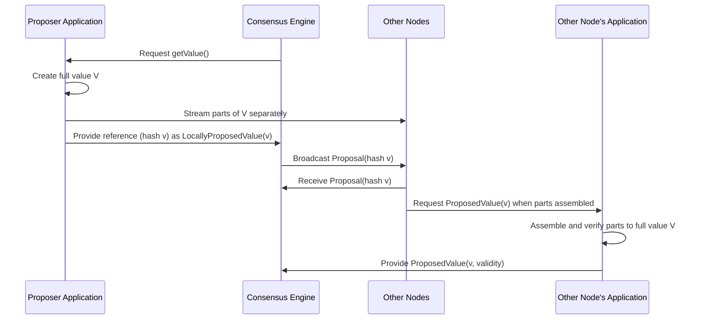
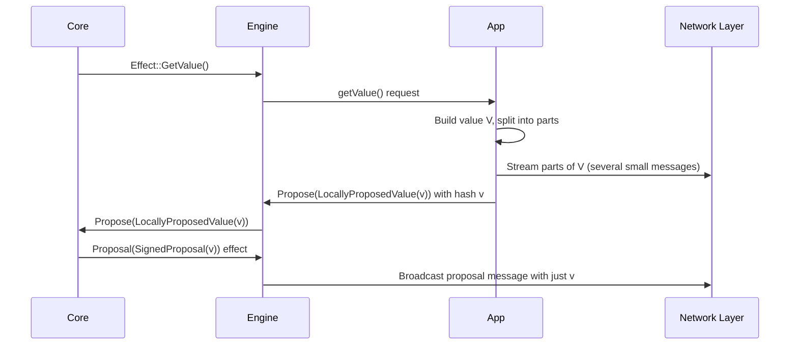

# Chapter 6: Proposal Value Propagation Modes

Welcome back! In the previous chapter, [Application State and Proposal Streaming](05_application_state_and_proposal_streaming_.md), we explored how Malachite applications keep track of proposals — building, splitting, streaming, assembling, and verifying them. Now, it’s time to understand **how these proposed values are sent around the network in different ways to optimize performance**. This is the topic of **Proposal Value Propagation Modes**.

---

## Why Do We Need Proposal Value Propagation Modes?

Imagine you want to send a gift to a friend:

- You could pack **everything in one big box** and send it all at once.
- Or, you could split the gift into **smaller parcels**, each sent separately.
- Maybe you even want a mix: send part of it in a big box and the rest in smaller parcels later.

Which method you choose depends on how fast you want it delivered, how much shipping costs, and how your friend can receive the parcels.

Similarly, in Malachite consensus, the **proposed value** (like a block or a data update) may be **small or huge**. Sending large values all at once might flood the network, cause delays, or waste bandwidth. To solve this, Malachite supports **different value propagation modes** that allow applications to balance **latency** (speed) and **bandwidth usage**.

---

## What Are Proposal Value Propagation Modes?

Malachite offers **three main modes** for sending proposed values over the network:

1. **ProposalOnly**  
   The entire value is sent inside the proposal message as one piece — like sending a single big package.  
   *Best for small values.*

2. **ProposalAndParts**  
   The proposal message contains a **compact reference** (like a hash), and the value is sent separately in **smaller parts** — like sending a small box plus parcels.  
   *Good for large values where you want to start the process quickly but still provide the full data.*

3. **PartsOnly**  
   The value is sent **entirely in parts** without sending a proposal message first. Applications manage the whole data dissemination.  
   *Great for very large values or systems that want full control over data distribution.*

---

## The Big Picture: How Does This Work?

Malachite’s consensus core deals mainly with **value identifiers (hashes)** for voting and agreement steps. The actual full value may be split up and sent around by the application layer.

Here’s a simple analogy:

| Mode              | What’s in Proposal Packet?              | How is the full value sent?                        |
|-------------------|---------------------------------------|---------------------------------------------------|
| **ProposalOnly**  | Full value included                   | Sent once in the proposal message                  |
| **ProposalAndParts** | Reference (hash), full value sent separately in parts | Proposal message sent with hash; value parts streamed separately |
| **PartsOnly**     | No proposal message sent              | Only value parts sent, proposal reconstructed locally |

---

### Quick Scenario Example

Imagine our application wants to propose the value `V` at height 10, round 0.

- In **ProposalOnly** mode:  
  The proposer builds `V` and **includes the entire value inside the proposal message**.  
  Other nodes simply receive it and vote.

- In **ProposalAndParts** mode:  
  The proposer sends a **proposal message containing a hash (a short ID) of `V`**, then sends all parts of `V` separately over the network.  
  Other nodes **assemble the parts**, verify the full value matches the hash, and then vote.

- In **PartsOnly** mode:  
  The proposer **only streams parts of the value**; no full proposal message is sent over the consensus network.  
  Nodes assemble and validate the value from parts, and consensus proceeds using only the value's identifier.

---

## Breaking Down Each Mode for Beginners

### 1. ProposalOnly Mode

- Like ordering a pizza and having it delivered entirely in one box.
- Simple to implement, because consensus core gets the full value at once.
- But if the pizza (value) is very large, this might take longer or clog the delivery network.
- Currently, this mode is still under development in Malachite.

### 2. ProposalAndParts Mode

- Like sending a pizza **box with a receipt (hash)** first, then sending slices separately.
- The proposal contains just the hash to identify the value being proposed.
- The actual value slices (parts) are spread in separate messages to all validators.
- Validators store parts, assemble the full pizza, verify it matches the receipt.
- Consensus core only works with the hash and assumes the parts will arrive in time.
- This mode **balances quick proposal dissemination with efficient use of bandwidth**.

### 3. PartsOnly Mode

- Imagine **no pizza box at all**, only pizza slices sent one by one.
- No proposal message is sent in the consensus network.
- The application layer handles spreading and assembling the full value parts.
- This is useful for very large values where complete control over transmission is needed.
- Consensus core waits for confirmation that the full value is fully available and valid before proceeding.

---

## How to Use These Modes in Your Application

You choose a mode in the consensus parameters configuration:

```rust
// Inside consensus parameters
pub struct Params<Ctx: Context> {
    // ...
    pub value_payload: ValuePayload, // can be ProposalOnly, ProposalAndParts, or PartsOnly
    // ...
}
```

When your node is the proposer:

- **In ProposalOnly:** your application provides the full value immediately in response to `getValue()`.
- **In ProposalAndParts or PartsOnly:** your application:
  1. Builds the full value `V`.
  2. Splits it into parts (e.g., chunks, factors, or blocks).
  3. Signs each part or the full value hash.
  4. Sends the proposal message with just the hash (`ProposalAndParts` mode), or skips it entirely (`PartsOnly` mode).
  5. Streams parts to peers.
  
When your node receives a proposal:

- **In ProposalOnly:** you receive the full value and can vote directly.
- **In ProposalAndParts or PartsOnly:** you collect parts over the network.
- When all parts are received, you reconstruct the full value.
- You verify the value’s signature.
- Only then do you provide the full value to consensus to proceed with voting.

---

## Example: High-Level Sequence in ProposalAndParts Mode



---

## Internal Walk-through: What Happens Under the Hood?

Let’s look at a simplified **step-by-step** process when a proposer tries to propose a value in `ProposalAndParts` mode:



On the receiving side:

```mermaid
sequenceDiagram
    participant Network
    participant ConsensusEngine as Engine
    participant ConsensusCore as Core
    participant Application as App

    Network->>ConsensusEngine: Proposal(SignedProposal(v))
    ConsensusEngine->>ConsensusCore: Proposal(SignedProposal(v))
    ConsensusCore-->>App: Proposal(v) 
    Network->>App: Receive parts of value V
    App->>App: Assemble and verify parts
    App->>ConsensusEngine: ProposedValue(v, validity)
    ConsensusEngine->>ConsensusCore: ProposedValue(v, validity)
    ConsensusCore: proceeds with voting
```

---

## Diving Into Code: Simplified Proposal Splitting (From Your Application)

Your application splits a large value into parts like this:

```rust
fn split_value_into_parts(value: u64) -> Vec<ProposalPart> {
    let mut parts = Vec::new();

    // Add an init part with metadata
    parts.push(ProposalPart::Init { height, round, proposer });

    // Split value into factors or chunks
    for chunk in factor_value(value) {
        parts.push(ProposalPart::Data { factor: chunk });
    }

    // Add a final part with a signature over all parts
    parts.push(ProposalPart::Fin { signature });

    parts
}
```

> **Explanation:**  
> - `Init` part tells who proposed and at which height and round.  
> - `Data` parts hold pieces of the real data.  
> - `Fin` contains a signature ensuring the full data’s integrity.  

---

## How Are The Different Modes Connected to Your Application?

- Your **application decides how to split and send the values** depending on the mode you choose.
- Consensus core only handles **value references (hashes)** or full values depending on the mode.
- Network handles the **actual transmission**.
- Your app acts like the **post office**, assembling and verifying parcels.

---

## Summary: What Did You Learn?

- Malachite has **three different modes** to propagate proposed values:
  - **ProposalOnly:** Sends full value in one go.
  - **ProposalAndParts:** Sends reference in proposal and parts separately.
  - **PartsOnly:** Sends only parts, no proposal message.

- These modes give **flexibility to balance latency and bandwidth** depending on how your application and network behave.

- Application code is responsible for **splitting, streaming, assembling, and verifying the proposal parts** in the two parts-related modes.

- Consensus core mostly works with **compact value references (hashes)** and **trusts the application to verify full values**.

- Choosing the right mode depends on **value size** and your system’s performance needs.

---

## What’s Next?

You now understand the *why* and *how* of **Proposal Value Propagation Modes** in Malachite. Up next, you will learn about the [Consensus Engine and Effect System](07_consensus_engine_and_effect_system_.md), which ties together consensus core, application, and networking interactions, making Malachite’s distributed consensus tick smoothly!

---

Happy building and optimizing your consensus applications with Malachite! 🚀

---

Generated by [AI Codebase Knowledge Builder](https://github.com/The-Pocket/Tutorial-Codebase-Knowledge)