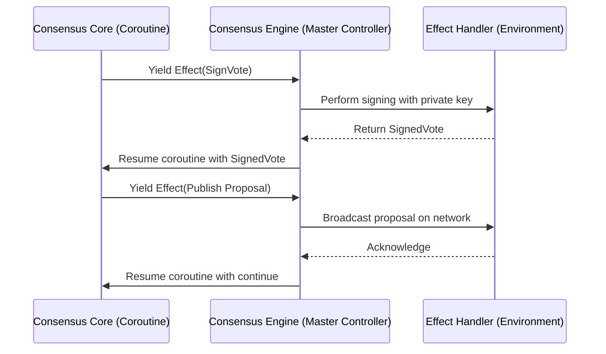
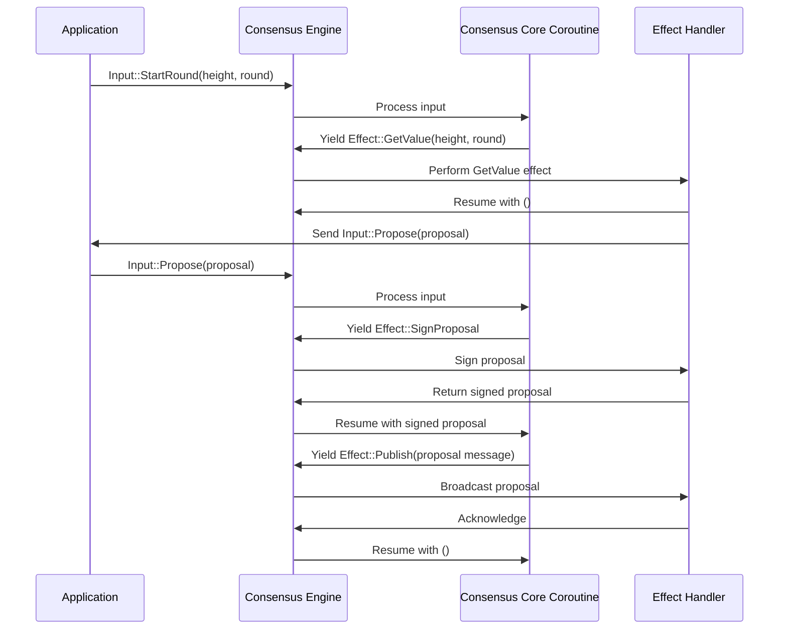

# Chapter 7: Consensus Engine and Effect System

Welcome back! Previously, in [Proposal Value Propagation Modes](06_proposal_value_propagation_modes_.md), we saw how Malachite applications send proposed values around the network in efficient ways — by sending full proposals, splitting them into parts, or streaming just those parts.

Now that you understand how values flow, it's time to uncover the magical middleman inside Malachite that connects the **core consensus logic** with the outside world — the **Consensus Engine and Effect System**.

---

## Why Do We Need a Consensus Engine and Effect System?

Imagine your consensus algorithm as a thoughtful chess player trying to make moves. Sometimes it needs to:

- Ask a teammate, "Can you sign this move?"
- Tell the network, "Broadcast this proposal!"
- Read data from storage.
- Wait for an answer, **without blocking forever**.

How do you keep the chess player focused, without mixing all those side tasks inside its decision-making brain?

This is exactly the challenge Malachite solves with the **Consensus Engine and Effect System**:

- The **Consensus Engine** acts like the middleman between the pure, clean **core consensus algorithm** and the environment where it runs.
- The **Effect System** is the way the engine **requests** external operations asynchronously (like networking or signing), waits for answers, then sends the results back to the core.
- This separation keeps the **core logic clean and simple**, while letting the engine flexibly connect to different environments (synchronous, asynchronous, actor systems, and others).

---

## Key Concepts: Breaking Down the Consensus Engine and Effect System

Let's unwrap this abstraction by understanding its building blocks.

### 1. **Core Consensus Logic — The Focused Brain**

The core consensus library (discussed in [Consensus Core Library Chapter](03_consensus_core_library__driver__votekeeper__round_state_machine__.md)) is **pure and stateless**:

- It knows how to react to inputs like votes and proposals.
- It decides what steps to take next.
- But it does **not** do networking, signing, storage, or anything external.
- It just tells the outside world, "I want to do X."

### 2. **Inputs and Effects — Conversation Between Core and Engine**

- **Inputs**: Messages sent *to* the consensus core (like “Received a vote” or “Start a new round”).
- **Effects**: Requests sent *from* the core *to* the environment, asking for side-effectful actions.

Examples of effects include:

- `SignVote`: “Please sign this vote for me.”
- `Publish`: “Please broadcast this proposal to the network.”
- `GetValue`: “Give me a value to propose (like a new block).”
- `ScheduleTimeout`: “Please schedule a timeout event.”

The core sends effects *and* waits for **resumed inputs** that provide the results.

### 3. **Coroutine-Based Effect System — The Wait-and-Resume Mechanism**

- The consensus core is implemented as a **coroutine** — think of it as a "pause and resume" function.
- When the core needs something external (an effect), it **yields** control, asking the environment to perform it.
- The environment does its job asynchronously and **resumes** the core with the outcome.
- This way, the consensus logic looks linear and easy to follow, even though it does asynchronous work.

### 4. **Effect Handler — The Environment's Role**

- The **effect handler** is the part of the system that **listens to effect requests**, performs needed operations (like signing or network broadcast), then returns the results back.
- It can use whatever async runtime or sync mechanism it wants.
- The consensus core remains environment-agnostic.

---

## How Does This Work? — A Beginner-Friendly Example

Imagine your consensus core is playing a game and suddenly wants to **sign a vote** and **broadcast a proposal**.

Here’s a small walkthrough:



**Step-by-step Description:**

1. The consensus core reaches the point where it needs to sign a vote. It **yields** the `SignVote` effect to the engine.
2. The **engine** passes this request to the environment, which signs the vote using the private key.
3. The environment returns the signed vote.
4. The engine **resumes** the consensus core coroutine, passing the signature back as input.
5. Later, the core wants to broadcast a proposal, so it yields a `Publish` effect.
6. The engine asks the environment to send this message over the network.
7. After it's done, the effect handler acknowledges.
8. The engine resumes the core again, and so on.

---

## Using the Consensus Engine and Effect System

### Example: Input-Effect Interaction in Code

Here’s how your application might interact with Malachite’s consensus engine in simplified Rust-like pseudocode:

```rust
// Your app sends an input to the consensus core:
engine.process_input(Input::StartRound(height, round)).await;

// Internally, the consensus core yields an effect requesting a value:
let effect = engine.next_effect();

match effect {
    Effect::GetValue(height, round, timeout, resume) => {
        // Your app builds a new block or proposal asynchronously
        let proposal = build_proposal().await;

        // Resume the consensus core coroutine with the proposal wrapped in Input::Propose
        engine.process_input(Input::Propose(proposal)).await;
    }
    // Handle other effects similarly
}
```

**Explanation:**

- Your app sends inputs like `StartRound` to the consensus engine.
- The engine replies with **effects** saying what it needs next.
- Your app handles the effect asynchronously (e.g., running network code or cryptographic signing).
- When the result is ready, your app sends new inputs like `Propose` or `Vote` back into the engine.
- This back-and-forth continues, driving consensus forward.

---

### Handling Asynchronous Effects: The `GetValue` Example

`GetValue` is a *special* effect because it involves potentially slow operations like:

- Collecting transactions from a mempool,
- Executing application logic,
- Building a block value to propose.

Malachite's effect system handles this smoothly without blocking the entire consensus.

#### Simplified workflow:

```rust
async fn handle_effect(effect: Effect) -> Resume {
    match effect {
        Effect::GetValue(height, round, timeout, resume) => {
            // Immediately resume consensus so it can continue other work
            let immediate_resume = resume.resume_with(());

            // Spawn background task to build proposal asynchronously
            tokio::spawn(async move {
                let proposal = build_proposal_value(height, round).await;
                // Feed the proposal back as an input later
                engine.process_input(Input::Propose(proposal)).await;
            });

            immediate_resume
        }
        // handle other effects...
    }
}
```

**Explanation:**

- The effect handler immediately resumes consensus with an empty result so it won't block.
- It starts building the value in the background.
- When ready, it sends the `Propose` input back into the consensus engine.
- Consensus continues processing inputs and effects seamlessly.

---

## Under the Hood: How Does Malachite Implement This?

We can break down the internal flow as follows:



**Summary:**

- The core runs as a coroutine step-by-step.
- The engine acts as the controller driving inputs into the core and catching effects it yields.
- The environment performs effects (e.g., sign, broadcast, wait).
- Asynchronous effects are handled with immediate resumes and later inputs.
- The process repeats until consensus decides.

---

### Peek Into the Code: Simplified Core Effect Yielding

Here is a tiny example from inside the consensus core logic (very simplified):

```rust
async fn start_round(&mut self, height: Height, round: Round) {
    // Core wants a value to propose
    yield Effect::GetValue(height, round, timeout, resume_token);
    // After resuming, core receives the propose input with the value
    
    // Core wants to sign the proposal
    yield Effect::SignProposal(proposal, resume_token);

    // Core wants to publish the signed proposal
    yield Effect::Publish(signed_proposal, resume_token);

    // Core proceeds with voting, etc.
}
```

Each `yield` pauses the coroutine and returns control to the engine, which asks for the effect to be performed.

---

### Coroutine and Resume Types — Keeping Types Safe

- Effect variants carry a special "resumable" token.
- The environment uses this token to resume the coroutine with a correctly typed value.
- This avoids errors where, for example, the core expects a signed vote but gets a different result.

This typing discipline makes the effect system **type-safe** and predictable.

---

## Summary: What We Learned

- The **Consensus Engine** sits between the pure consensus core and the environment, handling inputs and producing effects.
- The **Effect System** is a coroutine-based mechanism allowing the core to asynchronously request side-effectful operations like signing, broadcasting, or retrieving data.
- Effects are explicit, typed requests that the environment performs and then resumes the core with the result.
- This design keeps consensus **clean, linear, and testable**, while supporting both sync and async environments.
- The application or environment implements an **effect handler** to perform these operations.
- Asynchronous effects like `GetValue` are handled gracefully by immediately resuming core and feeding back results as new inputs later.
- You don’t need to mix networking, signing, storage, or timeouts into your core consensus logic — the effect system neatly separates those concerns.

---

## What’s Next?

You have reached a crucial understanding of how Malachite connects its consensus core with the outside world, making it flexible and robust.

Next, in [Networking Layer and Gossip Protocol](08_networking_layer_and_gossip_protocol_.md), we will explore how Malachite *actually sends* those proposals, votes, and messages between peers over the network.

---

Happy building with Malachite! 🎉🚀

---

Generated by [AI Codebase Knowledge Builder](https://github.com/The-Pocket/Tutorial-Codebase-Knowledge)