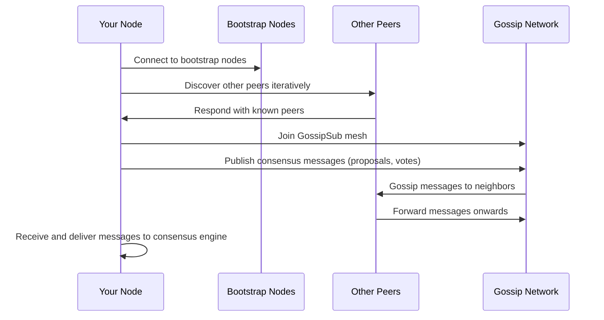
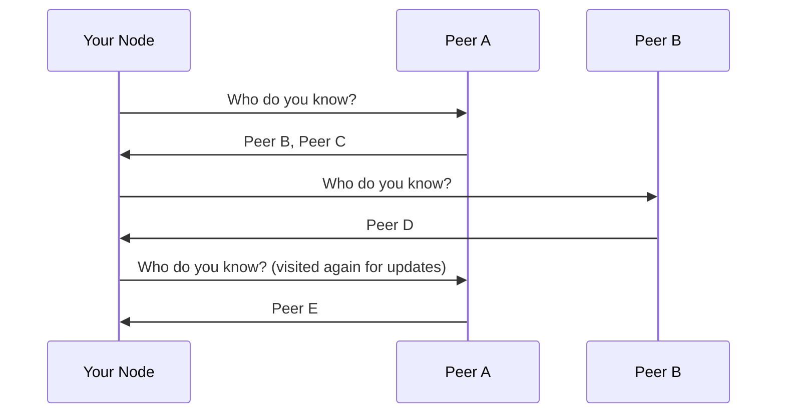
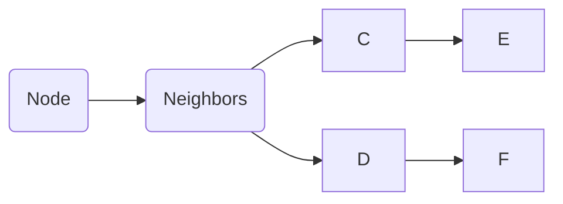
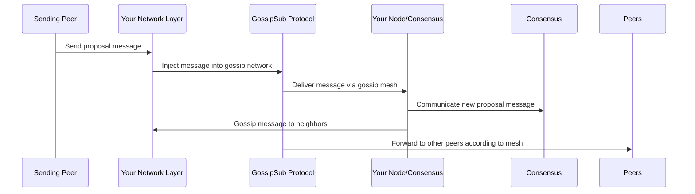

# Chapter 8: Networking Layer and Gossip Protocol

Welcome back! We have just explored in [Chapter 7: Consensus Engine and Effect System](07_consensus_engine_and_effect_system_.md) how Malachite’s core consensus logic communicates asynchronously with the outside world. 

Now, it’s time to dive into the crucial part that ties all nodes together: **the networking layer and gossip protocol**. In this chapter, we’ll understand how Malachite’s peers **find each other**, **talk to each other**, and **efficiently spread consensus messages like proposals and votes** across the network.

---

## Why Does Malachite Need a Special Networking Layer and Gossip Protocol?

Imagine you're in a big school playground filled with dozens of children (nodes/peers). You want **everyone to know the same exciting news** (like a new proposal or vote) as quickly as possible. How do you get the message across?

- You could tell each child individually, but that takes a lot of energy and time.
- Instead, you might start a **"rumor mill"** behavior: you tell a few friends, they tell a few more, and soon the whole playground knows!

This analogy is exactly how Malachite ensures all peers learn about the latest consensus messages **reliably** but **without flooding the network**.

This challenging task is handled by two important components:

1. The **Networking Layer** — so peers can **discover and connect** to each other, even if they don’t know everyone initially.
2. The **Gossip Protocol** — a smart way of **disseminating messages** so the network efficiently spreads news without overwhelming any peer.

Let's break these down.

---

## Key Concepts to Understand

### 1. **Peer-to-Peer Networking with libp2p**

Malachite uses the library called **libp2p** to implement its networking layer.

- **What is libp2p?**  
  Think of libp2p as a toolkit for building peer-to-peer networks. It helps nodes find each other, open connections, communicate, and manage those connections safely.

- **Peer Discovery:**  
  Nodes typically **do not know the full list** of all peers. Instead, they know some "bootstrap" nodes (think of them as contacts or friends).  
  The network uses a **Peer Discovery Protocol** to find other peers step-by-step from those bootstrap nodes.

- **Why is this important?**  
  It means any new node can start with just a few contacts and eventually find all **honest** peers in the network, even if some nodes are faulty or malicious.

### 2. **GossipSub Protocol for Message Dissemination**

To spread messages through the network in a scalable way, Malachite uses the **GossipSub** protocol implemented on top of libp2p.

- **What is GossipSub?**  
  It is like a **rumor mill** optimized as a pub-sub (publish-subscribe) system. Peers share messages with a selected subset of neighbors (called the mesh), and those neighbors forward the messages intelligently.

- **How GossipSub Helps:**  
  - Ensures **every honest peer gets the message** eventually.  
  - Prevents any peer from being overwhelmed with redundant or malicious messages.  
  - Works well even if some nodes send bad or faulty messages.

- **What kind of messages does Malachite gossip?**  
  Consensus messages such as proposals, votes, or even network control messages.

---

## Putting It All Together: How Does Malachite’s Networking Stack Work?

Here’s a high-level overview of the flow when a node starts up and participates in the network:



**Step by step explanation:**

1. Your node connects to a small set of **bootstrap nodes**.  
2. Using the **Iterative Peer Discovery (IPD)** algorithm, your node asks peers for their known peers, gradually building a peer list.  
3. Once discovered, your node **joins the GossipSub network**, establishing a communication mesh with some neighbors.  
4. When your node needs to broadcast a proposal or vote, it publishes the message to the GossipSub network.  
5. The gossip network efficiently forwards the message to all nodes, ensuring that everyone gets it reliably without flooding.  
6. Your node receives gossip messages from neighbors and forwards them to the Malachite consensus engine for processing.

---

## Exploring Peer Discovery: Finding Your Friends on the Playground

Imagine you know just a few kids at the playground but want to meet everyone else.

Malachite uses **Iterative Peer Discovery (IPD)**:

- You ask your known friends: "Who else do you know?"
- They give you a list of new kids.
- You ask those new kids the same question.
- You keep repeating until you discover all honest kids.

**Why Iterative?**  
Because your node doesn’t need to know all peers at the start, and you don’t flood the network with unnecessary requests.

### Algorithm in Simple Terms



You gather more and more peers by asking, until no new peers are found.

---

## Gossip Protocol: Efficiently Sharing Messages Without Overload

Once peers know each other, consensus messages need to be shared reliably and efficiently.

### Why Not Broadcast to Everyone Directly?

- Broadcasting naively means every node sends every message to every other node.  
- This **creates a large number of duplicate messages** and wastes bandwidth.  
- It doesn’t scale well for large networks.

### GossipSub’s Clever Approach

- Each node maintains a **small mesh** of connected neighbors for each topic (e.g., consensus messages).  
- When a node receives a new message, it sends it **only to neighbors in the mesh**.  
- Those neighbors forward it onward, propagating the message throughout the network without redundant duplication.  
- Honest nodes monitor the mesh and adjust connections to maintain good coverage and resilience.

### How GossipSub Effectively Spreads Rumors



- Node A sends the message to neighbors B.  
- B forwards to their neighbors (C, D).  
- C and D forward further, until all nodes receive the message.

---

## Using Malachite’s Networking Layer: A Simple Example in Practice

```rust
// Step 1: Node starts and connects to bootstrap nodes
let peers = libp2p::PeerId::from_bytes(...);
network.connect_peers(bootstrap_peers);

// Step 2: Node runs iterative peer discovery to find other nodes
while network.has_pending_requests() {
    network.process_peer_responses();
}

// Step 3: Join GossipSub topic for consensus messages
network.join_topic("malachite/consensus");

// Step 4: Publish a proposal message via GossipSub
network.publish(consensus_proposal_message);

// Step 5: Receive messages from GossipSub and pass to consensus engine
while let Some(msg) = network.next_gossip_message().await {
    consensus_engine.handle_message(msg);
}
```

**What happens here?**

- Your node starts with some known bootstrap peers.  
- It uses iterative peer discovery to find more peers.  
- Then it joins the *gossip* topic where all consensus messages are shared.  
- When your app needs to send consensus messages, it publishes to the gossip protocol.  
- Incoming messages from the network are delivered to the consensus engine for processing.

---

## What Happens Inside: A Step-by-Step Walkthrough

Imagine a node receiving a new proposal from a peer:



- A peer sends you a proposal message.  
- Your network layer passes it to GossipSub.  
- GossipSub shares it around efficiently.  
- Your node processes the message with consensus logic.  
- Your node gossips the message further to your neighbors for propagation.

---

## Internal Implementation Insights (Code Pointers)

Malachite's networking layer is implemented primarily using **libp2p** and the **GossipSub** protocol:

- The network actor uses libp2p's **Swarm** interface to manage connections.  
- The **Iterative Peer Discovery protocol** is implemented as a query-response pattern where the node asks peers for known peer lists and integrates responses. See `specs/network/discovery/ipd-protocol.md`.  
- The **GossipSub** implementation handles pub-sub of consensus messages efficiently. You can find more details in `specs/network/gossip/README.md`, and the code lives in the Malachite repository under the network crates.

### Simplified Example of Publishing in GossipSub

```rust
async fn publish_message(network: &mut GossipNetwork, message: ConsensusMessage) -> Result<()> {
    network.publish("malachite/consensus", message).await?;
    Ok(())
}
```

- The string `"malachite/consensus"` is a **topic name** — a logical channel for consensus messages.
- Your node publishes messages to this topic.
- GossipSub takes care of forwarding messages to neighbors subscribed to this topic.

### Handling Incoming Messages

```rust
async fn process_gossip_messages(network: &mut GossipNetwork, consensus_engine: &mut ConsensusEngine) {
    while let Some(message) = network.next_message().await {
        // Forward the message to the consensus engine for processing
        consensus_engine.handle_message(message).await;
    }
}
```

---

## Why Libp2p and GossipSub Are a Great Fit for Malachite

- **Modular and tested networking stack.**  
  Libp2p offers a battle-tested, production-ready stack used in many decentralized networks.

- **Automatic peer discovery and connection management.**

- **Efficient and reliable message dissemination with GossipSub.**

- **Resilience to faulty or malicious nodes.**

- **Flexibility to configure behaviors** like mesh size, subscription strategies, and more.

---

## Summary: What Did You Learn?

- Malachite uses **libp2p** for its networking layer, enabling nodes to discover and connect to each other even with minimal initial knowledge.

- The **Iterative Peer Discovery algorithm** helps a node find all honest peers step-by-step by asking known nodes about their contacts.

- Malachite uses the **GossipSub** protocol to spread messages (proposals, votes, etc.) efficiently through a gossip mesh, making sure every node eventually hears the news without overloading peers.

- The networking layer and gossip protocol **form the "rumor mill" or postal network**, enabling reliable, scalable communication even in presence of faulty or malicious nodes.

- Messages are published and received via pub-sub topics, with the consensus engine subscribing and listening for relevant messages.

- This design keeps the network robust, efficient, and scalable for many peers running Malachite.

---

## Where to Go Next?

With an understanding of how Malachite nodes communicate and spread messages over the network, you are ready to learn about **safely saving consensus progress and recovering after crashes** in the next chapter: [Write-Ahead Log (WAL) and Crash Recovery](09_write_ahead_log__wal__and_crash_recovery_.md).

See you there! 🎉🚀

---

Generated by [AI Codebase Knowledge Builder](https://github.com/The-Pocket/Tutorial-Codebase-Knowledge)