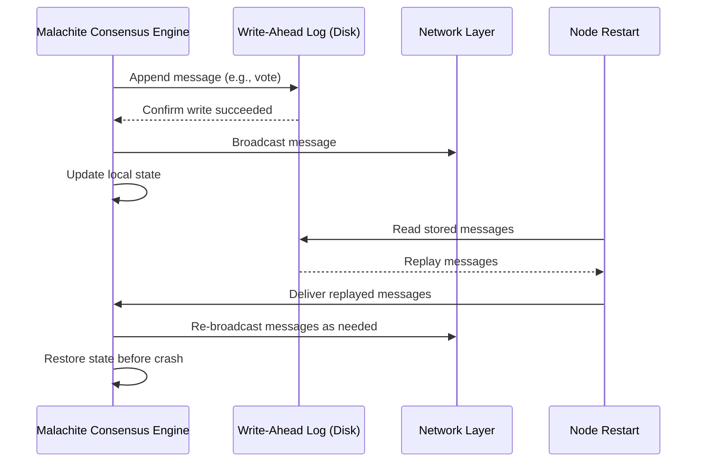

# Chapter 9: Write-Ahead Log (WAL) and Crash Recovery

Welcome back! In the previous chapter, [Networking Layer and Gossip Protocol](08_networking_layer_and_gossip_protocol_.md), we learned how Malachite nodes **find each other**, **connect**, and **efficiently spread consensus messages**. Now, it’s time to explore an essential feature that helps Malachite keep its promises even when things go wrong: the **Write-Ahead Log (WAL)** and **Crash Recovery**.

---

## Why Do We Need a Write-Ahead Log and Crash Recovery?

Imagine you're working on a long document in a text editor. Suddenly, your computer crashes. Wouldn't it be awful to lose all your recent edits?

Fortunately, most modern text editors save your changes in an **undo log** or **write-ahead log** before applying them. So when you reopen the editor, it can recover exactly where you left off, and you don’t lose your work.

Malachite works similarly for consensus. Since consensus runs continuously, possibly over days or months, **a node might crash or restart at any time** — due to hardware failures, power outages, or software bugs.

Without **persisting its progress safely to disk**, a crashed node could:

- Lose information about what votes it cast.
- Forget which proposals it sent or received.
- Accidentally replay old messages, causing confusion.
  
This risks **breaking the safety and liveness guarantees** of consensus.

### Enter the Write-Ahead Log (WAL)

The **WAL records all crucial consensus messages and state changes to disk before they are executed or broadcast**. This means:

- Before Malachite "commits" to an action (like sending a vote), it first writes it safely to the WAL.
- If the node crashes, upon restart it **replays everything in the WAL** before continuing.
- This ensures **no progress is lost** and **no unsafe actions are repeated**.
  
In simple terms, the WAL is like the **undo log for a text editor**, but for consensus — logging everything safely so that Malachite can recover without losing its spot.

---

## Key Concepts of WAL and Crash Recovery

Let's break down the WAL and Crash Recovery into bite-sized pieces.

### 1. Write-Ahead Logging: Record Before Action

- Before performing any important consensus step or broadcasting a message, Malachite **writes a record to the WAL**.
- This record includes the **exact message or state transition** that’s about to happen.
- Writing is done **synchronously** to ensure the data is safely on disk.

### 2. Log Replay After Crash or Restart

- When Malachite starts, it **reads the WAL from disk sequentially**.
- It **replays** each recorded message or state change in the same order.
- This brings Malachite’s internal state back to exactly where it left off before the crash.

### 3. Safety and No-Double Execution

- Since every important consensus event was logged before execution, no message is lost.
- No event is applied twice because replay occurs only once in order.
- This ensures consensus correctness — no safety callbacks or votes are missed or redone incorrectly.

### 4. Managing WAL Size and Log Truncation

- WAL files grow as more consensus messages happen.
- To avoid endless growth, Malachite **truncates or rotates logs after certain checkpoints** (e.g., after committing a block).
- This keeps storage manageable.

---

## How WAL Solves the Crash Recovery Use Case: A Simple Example

Imagine our consensus engine is about to **send a precommit vote** in round 3, height 10.

**Without WAL**, if the node crashes right now:

- The node forgets it wanted to send that vote.
- After restart, it may not send the vote at all.
- Consensus may stall or peers might disagree.

**With WAL**:

1. Malachite **writes the precommit vote message to the WAL first**.
2. The vote is **then sent and executed**.
3. If node crashes before the vote reaches others, on restart:
   - The WAL contains the vote.
   - Malachite **replays the WAL**, resending the vote.
4. Others eventually receive the vote, keeping the consensus working smoothly.

---

## Using WAL in Malachite: Minimal Example Walkthrough

Here’s a very simplified beginner-friendly snippet illustrating how WAL fits into consensus message processing:

```rust
async fn send_vote(vote: Vote) -> Result<()> {
    // Step 1: Write the vote to WAL before sending
    wal.write(&vote).await?;

    // Step 2: Broadcast vote to other peers
    network.broadcast(vote.clone()).await?;

    // Step 3: Update internal state accordingly
    consensus_state.record_vote(vote);

    Ok(())
}
```

**Explanation:**

- `wal.write(&vote)` ensures the vote is safely stored before sending.
- If this function crashes or machine restarts before step 2 completes, the log ensures votes aren't lost.
- On startup, the log is replayed to resend any votes.

---

## Internal Process: What Happens During WAL and Crash Recovery?

Let's break this down into a simple sequence diagram showing how the system uses WAL:



**What’s going on?**

- Before acting, the consensus engine ensures messages are safely logged.
- Messages are only sent after confirming they are logged.
- If crash happens, on restart Malachite uses the WAL to rebuild state by replaying.
- This guarantees no vote or proposal is lost, protecting consensus safety and progress.

---

## Diving a Bit Deeper: WAL Implementation Details in Malachite

The WAL in Malachite is implemented to be simple, efficient, and durable.

### How Messages Are Stored

- Each consensus **message or event** (vote, proposal, state transition) is serialized to bytes.
- It is **appended** to a log file with a simple framing format.
- Writing is **synchronous** to guarantee durability on crash.

### Reading and Replaying

- On startup, Malachite reads the WAL file sequentially.
- For each logged message, Malachite:
  - Deserializes it.
  - Passes it as input to consensus core as if it just happened.
- The consensus core then restores its state as if it never stopped.

### Managing WAL Files

- When a new height is committed (finalized), messages older than that height can be **safely removed**.
- WAL supports **rotation and pruning** to keep disk usage reasonable.
- Checkpoints correspond to consensus decisions so that replay doesn't go all the way back to genesis.

---

## Simple Snippet: Writing to the WAL

```rust
// This is a mock, simplified example
struct Wal {
    file: File,
}

impl Wal {
    async fn write(&mut self, message: &ConsensusMsg) -> std::io::Result<()> {
        let bytes = serialize(message)?;
        // Write bytes length followed by bytes
        self.file.write_all(&(bytes.len() as u32).to_be_bytes()).await?;
        self.file.write_all(&bytes).await?;
        self.file.sync_data().await?; // Ensure data flushed to disk
        Ok(())
    }
}
```

**Explanation:**

- Each message is serialized and framed by length to store in the WAL.
- `sync_data()` ensures the data is actually written to disk, preventing data loss.
- This function blocks until the write is guaranteed.

---

## Simple Snippet: Replaying from WAL

```rust
async fn replay_wal(path: &Path, consensus: &mut ConsensusEngine) -> std::io::Result<()> {
    let mut file = File::open(path).await?;
    while let Ok(len_bytes) = file.read_exact(4).await {
        let len = u32::from_be_bytes(len_bytes) as usize;
        let mut buf = vec![0u8; len];
        file.read_exact(&mut buf).await?;
        
        let msg: ConsensusMsg = deserialize(&buf)?;
        consensus.handle_input(msg).await?;
    }
    Ok(())
}
```

**Explanation:**

- Reads each message length and then the message bytes.
- Deserializes and feeds the message back as input to consensus logic.
- Processes all stored messages to restore state.

---

## Integration: How the WAL Fits Into Malachite’s Consensus Engine

In Malachite, the WAL is integrated at the engine level (outside the pure consensus core, but tightly coupled):

1. Before broadcasting a **consensus message** (proposal, vote), the engine writes it to the WAL.

2. The engine assumes the write succeeds; if it fails, the node crushes or retries (to avoid unsafe state).

3. On node startup, the WAL is replayed fully to restore all consensus progress.

4. The engine continues consensus rounds from the restored state, preventing loss or inconsistency.

---

## Summary: What You Learned

Congratulations! You now understand the important role of the **Write-Ahead Log (WAL) and Crash Recovery** in Malachite.

- The WAL is like an **undo log for a text editor** but for consensus messages.
- Malachite **logs all critical consensus decisions and messages before applying or broadcasting them**.
- If the node crashes, Malachite **replays the WAL during restart**, recovering its exact previous state.
- This mechanism ensures **no lost progress**, **no double execution**, and maintains the **safety and liveness guarantees** of consensus.
- Proper WAL management involves **writing, reading, replaying, and pruning** logs.
- This design helps Malachite be **robust in real-world environments** where crashes are inevitable.

---

## What’s Next?

Now that you understand how Malachite **saves progress and recovers safely from crashes**, you are ready to dive into the internal design of Malachite’s [Actor-based Node Architecture](10_actor_based_node_architecture_.md) — the final chapter in this beginner-friendly tutorial.

Happy safe consensus building with Malachite! 🚀

---

Generated by [AI Codebase Knowledge Builder](https://github.com/The-Pocket/Tutorial-Codebase-Knowledge)