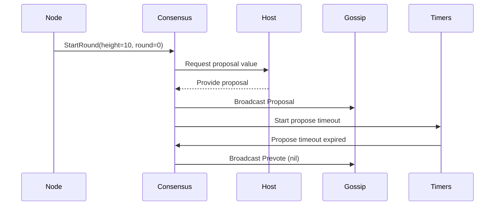
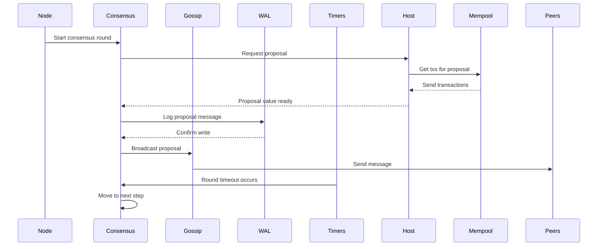

# Chapter 10: Actor-based Node Architecture

Welcome back! In the previous chapter, [Write-Ahead Log (WAL) and Crash Recovery](09_write_ahead_log__wal__and_crash_recovery_.md), you learned how Malachite safely saves progress and recovers after crashes. Now, it’s time to discover the backbone that holds Malachite’s node together: the **Actor-based Node Architecture**.

---

## Why Actor-based Architecture?

Imagine you’re managing a busy restaurant kitchen. There are many specialized cooks:

- One for pizzas,
- One for desserts,
- One for drinks,
- One taking orders, 
- And another cleaning up.

Each cook works independently, focusing on their own job. They communicate by passing short notes or talking — coordinating smoothly without getting in each other’s way.

Malachite’s node works much like this kitchen — it uses the **actor model** where different **actors** are independent "workers" handling specific parts like:

- **Consensus** (agreeing on the next block),
- **Gossip** (spreading messages),
- **Mempool** (managing transactions),
- **WAL** (logging safely),
- **Persistence** (saving final data),
- **Timers** (handling timeouts),
- **Host** (building proposals).

Each actor runs concurrently and communicates **only by sending messages**, like passing notes among the cooks. This makes the system modular, easy to understand, and resilient — even if one actor hits a problem, others can continue working or restart the troubled actor.

---

## What’s the Actor Model? A Beginner’s Explanation

The **actor model** is a way to organize software where:

- **Actors are independent entities** with their own internal state.
- Actors do NOT share data directly.
- They communicate **only by sending messages** asynchronously.
- When an actor receives a message, it can:
  - Change its own state,
  - Send messages to other actors,
  - Create new actors,
  - And decide when to stop.

Each actor behaves like a **specialized worker** with a mailbox, reading and responding to messages as they come.

---

## Why Use Actors in Malachite?

Consensus nodes have **many concerns happening at the same time**:

- Receiving votes from peers,
- Sending proposals,
- Handling timeouts,
- Persisting logs,
- Broadcasting messages,
- Adding new transactions,
- And more.

If all these happened in a single thread or component, the code would be tangled, hard to maintain, and fragile.

By splitting responsibilities into **actors**:

- It's easier to reason about each part in isolation.
- Concurrent tasks don’t interfere with each other (avoid shared data problems).
- Faults can be isolated; misbehaving actors can be restarted.
- The system can scale and be flexible for different environments.

---

## Meet the Main Actors in Malachite’s Node

Here’s a starter list of the main actors inside a Malachite node and what each one does:

| Actor            | What It Does                                               |
|------------------|------------------------------------------------------------|
| **Node**         | The *supervisor* actor that starts and manages all others. |
| **Consensus**    | Runs the core consensus logic, tracking rounds and votes.  |
| **Gossip**       | Sends and receives messages to peers over the network.     |
| **Mempool**      | Manages transactions waiting to be included in proposals.  |
| **Write-Ahead Log (WAL)** | Safely logs messages for recovery after crashes.          |
| **Persistence**  | Saves finalized state and data persistently.                |
| **Timers**       | Manages timeouts and triggers actions as timers expire.     |
| **Host**         | Builds proposals using mempool data; interfaces with apps.  |

Each actor is a **black box** handling one concern, and they send messages back and forth to coordinate.

---

## How These Actors Talk: Message Passing

Instead of sharing variables or calling each other’s functions directly, actors **send messages**. Think of these like letters or postcards.

For example, when the **Consensus actor** needs to broadcast a vote, it sends a message to the **Gossip actor** saying:

> “Please send this vote message to other nodes.”

When timeouts happen, the **Timers actor** sends a message to **Consensus**:

> “Your round 2 propose timeout just expired!”

This style means:

- No data races — actors never access shared memory directly.
- Easy to add logging or monitoring on messages.
- Clear boundaries between components.

---

## Starting the Actor System: The Node Actor

The **Node actor** is like the kitchen manager.

### What does the Node actor do?

- Starts all other actors during initialization.
- Keeps an eye on them — if an actor crashes or stops, the Node can restart it.
- Routes messages between actors if needed.
- Handles shutdown and cleanup.

This design lets other actors focus on *their own job*, trusting the Node will keep everything running smoothly.

---

## Example: Sending a Vote from Consensus to Gossip

Let's see a simplified interaction.

```rust
// Consensus actor wants to broadcast a vote
consensus_actor.send(Message::BroadcastVote(vote));

// Gossip actor receives the message
gossip_actor.handle_message(Message::BroadcastVote(vote)) {
    // Gossip actor sends the vote to peers over the network
    network.broadcast(vote);
}
```

> **Explanation:**  
> The Consensus actor sends a `BroadcastVote` message to Gossip. Gossip forwards it to peers asynchronously. Consensus doesn't worry about the network details.

---

## Beginner-Friendly Sequence Diagram: A Proposal Round



**What happens here?**

1. Node tells Consensus to start round 0 at height 10.
2. Consensus asks Host for a proposal value.
3. Host replies with the proposal.
4. Consensus tells Gossip to broadcast the proposal.
5. Consensus asks Timers to start a timeout.
6. When the timeout expires, Timers notify Consensus.
7. Consensus then broadcasts a prevote with no value (`nil`) due to the missing proposal.

Notice each actor does its job and communicates via **messages only**.

---

## Internal Implementation: How Are Actors Made in Malachite?

Malachite uses Rust’s [`ractor`](https://docs.rs/ractor/) actor framework (or similar) to implement actors.

### Creating an Actor

Actors are structs with message handlers. Here is a very minimal example of how an actor might look:

```rust
struct GossipActor;

impl Actor for GossipActor {
    type Msg = Message;

    fn handle(&mut self, msg: Self::Msg, ctx: &ActorContext<Self::Msg>) {
        match msg {
            Message::BroadcastVote(vote) => {
                // send vote over network
                // (details omitted)
            }
            _ => {}
        }
    }
}
```

> **Explanation:**  
> `GossipActor` listens for messages. When it receives `BroadcastVote`, it sends the vote to the network.

### Starting Actors and Obtaining References

Actors are started by spawning, which gives you an **actor reference** to send messages:

```rust
let gossip_actor = GossipActor::start().await.unwrap();
gossip_actor.send(Message::BroadcastVote(vote)).await.unwrap();
```

---

## How Do These Actors Work Together Inside Malachite?

Here’s a simplified event flow for a typical node operation:



**Highlights:**

- Node starts and supervises actors.
- Consensus uses Host and Mempool to get proposals.
- WAL logs messages before broadcast.
- Gossip handles sending messages to peers.
- Timers notify Consensus when timeouts happen.

---

## Why Use the Actor Model Instead of Direct Calls?

| Actor Model Advantages                 | What if We Use Direct Calls?                     |
|--------------------------------------|-------------------------------------------------|
| Encapsulated state, no data races    | Shared state causes locks and race conditions   |
| Clear message boundaries             | Mixing responsibilities and complex flows       |
| Easier to scale and add new actors   | Hard to expand or replace parts                  |
| Fault isolation — can restart actors | One failure may crash whole node                 |
| Concurrency handled gracefully       | Complex synchronization needed                   |

For a decentralized consensus node managing many concurrent tasks, these benefits matter a lot.

---

## Wrap-up: What Did We Learn?

- Malachite’s node is built as an **actor system** where independent components run concurrently and communicate solely via messages.
- Main actors include **Consensus**, **Gossip**, **Mempool**, **WAL**, **Persistence**, **Timers**, **Host**, and a top-level **Node** supervisor.
- The **actor model** enables modular, fault-tolerant, and scalable design.
- Actors use **message passing**, avoiding shared state and data races.
- The Node actor supervises and manages the entire actor ecosystem.
- Actors cooperate by sending and receiving messages, driving the complex consensus protocol as a well-orchestrated team.

---

## What’s Next?

You’ve reached an excellent milestone: understanding how Malachite runs consensus inside a sophisticated, actor-based node architecture!

Malachite also provides different interfaces to work with consensus — from low-level libraries to higher-level channel-based APIs — depending on your application needs.

If you want to explore adapting Malachite’s consensus to your custom apps, check out [Context Trait and Application Abstractions](04_context_trait_and_application_abstractions_.md). Otherwise, consider diving into the code base or experimenting with example applications.

---

Happy building with Malachite! 🚀🎉

---

Generated by [AI Codebase Knowledge Builder](https://github.com/The-Pocket/Tutorial-Codebase-Knowledge)