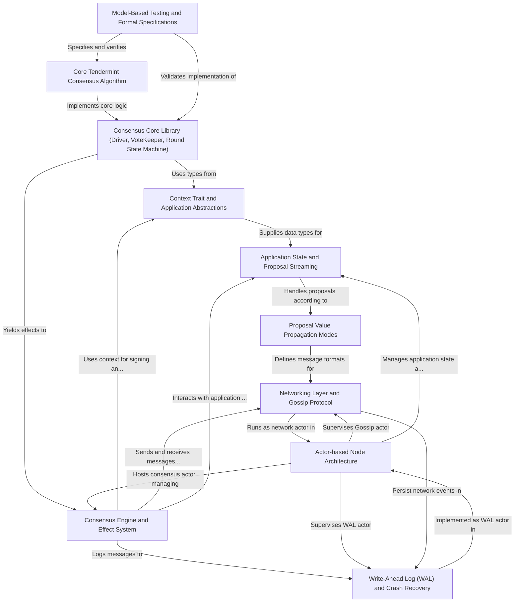

# Tutorial: malachite

Malachite is a **Byzantine Fault-Tolerant (BFT) consensus engine** that helps distributed systems and applications reach agreement on shared data, even when some participants are faulty or malicious.  
It implements the _Tendermint consensus algorithm_, allowing multiple nodes to propose, vote, and decide on values (*e.g.*, blocks) in a robust and efficient way.  
The project is designed with modularity and flexibility in mind, using abstractions like a _Context trait_ for application-specific types, an _effect system_ to interact asynchronously with the environment, and an actor-based architecture for scalability and fault-tolerance.  
Malachite also supports various modes of propagating proposed data to optimize performance and ensures safety and recovery through write-ahead logging and synchronization protocols.

**Source Repository:** [None](None)

## Chapters

1. [Core Tendermint Consensus Algorithm](01_core_tendermint_consensus_algorithm_.md)
2. [Model-Based Testing and Formal Specifications](02_model_based_testing_and_formal_specifications_.md)
3. [Consensus Core Library (Driver, VoteKeeper, Round State Machine)](03_consensus_core_library__driver__votekeeper__round_state_machine__.md)
4. [Context Trait and Application Abstractions](04_context_trait_and_application_abstractions_.md)
5. [Application State and Proposal Streaming](05_application_state_and_proposal_streaming_.md)
6. [Proposal Value Propagation Modes](06_proposal_value_propagation_modes_.md)
7. [Consensus Engine and Effect System](07_consensus_engine_and_effect_system_.md)
8. [Networking Layer and Gossip Protocol](08_networking_layer_and_gossip_protocol_.md)
9. [Write-Ahead Log (WAL) and Crash Recovery](09_write_ahead_log__wal__and_crash_recovery_.md)
10. [Actor-based Node Architecture](10_actor_based_node_architecture_.md)

---

Generated by [AI Codebase Knowledge Builder](https://github.com/The-Pocket/Tutorial-Codebase-Knowledge)