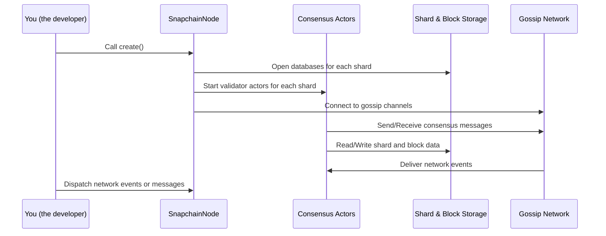

# Chapter 1: SnapchainNode and SnapchainReadNode

Welcome to the very first chapter of the Snapchain tutorial! Here, we'll explore two important components at the heart of the Snapchain network: **SnapchainNode** and **SnapchainReadNode**.

---

### Why do we need SnapchainNode and SnapchainReadNode?

Imagine a busy post office where many letters arrive and are sorted every day. Some employees are responsible for **accepting** new letters and deciding where they should go. Others just **read** the sorted mail and keep records, but they don’t handle new mail.

In Snapchain, the network has similar roles:

- **SnapchainNode** acts like the post office employee who handles *writing and organizing* new blocks or shards. These nodes **propose** new blocks and validate them — they are called **validators**.
- **SnapchainReadNode** acts like the employee who only *reads* or **syncs** the already agreed-upon data — they don't create new blocks but make sure to stay updated.

These two types of nodes work together to keep the network secure, consistent, and synced.

---

## Understanding the Core Concepts

Let's break down what SnapchainNode and SnapchainReadNode actually do.

### 1. SnapchainNode — The Validator Node

- Responsible for proposing new blocks or shards.
- Runs consensus algorithms to decide on the next valid block.
- Keeps track of shard data and block data (think of shards as smaller pieces of the whole blockchain).
- Talks with other network participants to exchange messages and agree on the blockchain state.

### 2. SnapchainReadNode — The Read-Only Node

- Does *not* create or propose new blocks.
- Listens to finalized decisions made by validator nodes.
- Syncs and processes blocks and shards already decided.
- Helps keep the network scalable by offloading syncing tasks.

---

## SnapchainNode and SnapchainReadNode in Action: A Simple Example

Imagine you want to join the network as a validator, or simply as a node that keeps synced.

- If you want to **validate and propose blocks**, you'll use a **SnapchainNode**.
- If you want to **follow the network and stay updated** without proposing, you'll use a **SnapchainReadNode**.

Let’s look at minimal examples of how to create these nodes (highly simplified):

```rust
// Simplified pseudocode to create a SnapchainNode (validator)
let validator_node = SnapchainNode::create(
    keypair,
    config,
    local_peer_id,
    gossip_channel_sender,
    shard_decision_sender,
    optional_block_sender,
    messages_sender,
    block_storage,
    local_state_storage,
    rocksdb_directory,
    stats_client,
    trie_branching_factor,
    network_config,
    metrics_registry,
).await;
```

This will set up all the validators for the shards you are responsible for, as well as the block shard validator. The node will manage sending and receiving consensus messages, propose blocks, and store shards.

```rust
// Simplified pseudocode to create a SnapchainReadNode (read-only)
let read_node = SnapchainReadNode::create(
    keypair,
    config,
    local_peer_id,
    gossip_channel_sender,
    system_messages_sender,
    messages_sender,
    block_storage,
    rocksdb_directory,
    stats_client,
    trie_branching_factor,
    network_config,
    metrics_registry,
).await;
```

This sets up read-only consensus actors that sync shard and block data by processing decided values, without proposing new blocks.

---

## What Happens Inside When You Create These Nodes?

Let's step through what SnapchainNode does when you create it. The process is similar for SnapchainReadNode but tailored for read-only operation.



This diagram shows how the SnapchainNode sets up databases, connects consensus actors (the actors handling consensus), and integrates with the network for communication.

---

## Internals — Breaking Down SnapchainNode Creation

The SnapchainNode manages several things:

- **Consensus actors**: The small "managers" that run consensus logic for each shard.
- **Shard stores and senders**: Components responsible for reading/writing shard data and for managing message sending.
- **Address**: The node’s unique identity.

Here’s a small simplified snippet illustrating how the node creates consensus actors for shards:

```rust
for shard_id in config.shard_ids.clone() {
    if shard_id == 0 {
        // Shard 0 is for blocks, skipped here
        continue;
    }

    // Create context with node keys
    let ctx = SnapchainValidatorContext::new(keypair.clone());

    // Open DB and create shard storage engine
    let db = RocksDB::open_shard_db(rocksdb_dir.as_str(), shard_id);
    let engine = ShardEngine::new(db.clone(), network.clone(), /* other args */);

    // Create proposer
    let proposer = ShardProposer::new(address.clone(), shard_id, engine.clone(), /* others */);

    // Setup validator with proposer
    let validator = ShardValidator::new(address.clone(), shard_id, /* validator set */, Some(proposer), None, /* storage */, /* statsd */);

    // Launch consensus actor with validator
    let consensus_actor = MalachiteConsensusActors::create_and_start(ctx, validator, /* more params */).await?;

    consensus_actors.insert(shard_id, consensus_actor);
}
```

- For each shard except the block shard (id 0), it creates a storage engine using RocksDB.
- Sets up a proposer and validator to handle block creation/validation.
- Starts an asynchronous consensus actor for managing shard consensus.
- Adds the actor to a collection for later message dispatching.

The block shard (shard 0) is handled similarly but uses a **BlockEngine** and a **BlockProposer**.

---

## How about SnapchainReadNode?

SnapchainReadNode is a lot like SnapchainNode, but the consensus actors it creates are "readers" instead of "validators":

- They only **process finalized** blocks and shards but do NOT propose new ones.
- Their engine uses **BlockEngine** or **ShardEngine**, but wrapped inside **MalachiteReadNodeActors** for read-only consensus operations.
- They listen and sync data continuously to keep the read state updated.

Minimal internal flow:

```rust
for shard_id in config.shard_ids.clone() {
    // Open DB and create shard engine
    let db = RocksDB::open_shard_db(rocksdb_dir.as_str(), shard_id);
    let engine = ShardEngine::new(db.clone(), network.clone(), /* other args */);

    // Create read node consensus actor
    let consensus_actor = MalachiteReadNodeActors::create_and_start(
        context,
        Engine::ShardEngine(engine),
        peer_id,
        gossip_tx.clone(),
        system_tx.clone(),
        metrics_registry,
        shard_id,
        statsd.clone(),
        config.clone(),
    )
    .await?;
    
    consensus_actors.insert(shard_id, consensus_actor);
}
```

---

## Summary

Here’s what you have learned in this chapter:

- **SnapchainNode** and **SnapchainReadNode** are your primary ways to join the Snapchain network either as a **validator** node or a **read-only** node.
- Both nodes manage their own consensus actors, shard/block storage, and networking.
- SnapchainNode proposes and validates blocks/shards, while SnapchainReadNode syncs and processes finalized data.
- Both nodes orchestrate between consensus logic, storage, and the network layer.
- Creating a node involves spinning up consensus actors per shard and integrating with RocksDB and gossip channels.

Now that you understand the foundation of Snapchain nodes, you are ready to dive into **[Configuration and Startup Flow](02_configuration_and_startup_flow_.md)** in the next chapter, where you will learn how to configure and start these nodes for your network.

---

> Great job on finishing Chapter 1! Keep going — this journey will help you master Snapchain step-by-step.

---

Generated by [AI Codebase Knowledge Builder](https://github.com/The-Pocket/Tutorial-Codebase-Knowledge)