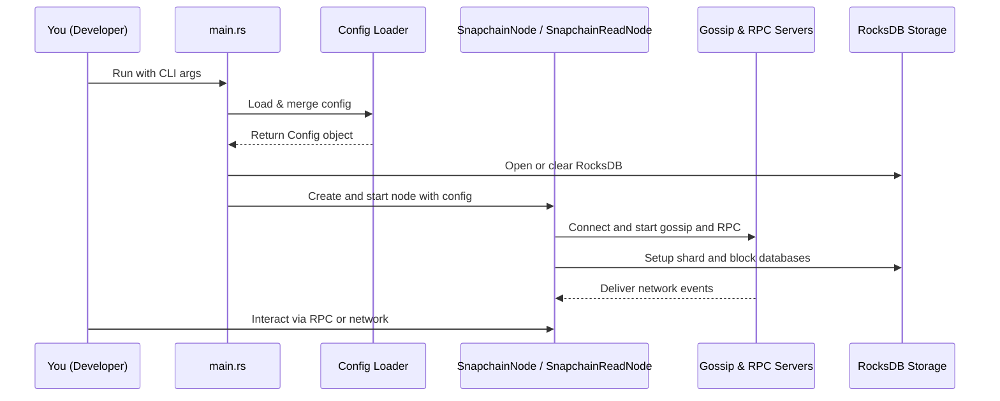
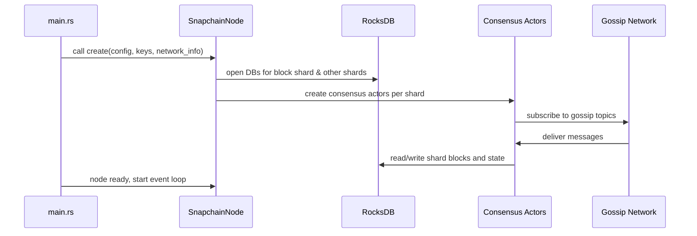

# Chapter 2: Configuration and Startup Flow

Welcome back! In the previous chapter, we learned about how **SnapchainNode** and **SnapchainReadNode** form the building blocks of the Snapchain network, acting as validator and read-only nodes respectively.

Now that we understand these nodes, it’s time to explore how to **configure and start** them up properly. In this chapter, we will learn how Snapchain loads its configuration settings and how the `main.rs` file acts as the “control room” to start all the important parts of the node.

---

## Why is Configuration and Startup Flow Important?

Imagine you bought a fancy smart home system. Before it can work, you need to:

- Set it up with your Wi-Fi, username, and preferences
- Turn on the main control hub that connects all devices
- Start each device with proper settings so they work together smoothly

Similarly, when you start a **SnapchainNode** or **SnapchainReadNode**, you must tell it how to behave by providing settings (the configuration), and then launch all the required subsystems like networking, storage, and consensus.

---

## Use Case: Starting a Snapchain Node with Custom Settings

Let’s say you want to run a Snapchain validator node on your local machine. You want to:

- Use a specific config file (`config.toml`)
- Choose a log format (e.g., text or JSON)
- Clear the database before starting fresh
- Start networking, consensus, and database storage correctly

How does Snapchain take your settings and get everything ready with one command?

The answer lies in its **configuration loading** and **startup orchestration** — taking **CLI arguments, environment variables,** and **config files**, merging them into one settings structure, and then initializing your node with these settings.

---

## Key Concepts in Configuration and Startup

Let's break down this process into simple parts:

### 1. Configuration Loading

Snapchain supports three sources of configuration that get merged together:

- **Command-Line Arguments (CLI args):** Options you specify when running the program. Example: `--config_path config.toml`
- **Environment Variables:** Settings in your shell environment, prefixed with `SNAPCHAIN_`. Example: `SNAPCHAIN_LOG_FORMAT=json`
- **Configuration File:** A TOML file (like `config.toml`) that holds many nested settings.

Snapchain reads all these sources and merges them with a default configuration. The later sources override earlier ones, so CLI args take top priority.

### 2. Initialization of Subsystems

Once configuration is loaded and merged into a single `Config` struct, the `main.rs` file:

- Sets up **logging** (decides how logs are shown)
- Loads or clears **databases** (using RocksDB for shard/block storage)
- Creates and starts the **network layer** (for gossip and RPC communication)
- Sets up **consensus actors** (the validators or read-only actors that run consensus algorithms)
- Launches **services** like mempool, on-chain event listeners, and HTTP/GRPC servers
- Runs **background jobs** such as pruning or snapshot uploads

This process is like flipping switches in the right order, ensuring your node is fully operational.

---

## How does Configuration Loading Work? — A Simple Example

Here’s a tiny example to show how Snapchain loads config:

```rust
let args: Vec<String> = std::env::args().collect();
let config = snapchain::cfg::load_and_merge_config(args)?;
println!("Log format: {}", config.log_format);
println!("Config file used: {}", config.config_path);
```

- `std::env::args()` grabs CLI inputs.
- `load_and_merge_config` parses CLI args, then loads the TOML config file specified.
- Then it applies environment variables starting with `SNAPCHAIN_`.
- The result is a `Config` object with *all* your settings in one place.

**Output:** 

```
Log format: json
Config file used: config.toml
```

This means your node now knows to log in JSON format and has loaded that exact config.

---

## What Happens When You Start the Node? — Overview

1. **Parse and Merge Config** from CLI args, env vars, and file.
2. **Initialize Logging** based on the chosen log format.
3. **Optionally Clear Database** if `--clear_db` cli flag is set.
4. **Download Snapshots** if configured and database is empty.
5. **Open RocksDB Databases** for each shard and blocks.
6. **Create the Node:**
   - For a validator, create a `SnapchainNode`
   - For a read-only sync node, create a `SnapchainReadNode`
7. **Start Background Jobs** like pruning or snapshot uploads.
8. **Start Mempool** to manage pending transactions.
9. **Launch Network Services**: gossip network, RPC servers.
10. **Begin Event Loop** to process consensus messages, mempool, network events, etc.

---

### Here’s a high-level flow diagram:



This shows how your CLI invocation results in a fully running Snapchain node ready to join the network.

---

## Diving a Bit Deeper: Configuration in `src/cfg.rs`

The Snapchain config is defined in a big struct named `Config`, made up of nested configs like `StatsdConfig` (for metrics), `PruningConfig` (for cleaning old data), `Consensus::Config`, and many others.

Here is a simplified version showing just a few fields:

```rust
#[derive(Debug, Deserialize, Serialize)]
pub struct Config {
    pub log_format: String,        // "text" or "json"
    pub rpc_address: String,       // gRPC server address
    pub http_address: String,      // HTTP server address
    pub rocksdb_dir: String,       // Database directory path
    pub clear_db: bool,            // Flag to clear DB at start
    pub read_node: bool,           // Whether this is a read-only node
}
```

Defaults are provided so even if you forget something, Snapchain will use reasonable settings.

The **CLI arguments struct** looks like this:

```rust
#[derive(Parser)]
pub struct CliArgs {
    #[arg(long)]
    pub log_format: Option<String>,

    #[arg(long)]
    pub config_path: String, // mandatory CLI option

    #[arg(long, action)]
    pub clear_db: bool,
}
```

And loading the config merges default → file → environment vars → CLI args, so you get one complete config ready for the node startup.

---

## The Main Startup Logic in `src/main.rs`

The main function (`main.rs`) is where the magic happens:

- It calls `load_and_merge_config` to get the configuration.
- Sets up **logging** based on `log_format`.
- Checks if the database should be cleared (deleting old RocksDB files).
- Downloads snapshots if configured and if the database is empty.
- Opens RocksDB for the block shard (shard 0) and multiple other shards.
- Uses the config’s `read_node` flag to decide whether to start a `SnapchainNode` or a `SnapchainReadNode`.
- Launches background jobs such as pruning and snapshot uploading.
- Starts the **mempool** actor responsible for transaction pooling.
- Starts network servers (gRPC and HTTP).
- Enters an event loop watching for shutdown signals (`ctrl-c`) and processing messages from the network and internal subsystems.

---

### Example: Starting a Read-Only Node vs Validator Node

#### Starting a Read-Only Node:

```rust
if app_config.read_node {
    let node = SnapchainReadNode::create(
        keypair.clone(),
        app_config.consensus.clone(),
        local_peer_id,
        gossip_tx.clone(),
        system_tx.clone(),
        messages_request_tx,
        block_store.clone(),
        app_config.rocksdb_dir.clone(),
        statsd_client.clone(),
        app_config.trie_branching_factor,
        app_config.fc_network,
        registry,
    )
    .await;
    // Launch jobs, mempool, network servers...
}
```

#### Starting a Validator Node:

```rust
else {
    let node = SnapchainNode::create(
        keypair.clone(),
        app_config.consensus.clone(),
        local_peer_id,
        gossip_tx.clone(),
        shard_decision_tx,
        None,
        messages_request_tx,
        block_store.clone(),
        local_state_store.clone(),
        app_config.rocksdb_dir.clone(),
        statsd_client.clone(),
        app_config.trie_branching_factor,
        app_config.fc_network,
        registry,
    )
    .await;
    // Launch jobs, mempool, network servers...
}
```

The code sets up all consensus actors, storage, and networking accordingly.

---

## Under the Hood: What Happens During Node Creation?

Let’s walk through the simplified sequence of actions happening inside the `SnapchainNode::create` or `SnapchainReadNode::create` method:



This modular startup lets Snapchain flexibly handle complex networks with many shards.

---

## Conclusion

In this chapter, you have learned:

- Why configuration loading and startup flow is the foundation for running your Snapchain node.
- How Snapchain merges CLI args, environment variables, and config files into a single configuration.
- What happens inside `main.rs` to initialize logging, storage, networking, consensus, and background jobs.
- How to start either a **SnapchainNode** (validator) or **SnapchainReadNode** (read-only) based on config.
- The sequence of internal steps from config loading to network startup.

This understanding prepares you to dive into the next core piece: the **[Network Layer: Gossip, Server, and RPC](03_network_layer__gossip__server__and_rpc_.md)**, where you will see how Snapchain nodes talk to each other and to clients.

---

> Great job reaching Chapter 2! Keep up the great work as you explore Snapchain’s internals step-by-step.

---

Generated by [AI Codebase Knowledge Builder](https://github.com/The-Pocket/Tutorial-Codebase-Knowledge)