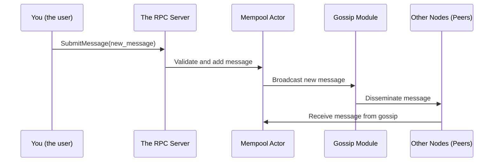
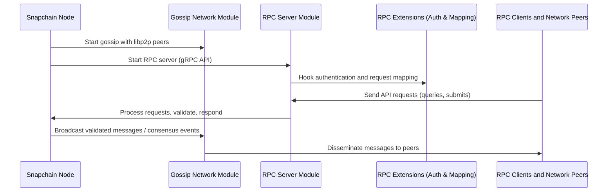

# Chapter 3: Network Layer: Gossip, Server, and RPC

Welcome back! In the last chapter, you learned all about how to **configure and start** your Snapchain nodes, whether as validators or as read-only nodes. Now that your nodes can start running, it's time to explore how they actually **talk to each other and to users**.

---

## Why Do We Need a Network Layer?

Imagine you have a group of friends playing a game, but none of you are in the same room. How do you share moves or messages? You need some way to communicate, like:

- **Whispering gossip** to your friends, so everyone hears about the latest news.
- **A telephone operator or server** that answers questions or takes your commands.
- **Special security checks** to make sure only trusted folks get through.

This is exactly what the **network layer** in Snapchain does. It’s the node’s communication department:

- **Gossip**: Like whispering news in the playground. Nodes share information with their peers.
- **Server**: Like a receptionist who answers questions and accepts new info from users.
- **RPC**: The special “phone line” that also checks if callers are allowed and sends requests to the right place.

Let’s break down each part in a beginner-friendly way.

---

## 1. Gossip: Whispering with Peers (Peer-to-Peer Message Spreading)

### What is Gossip in Snapchain?

Think of gossip like sharing secrets in a crowded room. When one person hears something important, it quickly spreads through the crowd because everyone tells their nearby friends.

In Snapchain, **gossip uses libp2p**, a powerful networking library, to let nodes tell each other about new blocks, votes, or transactions.

### Why gossip?

- It helps nodes learn about what others are doing fast.
- Keeps the network in sync without needing a central boss.
- Is resilient: even if some peers are offline, messages find their way around.

### How does it work?

- Every node **connects to some known peers** (called bootstrap peers).
- When a node gets a new message (like a new block), it **broadcasts** that message to its peers.
- Those peers then forward it to their peers, and so on — the gossip spreads like wildfire!

---

### Example: Sending a Mempool Message via Gossip

```rust
// Create a mempool message (simplified)
let mempool_message = MempoolMessage::UserMessage(new_transaction);

// Send the message to gossip
gossip_tx.send(GossipEvent::BroadcastMempoolMessage(mempool_message)).await.unwrap();
```

Here, `gossip_tx` is a channel that your node uses to send gossip events. This message will spread to all connected peers using libp2p under the hood!

---

## 2. Server: Your Friendly RPC API (Talking to Clients)

### What is the Server in Snapchain?

When someone wants to ask your node questions (“Hey, what’s the latest block?”) or submit new info (“Here’s a new transaction!”), they use a **gRPC server** — like talking to a digital assistant.

The server exposes many APIs:

- Query blockchain data (blocks, shards, messages)
- Submit new messages
- Subscribe to live event streams
- Get storage info and user proofs

### Why use gRPC?

- It’s an efficient way for clients to talk to the node.
- Supports streaming data (like listening to events as they happen).
- Comes with automatic message serialization and deserialization.

---

### Example: Calling the `submit_message` RPC

```rust
// The client sends a proto::Message to the RPC server
let response = my_hub_service.submit_message(request).await;
match response {
    Ok(resp) => println!("Message successfully submitted!"),
    Err(e) => println!("Failed to submit message: {}", e),
}
```

Behind the scenes, the server takes care of **validating** the message, passing it to the mempool, and responding with success or error.

---

## 3. RPC Extensions: Authentication and Request Mapping

### What are RPC Extensions?

Imagine your server is open to the world. You don't want just anyone to submit messages or change data! RPC extensions add:

- **Authentication**: Only users with the right username/password can submit messages.
- **Request mapping**: Mapping incoming requests (like JSON or protobuf) to internal Rust structures.
- **Error handling**: Sending clear error messages back to clients when something goes wrong.

This keeps the node secure and well-organized.

---

### Example: How Authentication Works (Very Simplified)

```rust
fn authenticate_request(auth_header: Option<&str>, allowed_users: &HashMap<String, String>) -> Result<(), &'static str> {
    if allowed_users.is_empty() {
        return Ok(()); // Auth disabled
    }

    if let Some(auth) = auth_header {
        // Simplified: Check if "username:password" is in allowed_users
        if let Some(password) = allowed_users.get(auth) {
            if password == "correct_password" {
                return Ok(());
            }
        }
    }
    Err("Authentication failed")
}
```

The real implementation securely decodes and verifies auth headers, but this shows the principle.

---

# How Do These Parts Work Together?

Here’s a simple real-world use case:

> You want to **submit a new message** to a Snapchain node, and **have it spread to other nodes and saved on the chain**.

Here's what happens step-by-step:



- The **client** calls the RPC server to submit a new message.
- The **server** validates and passes the message to the mempool.
- The **mempool** adds the message and asks the gossip module to broadcast it.
- The **gossip module** sends the message out to connected peers.
- Other **peer nodes** receive the message and add it to their mempools, continuing the gossip chain.

---

# Inside the Network Layer: An Overview Walkthrough

When your node creates its network layer, several things happen behind the scenes:



---

# Now, Let’s Peek Into the Code (Very Simplified!)

### Creating and Starting Gossip

```rust
let gossip_config = Config::new(my_address, bootstrap_peers);
let gossip = SnapchainGossip::create(
    keypair,
    &gossip_config,
    system_message_sender,
    false, // false indicates this is not a read-only node
    FarcasterNetwork::Devnet,
    statsd_client,
).await.unwrap();

tokio::spawn(async move {
    gossip.start().await;
});
```

- `SnapchainGossip::create` sets up libp2p topics (Consensus, Mempool, ContactInfo).
- It listens on the network for gossip messages.
- This module converts network bytes into internal messages and vice versa.

---

### Creating the RPC Server

```rust
let service = MyHubService::new(
    rpc_auth_string,
    block_store.clone(),
    shard_stores.clone(),
    shard_senders.clone(),
    statsd_client.clone(),
    num_shards,
    FarcasterNetwork::Devnet,
    message_router,
    mempool_tx.clone(),
    None, // Option<Box<dyn L1Client>> for on-chain validations
    version_string,
    peer_id_string,
);

// Use tonic to run the server on a given port
tonic::transport::Server::builder()
    .add_service(proto::hub_service_server::HubServiceServer::new(service))
    .serve(addr)
    .await?;
```

- This starts an RPC server listening on a configured port.
- The server handles client requests asynchronously.
- All API calls pass through `MyHubService` methods (like `submit_message`, `get_cast`, etc.).
- The service uses the RPC extensions module to **check authentication** on every request.

---

### How Do RPC Extensions Authenticate?

```rust
fn authenticate_request(request: &tonic::Request<T>, allowed_users: &HashMap<String, String>)
    -> Result<(), tonic::Status>
{
    // If authentication is disabled, accept all
    if allowed_users.is_empty() {
        return Ok(());
    }

    // Look for "authorization" header
    if let Some(auth) = request.metadata().get("authorization") {
        // Decode and verify username and password
        // Return Ok(()) if valid, else return Err(Status::unauthenticated(...))
    } else {
        return Err(tonic::Status::unauthenticated("missing authorization header"));
    }
}
```

- If no users are set, auth is off.
- Otherwise, incoming requests must have correct Basic Auth headers.
- Reject unauthorized or malformed requests.

---

# Recap: What Did We Learn?

- **The network layer handles all communication:** nodes gossip with peers, serve client queries, and authenticate RPC calls.
- **Gossip spreads messages directly among nodes**, enabling quick, decentralized sync.
- **The gRPC server listens to client requests**, offering a clean API to fetch data or submit messages.
- **RPC extensions add a layer of security and mapping** to ensure only authorized users interact.
- You learned a high-level flow of submitting a message: from client to server to mempool to gossip, and finally on to peers.

---

# What’s Next?

You now have a solid understanding of how Snapchain nodes communicate and serve clients.

Up next, in **[Chapter 4: Mempool and Rate Limits](04_mempool_and_rate_limits_.md)**, you’ll learn how Snapchain manages the pool of pending transactions and controls traffic to stay efficient and secure.

---

> Great work reaching Chapter 3! Stay curious and keep exploring Snapchain internals step-by-step.

---

Generated by [AI Codebase Knowledge Builder](https://github.com/The-Pocket/Tutorial-Codebase-Knowledge)