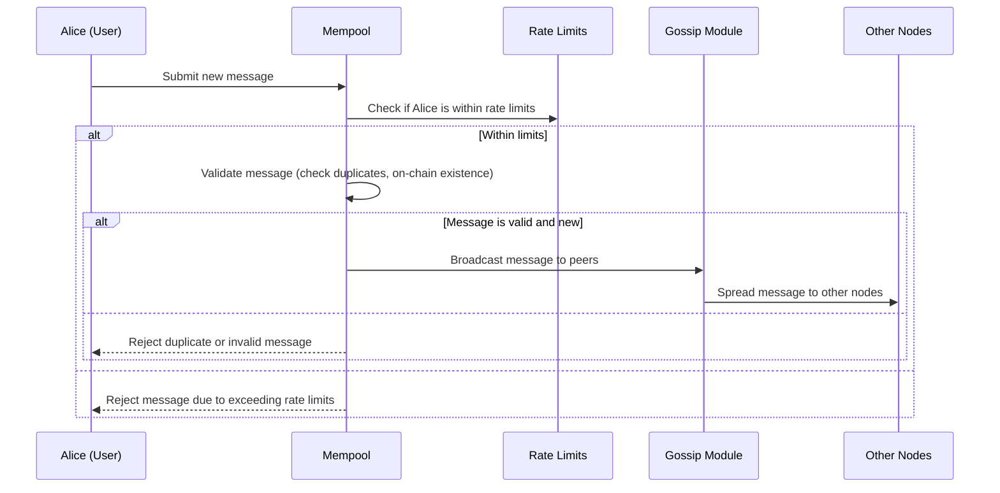
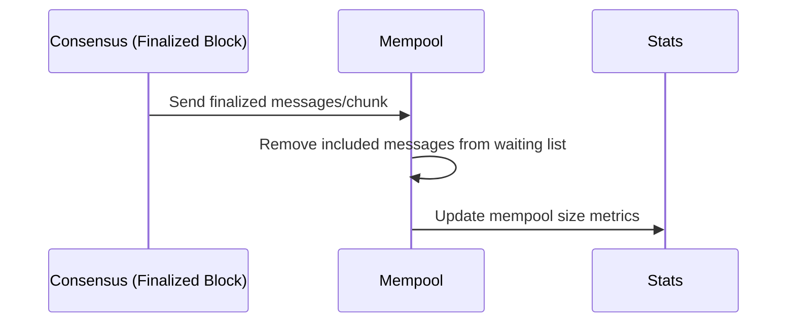
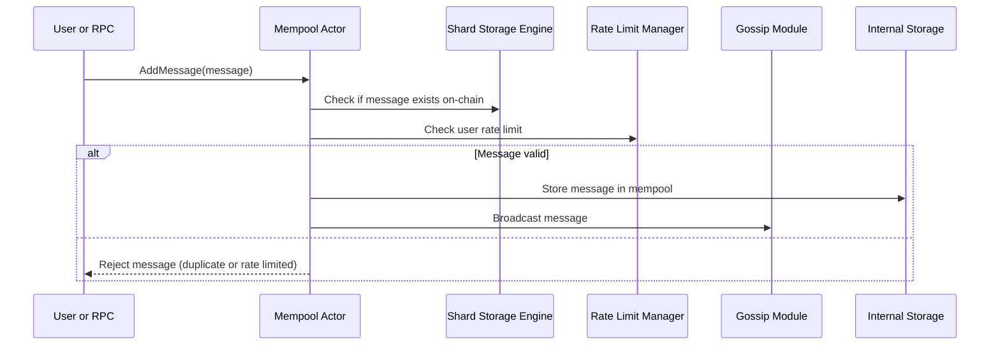

# Chapter 4: Mempool and Rate Limits

Welcome back! In the previous chapter, you learned all about the **[Network Layer: Gossip, Server, and RPC](03_network_layer__gossip__server__and_rpc_.md)** — how Snapchain nodes connect, talk, and share data. Now, we will explore the **Mempool and Rate Limits**, a very important part of the Snapchain network.

---

## Why is the Mempool Important? — A Real-World Example

Imagine you own a small café, and customers keep coming in to place orders. But your kitchen can only handle so many orders at once. If too many orders come in at the same time, things get messy, and orders get lost or mixed up.

To avoid that, you create a **waiting line** for incoming orders. You **validate** orders to make sure customers aren’t ordering impossible things, **avoid duplicates** (no double orders), and **limit** how many orders each customer can place — so the kitchen stays sane and all customers get served fairly.

---

In Snapchain, the **mempool** is like this waiting room. It manages **incoming user messages and validator events** before they get included (committed) on the blockchain. It makes sure:

- **Messages/transactions are valid.** No nonsense or corrupt data allowed.
- **No duplicates** get processed twice.
- **Rate limits are applied** to prevent spammy users from flooding the network.
- **Messages get gossiped efficiently** to other nodes without unnecessary repeats.

If the mempool gets overwhelmed, it could slow down the whole network or let bad actors cause trouble. Rate limits help Snapchain stay fast, reliable, and fair.

---

## What We'll Learn in This Chapter

- What is a **mempool** in Snapchain and why it matters.
- How the mempool **validates and filters** messages.
- What **rate limits** are and how they protect the network from spam.
- How messages move from user submission, through the mempool, and then to the network.
- A peek **under the hood** at how the mempool works internally.

Ready? Let’s dive in!

---

## What is the Mempool in Snapchain?

The mempool is short for **"memory pool"**. It's like a **waiting room** where all new messages (transactions or validator events) sit **before** they are included in a block.

**Key things the mempool does:**

1. **Validates incoming messages:** Checks that messages make sense and that they are not already included in the blockchain.
2. **De-duplicates messages:** If a message is already committed or already in mempool, ignore duplicates.
3. **Rate limits each user:** Prevents spamming by controlling how fast an individual user can send messages.
4. **Gossips messages:** Shares valid messages with other nodes to keep the network in sync.

---

## How Does the Mempool Validate and Deduplicate Messages?

Before anything goes into the mempool or gets broadcast to the network, it’s checked:

- **Is this message already on-chain?** If yes, throw it away.
- **Is it a genuine new message?** If yes, accept it.
- **Has this user sent too many messages recently?** If yes, reject it (rate limits).

For example, if Alice tries to send the same cast twice, the mempool will reject the duplicate. Or if Bob sends 100 messages at once, and the rate limit is 10 per hour, the mempool will only accept the first 10 and reject the rest.

---

## What Are Rate Limits? Why Do We Need Them?

Think of rate limits as the café's rule: each customer can only place **so many orders per hour** to keep things fair.

In Snapchain, **rate limits control how many messages a single user (identified by their unique ID, called `fid`) can send in a given time.**

- This prevents **spam**, where one bad actor floods the network.
- It keeps the mempool manageable, so it doesn't get overloaded.
- Rate limits are **per user and per shard**, so each user has their own quota on each shard.

---

## How Are Rate Limits Implemented?

- Each user has a **token bucket**: a "tank" of tokens representing how many messages they can send.
- When a new message arrives, **one token is consumed**.
- Tokens **refill slowly over time**, allowing steady sending later.
- If a user runs out of tokens, new messages are rejected until tokens refill.
- Rate limits are cached and **expire after a while** when unused (to free memory).

---

## Mempool in Action: Submitting a Message Step-by-Step

Let's consider a user Alice submitting a new message:

```rust
// Alice's message, e.g., a 'cast'
let alice_message = MempoolMessage::UserMessage(new_cast);

// Send the message to the mempool
mempool_tx.send(MempoolRequest::AddMessage(alice_message.clone(), MempoolSource::RPC)).await.unwrap();
```

Here’s what happens next in simple terms:



- The mempool first checks for spammy behavior (rate limits).
- Then it validates the message and deduplication.
- If accepted, message is broadcast (gossiped) to other nodes.
- If rejected, an error is returned or simply dropped.

---

## Using the Mempool: An Example of Validating a Message

Let’s look at a simplified function that checks if a message is valid for insertion:

```rust
fn message_is_valid(&mut self, message: &MempoolMessage) -> bool {
    let shard = self.get_shard_for_fid(message.fid());

    // Check if message already committed on-chain (duplicate)
    if self.message_already_exists(shard, message) {
        return false;
    }
    // Check if rate limit exceeded
    if self.message_exceeds_rate_limits(shard, message) {
        return false;
    }
    true
}
```

- `message_already_exists` queries the shard store to see if the message was committed.
- `message_exceeds_rate_limits` checks if the user has enough quota to send the message.

If both checks pass, the message is allowed in the mempool.

---

### Explanation for Beginners:

- `shard`: The blockchain part (e.g., shard ID) where this message belongs.
- `fid`: User identifier — like a customer ID.
- The function returns **`true`** if it’s okay to add this message to the mempool.

---

## How Does Rate Limit Consumption Look?

Here's a super simplified rate limit check per user:

```rust
fn consume_for_fid(&mut self, shard_id: u32, fid: u64) -> bool {
    let rate_limiter = self.get_or_create_rate_limiter(fid);
    if let Some(limiter) = rate_limiter {
        // Consume one token (if enough tokens are available)
        limiter.check().is_ok()
    } else {
        // No rate limiter (e.g., user has 0 storage), disallow all messages
        false
    }
}
```

- `get_or_create_rate_limiter` creates a rate limiter for each user only when needed.
- `check()` returns Ok if tokens are available, else error.
- Users without storage allowance get no tokens.

---

## Mempool Message Storage and Prioritization

- Messages are stored **per shard** in a **sorted map** (`BTreeMap`), ordered by:

  1. **Message type priority**: validator messages first, then user messages.
  2. **Timestamp**: older messages get priority.
  3. **Message hash**: to ensure consistent ordering.

- When it's time to create a new block, the mempool **pulls messages in order** up to the block capacity.

---

## What Happens to Messages When They Get Included on the Chain?

When consensus finalizes a new block or shard chunk that includes some messages, the mempool **removes those messages from its waiting pool**. This is called **eviction**, to keep the mempool clean.

Here’s a simplified flow:



- The mempool listens to finalized decisions.
- It evicts from the mempool any messages that are now on-chain.
- Rate limits can be **reset** or **updated** if user properties change (e.g., purchased more storage).

---

## Internal Walkthrough: What Happens When Mempool Receives a Message?



- The mempool actor is the manager coordinating these steps.
- It queries the storage engine (e.g., RocksDB) for duplicates.
- It consults the rate limits for the message sender.
- If accepted, it stores and gossips; otherwise, it rejects quietly or explicitly.

---

## Diving Deeper Into the Code (Simplified)

Here’s how the main `run` loop processes incoming messages (simplified):

```rust
async fn run(&mut self) {
    while let Some(message_request) = self.mempool_rx.recv().await {
        match message_request {
            MempoolRequest::AddMessage(message, _source) => {
                if self.message_is_valid(&message) {
                    // Store and broadcast message
                    self.insert(message).await;
                }
            }
            MempoolRequest::GetSize(reply_to) => {
                // Send current mempool size per shard
                let sizes = self.get_sizes();
                let _ = reply_to.send(sizes);
            }
        }
    }
}
```

- The mempool awaits messages or queries.
- For each new message, it validates and inserts if OK.
- Also responds with size info when requested.

---

Here is a **tiny snippet** showing rate limit enforcement when inserting a message:

```rust
fn message_exceeds_rate_limits(&mut self, shard_id: u32, message: &MempoolMessage) -> bool {
    if let Some(rate_limits) = &mut self.rate_limits {
        !rate_limits.consume_for_fid(shard_id, message.fid())
    } else {
        false
    }
}
```

---

## Summary and What’s Next?

In this chapter, you learned:

- The mempool is the **waiting room** for messages before they get stored on the blockchain.
- It **validates messages**, removes duplicates, and applies important **rate limits**.
- Rate limits help keep the network **safe and spam-free** by controlling how many messages each user can submit.
- The mempool **gossips** valid messages to other nodes, helping the network stay synchronized.
- When messages get finalized on-chain, the mempool **evicts** them.
- You saw how to submit messages to the mempool, and how it handles validation and broadcasting under the hood.

Up next, you will explore the **[Consensus Actors (MalachiteConsensusActors, Host, ReadHost, Sync Actors)](05_consensus_actors__malachiteconsensusactors__host__readhost__sync_actors__.md)** that make sure all nodes agree on the messages and blocks.

---

> You are doing great! Understanding the mempool and rate limits is a big step toward grasping how Snapchain stays fast, secure, and efficient. Keep going!

---

Generated by [AI Codebase Knowledge Builder](https://github.com/The-Pocket/Tutorial-Codebase-Knowledge)