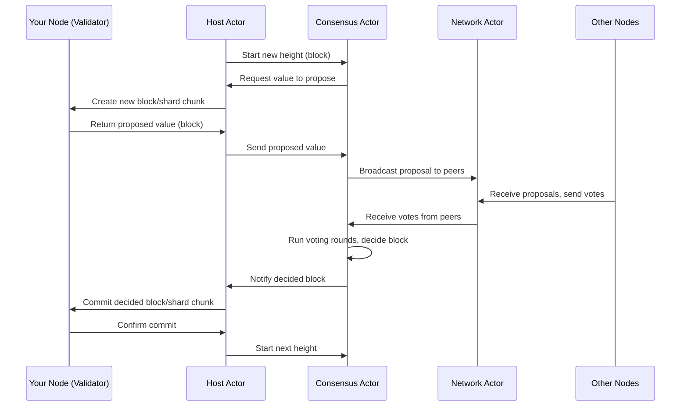
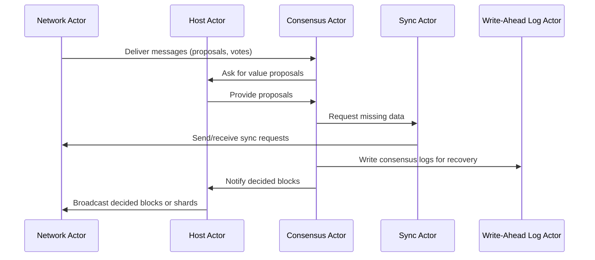

# Chapter 5: Consensus Actors (MalachiteConsensusActors, Host, ReadHost, Sync Actors)

Welcome back! In the last chapter, you learned about the **[Mempool and Rate Limits](04_mempool_and_rate_limits_.md)** — how Snapchain manages pending messages and keeps the network safe from spam. Now, it's time to explore the core part that *makes all nodes agree* on the blockchain’s current state.

This chapter introduces **Consensus Actors** — the "brain" of a Snapchain node that runs the consensus protocol and ensures everyone on the network agrees on blocks, shards, and state changes.

---

## Why Do We Need Consensus Actors?

Imagine a group of friends deciding together what movie to watch next. Everyone has their own opinion, but they need to agree to watch *one* movie so nobody gets frustrated. They chat, vote, maybe even have rules to break ties.

In Snapchain, the **Consensus Actors** are the friends in this decision-making group. They run the **consensus protocol**, helping nodes agree on:

- Which blocks to add to the blockchain
- How shards are updated and synced
- What state changes are valid

This agreement must happen **even if some nodes are slow, disconnected, or misbehaving** — consensus actors handle all that complex coordination behind the scenes.

---

## The Central Use Case: Agreeing on a New Block

Let's say you run a Snapchain node that wants to join the network as a validator node. Your node needs to:

1. **Propose new blocks or shard data** when it’s your turn.
2. **Listen to other validators’ proposals**.
3. **Vote on proposals** based on some rules.
4. **Agree together on the next block for the shard or blockchain**.
5. **Apply decided blocks to local storage** and proceed to the next block.
6. **Sync with the network so you don't miss any updates**.

Who does all this work? That's where the consensus actors come in!

---

## Key Consensus Actors in Snapchain

Let’s meet the actors that together make up the Snapchain consensus engine:

| Actor Name                     | Role                                                                                       | Analogy                          |
|-------------------------------|--------------------------------------------------------------------------------------------|---------------------------------|
| **MalachiteConsensusActors**  | Bundles all consensus-related actors for a shard (network, consensus, sync, host, WAL).   | The node’s "brain" for consensus |
| **Host**                      | Bridges between consensus protocol and the Snapchain application logic.                   | The translator and messenger    |
| **ReadHost**                  | A read-only version of Host, syncing finalized blocks/shards without proposing.           | A news reporter                 |
| **Sync Actors (Sync & ReadSync)** | Handle block and shard synchronization between peers.                                  | The courier delivering updates  |

---

### 1. MalachiteConsensusActors — The Brain of Consensus for Each Shard

This actor bundles everything needed for consensus on a shard:

- The **consensus algorithm actor** which runs the core consensus steps.
- The **network actor** which handles communication (sending/receiving messages).
- The **host actor** which bridges consensus and the app using channels.
- The **sync actor** which catches up missing data.
- The **WAL actor** which helps recover state after crashes.

When you start a SnapchainNode validator, one `MalachiteConsensusActors` instance is created for each shard you're validating.

---

### 2. Host — Bridging Consensus and Application

The Host actor connects the **consensus protocol** with Snapchain’s application logic:

- When consensus **starts a new height (block)**, Host tells the local shard validator to prepare.
- When it's time to **propose a value** (a block or shard chunk), Host asks the shard proposer to generate it.
- When **decisions are made** (blocks are finalized), Host tells the shard validator to commit those blocks.
- Host also **broadcasts decided values** to the network to keep peers informed.

Think of Host as the messenger that speaks both "consensus logic" and "blockchain app" languages fluently.

---

### 3. ReadHost — Read-Only Host for Sync Nodes

While Host runs on validator nodes proposing blocks, **ReadHost** runs on read-only nodes that just want to keep synced:

- It listens for finalized blocks from the network.
- It processes decided blocks/shards without proposing new ones.
- It keeps track of synced blocks, buffering and applying them.

ReadHost helps sync nodes catch up and stay updated without needing to join consensus voting.

---

### 4. Sync Actors — Helping Nodes Catch Up to the Latest State

Consensus nodes and read nodes may fall behind. The **Sync actors** coordinate:

- Requesting missing blocks or shard chunks from peers.
- Responding to other peers' sync requests.
- Handling timeouts and retries.
- Updating local state when new data arrives.

This actor keeps your node from missing block history and maintains liveness.

---

## How to Use Consensus Actors to Agree on Blocks?

When you create a Snapchain validator node (`SnapchainNode`), it internally creates one `MalachiteConsensusActors` per shard, like this (simplified):

```rust
// For each shard the node validates
let consensus_actors = MalachiteConsensusActors::create_and_start(
    ctx,               // consensus context with keys
    shard_validator,   // local shard validator state
    local_peer_id,     // network peer ID
    db_dir.clone(),    // path for storing WAL
    gossip_tx.clone(), // channel to gossip messages
    registry,          // metrics
    config.consensus,  // consensus config (timeouts etc)
    statsd_client,     // metrics client
).await?;
```

This launches the whole consensus stack for that shard:

- Starts networking,
- Opens WAL files,
- Creates and runs the consensus protocol actor,
- Spawns the Host actor,
- Spawns a Sync actor to keep updated.

Once started, these actors begin talking with other peers and get to work on block proposals, voting, and finally deciding on the next block.

---

## What Happens When Consensus Runs? (Step-by-Step Overview)



This loop runs continuously as blocks are created, validated, and finalized.

---

## Inside the Host Actor — Simplified Explanation

The Host manages messages between consensus and your local shard validator:

- **StartHeight:** Called when consensus wants to start a new block height.
- **GetValue:** Called when consensus asks for a proposal for a specific height and round.
- **Decided:** Called when consensus finalized a block — Host commits it.
- **ReceivedProposalPart:** Called when consensus receives parts of proposals.

The Host bridges consensus messages to your local application, and also publishes decided blocks over the gossip network to other peers.

---

## Simplified Host Code Snippet

```rust
async fn handle_msg(&self, msg: HostMsg, state: &mut HostState) {
    match msg {
        HostMsg::GetValue { height, round, reply_to } => {
            // Ask shard_validator to propose a block for given height-round
            let value = state.shard_validator.propose_value(height, round).await;
            reply_to.send(value).unwrap();

            // Broadcast value to peers via network actor
            state.network.cast(NetworkMsg::PublishProposalPart(value)).unwrap();
        }

        HostMsg::Decided { certificate, consensus_ref, .. } => {
            let proposed_value = state.shard_validator.get_proposed_value(&certificate.value_id);
            if let Some(proposal) = proposed_value {
                // Commit block/shard chunk
                state.shard_validator.decide(certificate).await;

                // Broadcast decided value if proposer
                if proposal.is_proposer() {
                    state.gossip_tx.send(GossipEvent::BroadcastDecidedValue(proposal)).await.unwrap();
                }
                // Start next height
                let next_height = certificate.height.increment();
                let validator_set = state.shard_validator.get_validator_set(next_height);
                consensus_ref.cast(ConsensusMsg::StartHeight(next_height, validator_set)).unwrap();
            }
        }

        // Other message handlers omitted for brevity...
        _ => {}
    }
}
```

**Explanation:**  
- When consensus asks for a value, Host gets it from the validator and sends it back.  
- When a decision is reached, Host tells the validator to commit and announces the decision to peers.  
- It also instructs consensus to start the next block.

---

## ReadHost and Sync Actor — How Do They Keep the Read-Only Nodes Updated?

**ReadHost** is a simpler version of Host that only processes finalized blocks but does **not** propose new ones.

The **ReadSync** actor actively requests missing blocks or shard chunks from peers, tracks what data is missing, and retries if needed.

Together, they make sure your read-only node stays caught up with all finalized blocks without participating in consensus voting.

---

## How Do All Consensus Actors Work Together?

Here’s how messages flow inside a typical MalachiteConsensusActors group:



Each actor focuses on a specific job, but they collaborate closely to keep the node in sync, consistent, and resilient.

---

## Diving Deeper: MalachiteConsensusActors (Simplified)

MalachiteConsensusActors combines all parts for shard consensus:

```rust
pub struct MalachiteConsensusActors {
    pub network_actor: NetworkRef,
    pub wal_actor: WalRef,
    pub host_actor: HostRef,
    pub sync_actor: SyncRef,
    pub consensus_actor: ConsensusRef,
}

impl MalachiteConsensusActors {
    pub async fn create_and_start(
        ctx: SnapchainValidatorContext,
        shard_validator: ShardValidator,
        local_peer_id: PeerId,
        db_dir: String,
        gossip_tx: Sender<GossipEvent>,
        registry: &SharedRegistry,
        config: Config,
        statsd: StatsdClientWrapper,
    ) -> Result<Self, SpawnErr> {

        let network_actor = spawn_network_actor(gossip_tx.clone(), local_peer_id).await?;
        let wal_actor = spawn_wal_actor(db_dir_path, ctx.clone(), registry, span).await?;
        let host_actor = spawn_host(network_actor.clone(), shard_validator, gossip_tx.clone(), ...).await?;
        let sync_actor = spawn_sync_actor(ctx.clone(), network_actor.clone(), host_actor.clone(), ...).await?;
        let consensus_actor = spawn_consensus_actor(ctx.clone(), ...).await?;

        Ok(Self {
            network_actor,
            wal_actor,
            host_actor,
            sync_actor,
            consensus_actor,
        })
    }
}
```

- `spawn_network_actor` handles libp2p comms.  
- `spawn_wal_actor` manages persistent logs.  
- `spawn_host` creates the Host bridge.  
- `spawn_sync_actor` sets up the syncing logic.  
- `spawn_consensus_actor` runs the actual consensus algorithm.

---

## Summary: What You Learned About Consensus Actors

- Consensus actors are the **core decision-makers** in Snapchain, running the algorithm that keeps nodes in agreement.
- **MalachiteConsensusActors** bundles everything needed to run consensus on a shard, including network communication, syncing, logging, and the consensus protocol.
- The **Host actor** connects consensus with the application — proposing blocks and committing decided ones.
- The **ReadHost** and **ReadSync** actors help **read-only nodes** keep synced without participating in block proposals.
- The **Sync actors** deliver missing blocks or shards between nodes to ensure all keep up-to-date.
- Together, these actors form the **"brain"** of each shard’s consensus engine, ensuring the blockchain moves forward reliably and securely.

---

## What’s Coming Next?

Now that you understand how consensus actors work to keep the network in agreement, the next chapter dives into the **[Core Protocol Types and Validation](06_core_protocol_types_and_validation_.md)**.

You'll learn about the essential data types used in Snapchain and how Snapchain validates messages and blocks to ensure safety and correctness.

---

> Great job completing Chapter 5! Consensus can be complex, but you’ve built a solid foundation to keep exploring Snapchain’s internals step-by-step. Keep up the fantastic work!

---

Generated by [AI Codebase Knowledge Builder](https://github.com/The-Pocket/Tutorial-Codebase-Knowledge)