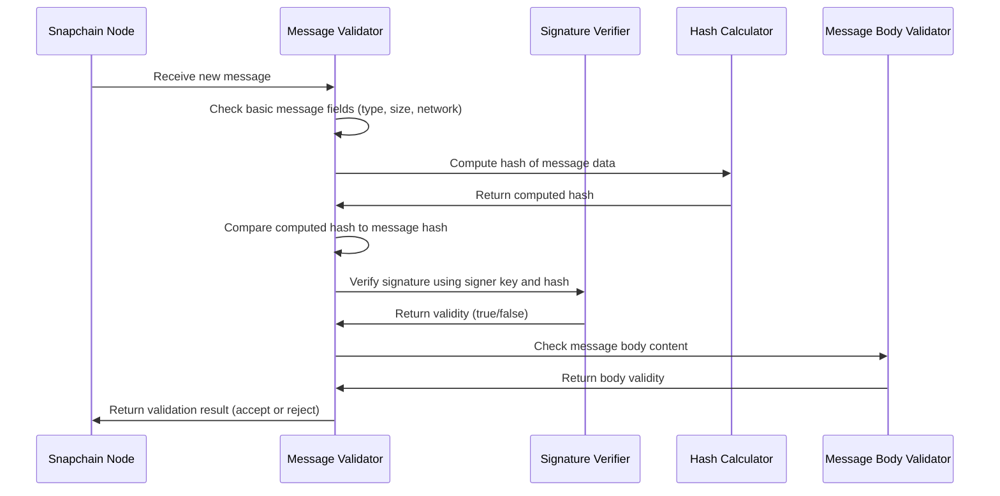

# Chapter 6: Core Protocol Types and Validation

Welcome back! In the previous chapter, you learned about the **[Consensus Actors (MalachiteConsensusActors, Host, ReadHost, Sync Actors)](05_consensus_actors__malachiteconsensusactors__host__readhost__sync_actors__.md)** that help Snapchain nodes agree on the blockchain state. Now, we will dive into the **Core Protocol Types and Validation**, which form the foundation for all data and messages in Snapchain.

---

## Why Are Core Protocol Types and Validation Important?

Imagine you are playing a game with your friends, but everyone uses different languages and rules. Messages get confused, and some players cheat or send broken info. To keep the game fair and fun, **everyone needs to speak the same language and follow the same rules**.

In Snapchain, this "language" and these "rules" are called the **core protocol types** and **validation**:

- **Core Protocol Types** define the fundamental building blocks — things like `Address`, `Vote`, `Proposal`, and how messages are signed.
- **Validation** ensures every message follows the expected format, is cryptographically correct, and fits within data limits.
- The validation modules act like **guardians** that only allow well-formed and trustworthy messages into the network.

---

## Central Use Case: Validating an Incoming User Message

Let’s say your Snapchain node receives a new message from the network — for example, a user’s **cast** (like a short post).

Before adding this cast into your mempool or accepting it on-chain, your node needs to:

1. Check if the message format is valid.
2. Verify the content inside the message (e.g., text length).
3. Check that the cryptographic signature is correct.
4. Confirm the message hash matches its contents.
5. Validate network membership (e.g., do we accept it here?).

If **all these checks pass**, your node treats the message as valid. Otherwise, the message is rejected.

---

## Breaking Down Core Protocol Types

Snapchain's core protocol defines several key types to organize information and secure the network.

### 1. Address

- Think of an **Address** as a unique ID for a validator or user.
- It is a **32-byte** identifier, shown often in hexadecimal form.
- It identifies *who* signed a message or *who* a vote came from.
- Snapchain uses **Ed25519 public keys** as addresses.

### 2. Vote and Proposal

- A **Vote** represents a validator's vote during consensus on a block or shard.
- It records information like **height** (block number), **round** (vote phase), and the **hash of the proposed block**.
- A **Proposal** is the actual block or shard data a validator proposes for consensus.
- Both Votes and Proposals are signed by validators to prove authenticity.

### 3. Signed Messages and Signature Verification

- Each message (like a Vote or Proposal) is **signed cryptographically** by the sender.
- Snapchain uses **Ed25519 signatures** to ensure the sender is genuine and the message is not tampered with.
- The node **verifies each signature** on incoming messages to prevent forgery.

### 4. Hashes and Message Integrity

- Each message contains a **hash** (a digest computed using Blake3, a cryptographic hash function).
- The hash acts like a unique fingerprint of the message content.
- The node verifies that the **hash matches the message's actual content** to detect any tampering.

---

## How Snapchain Validates Messages: Step-by-Step

1. **Check message type** — is the message one Snapchain expects?  
2. **Decode message data** — ensure the message can be properly parsed.  
3. **Check data length limits** — validate message size is not too large.  
4. **Verify the network** — messages must belong to the correct network (mainnet, testnet).  
5. **Validate the cryptographic hash** — hash in the message matches that computed from content.  
6. **Verify the signature** — the signature correctly signs the hash using the sender's public key.  
7. **Check the message body data** — run validations for specific message types (e.g., cast text size).  

---

### Example: Validating a Message's Signature (Simplified Rust)

```rust
fn validate_signature(
    signature: &[u8],
    data_bytes: &[u8],
    signer_pubkey: &[u8],
) -> bool {
    // Parse signature and public key into Ed25519 types (simplified)
    let sig = ed25519_dalek::Signature::from_bytes(signature).unwrap();
    let pubkey = ed25519_dalek::PublicKey::from_bytes(signer_pubkey).unwrap();

    // Verify signature signs the data bytes strictly
    pubkey.verify_strict(data_bytes, &sig).is_ok()
}
```

This function returns `true` if the signature is valid for the given data and public key, `false` otherwise.

---

## Basic Usage: Validating an Incoming Message

Here is a simplified flow of how Snapchain checks and validates an incoming message:

```rust
fn validate_message(message: &Message, current_network: Network) -> Result<(), ValidationError> {
    if !valid_message_type(message.message_type) {
        return Err(ValidationError::InvalidData);
    }

    if message.data.is_empty() || message.data.len() > MAX_SIZE {
        return Err(ValidationError::InvalidDataLength);
    }

    if !validate_network(message.network, current_network) {
        return Err(ValidationError::InvalidNetwork);
    }

    if !validate_message_hash(&message.data, &message.hash) {
        return Err(ValidationError::InvalidHash);
    }

    if !validate_signature(
        &message.signature, 
        &message.hash, 
        &message.signer
    ) {
        return Err(ValidationError::InvalidSignature);
    }

    // Message body-specific validation
    validate_message_body(&message.data)?;

    Ok(())
}
```

---

## How Does Validation Work Internally? — High-Level Flow



- The node sends the message to the validator.
- The validator performs layered checks: first structural, then cryptographic, then semantic.
- Only if all tests pass, the message is accepted.

---

## Diving Deeper: Core Code Pieces Explained

Let's peek into some parts of the code that define these core types and validations.

---

### 1. The `Address` Type — A Unique Identifier

```rust
#[derive(Clone, PartialEq, Eq, Hash, Debug)]
pub struct Address(pub [u8; 32]);

impl Address {
    // Convert to hexadecimal string like "0xabcdef..."
    pub fn to_hex(&self) -> String {
        hex::encode(&self.0)
    }

    // Display an address in a short format for logs, e.g. "0x1234"
    pub fn prefix(&self) -> String {
        format!("0x{}", &self.to_hex()[..4])
    }
}
```

- An `Address` wraps a fixed 32-byte array.
- It can be displayed as a hex string, handy for logging or debugging.

---

### 2. The `Vote` Type — Voting in Consensus

```rust
#[derive(Clone, Debug)]
pub struct Vote {
    pub height: Height,
    pub round: Round,
    pub shard_hash: Option<ShardHash>,
    pub voter: Address,
}

impl Vote {
    // Create a new precommit vote (final round agreement)
    pub fn new_precommit(height: Height, round: Round, value: Option<ShardHash>, voter: Address) -> Self {
        Self { height, round, shard_hash: value, voter }
    }

    // Serialize the vote for signing
    pub fn to_sign_bytes(&self) -> Vec<u8> {
        // Serialize in protobuf or bytes, simplified here
        vec![]
    }
}
```

- A vote records the block height, round, and the block hash being voted on.
- Validators sign votes to prove approval.

---

### 3. Validating Message Hashes (Simplified)

```rust
fn validate_message_hash(data_bytes: &[u8], message_hash: &[u8]) -> bool {
    // Compute Blake3 20-byte hash of data
    let computed_hash = blake3::hash(data_bytes);
    // Compare first 20 bytes
    &computed_hash.as_bytes()[..20] == message_hash
}
```

- The message hash is a **20-byte Blake3** hash.
- Validation recomputes the hash to ensure data integrity.

---

### 4. Validating the Message Body: Example for a “Cast” Message

```rust
fn validate_cast_body(cast: &CastAddBody) -> Result<(), ValidationError> {
    if cast.text.len() > 320 {
        return Err(ValidationError::InvalidDataLength);
    }

    if cast.embeds.len() > 2 {
        return Err(ValidationError::InvalidData);
    }

    // Additional checks omitted for brevity

    Ok(())
}
```

- Each message type has **body-specific rules**, e.g., cast text length limits.
- These checks prevent spam or malformed data inside messages.

---

## In Summary: Why This Matters

- The **core protocol types define a shared language**—validators, nodes, and clients use the same structures.
- **Validation acts as the bouncer** ensuring only valid, correctly signed, and well-formed messages enter the network.
- This keeps Snapchain **secure**, **trustworthy**, and **consistent** across all nodes.

---

## What’s Next?

You have now seen the foundation of Snapchain’s data structures and how incoming data is validated to keep the network safe.

Next, you will learn how these building blocks connect to persistent storage in the **[Stores and Store Trait (e.g., CastStore, LinkStore, ReactionStore)](07_stores_and_store_trait__e_g___caststore__linkstore__reactionstore__.md)** chapter.

---

> Congratulations! Understanding core protocol types and validation is crucial for ensuring your Snapchain node only accepts **good** messages. Great job reaching Chapter 6! Keep the momentum going.

---

Generated by [AI Codebase Knowledge Builder](https://github.com/The-Pocket/Tutorial-Codebase-Knowledge)