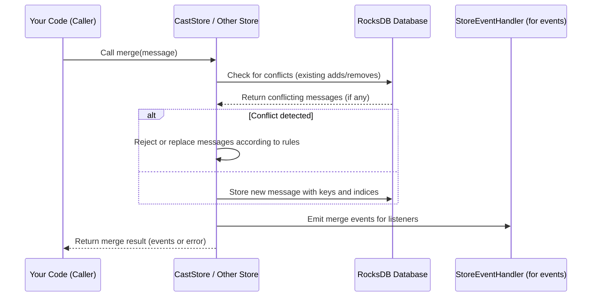

# Chapter 7: Stores and Store Trait (e.g., CastStore, LinkStore, ReactionStore)

Welcome back! In the previous chapter, you learned about **[Core Protocol Types and Validation](06_core_protocol_types_and_validation_.md)** — the foundation of Snapchain’s message formats and how messages get checked for correctness and safety.

Now, it’s time to explore **Stores and the Store Trait** — the specialized filing cabinets in Snapchain that organize, manage, and keep track of different types of user data like casts, links, reactions, verifications, and more.

---

## Why Do We Need Stores?

Imagine you're running a large digital library, where lots of books come in, get removed, moved around, or updated daily. To keep everything organized and easy to find, you have:

- Different shelves for different kinds of books (history, science, fiction).
- Rules for adding or removing books.
- Ways to merge new editions with old ones.
- A system to safely prune out old or irrelevant books.

In Snapchain, **Stores** play this organizing role for **different categories of protocol messages** — such as casts (short posts), links (connections between users), and reactions (likes or emojis).

Each store manages **how messages are indexed, merged, pruned, and revoked**, making sure the data stays consistent and easy to query.

---

## Central Use Case: Managing Cast Messages (Posts) in Snapchain

Let’s say you want to:

- Save all casts (posts) a user has created.
- Find all casts made by a specific user.
- Handle cases where a cast might be edited or removed.
- Efficiently remove old casts if a user exceeds storage limits.

To do this, you use the **CastStore**, a specialized store in Snapchain designed just for casts. It manages storing casts and their removals, indexes them for quick search, and merges conflicting changes gracefully.

How does the CastStore know what to do? It follows general rules shared with other stores, defined by the **Store Trait**.

---

## What is the Store Trait?

Think of the Store Trait like a **recipe template** that tells each specific store what it must know and be able to do:

- How to **identify** which messages belong to it (message types).
- How to tell if a message is an **add** (new data) or a **remove** (deletion).
- How to **build index keys** for efficiently finding messages.
- How to **merge** conflicting messages (e.g., two versions of a cast).
- How to compute **pruning limits** when cleaning up data.

Every specialized store (like CastStore, LinkStore, ReactionStore, VerificationStore, UserDataStore) implements this trait, following the same rules but customized for their message type.

---

## Key Concepts in Stores and Store Trait

Let's break down important parts of how stores work:

### 1. Two-Phase CRDT Set (Add and Remove Sets)

- Each store treats its messages like a **special filing system** that supports adding and removing items.
- An **add message** means “put this in the system.”
- A **remove message** means “take this out.”
- The system merges these changes using **two sets**: the add set and the remove set, so everyone eventually agrees on what’s present.
- Rules like **Remove-Wins** (if there’s a remove and an add for the same data, remove wins) ensure consistency.

### 2. Indexing Messages

- Stores create unique **keys** for each message based on user ID (`fid`), message type, and timestamps.
- These keys work like addresses to quickly find messages or related data.
- Some stores create **secondary indices** — extra keys to quickly find messages by targets or mentions.

### 3. Merging and Conflict Resolution

- When two messages conflict (e.g., two edits or removals for the same cast), stores use rules to decide which one wins.
- For example, the **latest timestamp** wins; if timestamps tie, then the lexicographically highest hash wins.

### 4. Pruning and Storage Limits

- To avoid unlimited storage usage, stores enforce **prune limits**.
- This removes oldest messages to keep the data size under control.

---

## How to Use Stores: A Beginner-Friendly Example

Here’s a minimal example showing how you could interact with the **CastStore** in Rust:

```rust
// Assume you already have an instance of CastStore named `cast_store`
// and a user ID (`fid`) and a cast hash (`cast_hash`)

let fid: u64 = 12345;
let cast_hash: Vec<u8> = vec![0xab, 0xcd, 0xef, /* ... */];

// Get a cast add message by fid and cast hash
let cast_add = cast_store.get_cast_add(fid, cast_hash.clone());

match cast_add {
    Ok(Some(cast_msg)) => {
        println!("Found cast message with hash {:?}", cast_hash);
        // You can further process or display the message here
    }
    Ok(None) => {
        println!("No cast found with given hash.");
    }
    Err(e) => {
        println!("Error retrieving cast: {}", e);
    }
}
```

**What happened here?**

- `get_cast_add` asked the store if it has a cast add message tied to that user and hash.
- The store looks up the message using internal keys and returns the result.
- If found, you get the full message, ready to display or process.

Similarly, there are methods to get all casts by a user, get removes (deletions), and more.

---

## What Happens Internally When You Merge a Message?

Let’s walk through what happens inside a store when a new message arrives and gets **merged** (added or removed):



- The store checks for existing conflicting messages to avoid duplicates or conflicts.
- If conflicts exist, it follows predefined rules (like Remove-Wins) and either rejects or overwrites messages.
- The message, along with its index keys, is stored atomically in the database.
- Events related to this merge are emitted for other parts of the system to react.
- Finally, the merge result (success or failure) is sent back to the caller.

---

## Diving a Bit Deeper: How the CastStore Implements the Store Trait

Let’s look at how the **CastStoreDef** (the definition that implements Store Trait for casts) specifies key details.

```rust
impl StoreDef for CastStoreDef {
    fn postfix(&self) -> u8 {
        UserPostfix::CastMessage as u8
    }

    fn add_message_type(&self) -> u8 {
        MessageType::CastAdd as u8
    }

    fn remove_message_type(&self) -> u8 {
        MessageType::CastRemove as u8
    }

    fn is_add_type(&self, message: &Message) -> bool {
        // Checks if message is an Add cast with Ed25519 signature
        // return true if it matches
        // else false
    }

    fn is_remove_type(&self, message: &Message) -> bool {
        // Checks if message is a Remove cast with Ed25519 signature
        // return true if it matches
        // else false
    }

    fn get_prune_size_limit(&self) -> u32 {
        self.prune_size_limit
    }

    // Other methods handle building index keys and merging messages...
}
```

**Explanation:**

- `postfix()` returns the store's unique byte identifier used in keys (like a shelf label).
- `add_message_type()` and `remove_message_type()` specify which message types belong to the add and remove sets.
- `is_add_type()` and `is_remove_type()` check if a given message belongs to the respective type for this store.
- `prune_size_limit` sets limits for cleaning old messages.

---

## Internal Key Structure and Indexing

Stores use composite keys based on:

- `fid` — user ID
- `set` — whether the message is an add or remove
- `ts_hash` — timestamp + message hash combined for uniqueness

For example, the key for a cast message is constructed like so:

```rust
fn make_cast_adds_key(fid: u64, hash: &Vec<u8>) -> Vec<u8> {
    let mut key = Vec::new();
    key.extend_from_slice(&make_user_key(fid));   // user prefix + fid bytes
    key.push(UserPostfix::CastAdds as u8);        // postfix for Cast adds
    key.extend_from_slice(hash.as_slice());       // 20-byte hash
    key
}
```

This key helps **quickly look up all cast add messages for a user**, efficiently.

---

## What About Other Stores?

Besides **CastStore**, Snapchain has similar stores for:

- **LinkStore**: Manages links (like follows or friendships between users). It handles `LinkAdd` and `LinkRemove` messages.
- **ReactionStore**: Stores reactions (like emoji reactions) with `ReactionAdd` and `ReactionRemove` messages.
- **VerificationStore**: Deals with identity verifications such as Ethereum or Solana addresses.
- **UserDataStore**: Stores user-related data.
- **UsernameProofStore**: Manages username proofs linked to users.

All these stores implement the same **Store Trait**, but with custom logic suited for their message types.

---

## Stores Work Like Filing Cabinets With Special Drawer Labels

Imagine each store as a separate **filing cabinet**:

- **Each drawer** inside the cabinet corresponds to users (`fid`).
- **Each folder** inside the drawer corresponds to message types and their add/remove states.
- **Each file** inside a folder is a message, keyed for quick retrieval.
- When a new message arrives, the store checks if it conflicts with existing files and merges accordingly.
- When the drawer is full (storage limit reached), the oldest files get pruned.

This analogy helps visualize how stores organize and manage large amounts of user activity efficiently.

---

## Summary

In this chapter, you've learned:

- **Stores** are specialized components that manage different categories of protocol messages in Snapchain, like casts, links, reactions, and verifications.
- They implement **two-phase CRDT sets** with **add** and **remove** message sets for consistency.
- The **Store Trait** is a recipe that each store follows to identify, index, merge, prune, and revoke messages safely and efficiently.
- Stores use composite keys based on user IDs, message types, and hashes to organize data and support quick queries.
- You can interact with stores to retrieve messages, merge new ones, or prune old data — all while maintaining consistency.
- Stores are like **filing cabinets organizing different kinds of user actions**, making Snapchain scalable and user-friendly.

---

## What’s Next?

Now that you have a solid understanding of how Stores organize Snapchain’s data, your next step is to explore how Snapchain stores data persistently using **[Storage Trie and RocksDB Abstractions](08_storage_trie_and_rocksdb_abstractions_.md)**.

You'll see how the data we organized here lands safely on disk and how it's efficiently accessed.

---

> Excellent work completing Chapter 7! Understanding stores is key to grasping how Snapchain keeps your data safe, consistent, and organized. Keep up the great momentum!

---

Generated by [AI Codebase Knowledge Builder](https://github.com/The-Pocket/Tutorial-Codebase-Knowledge)