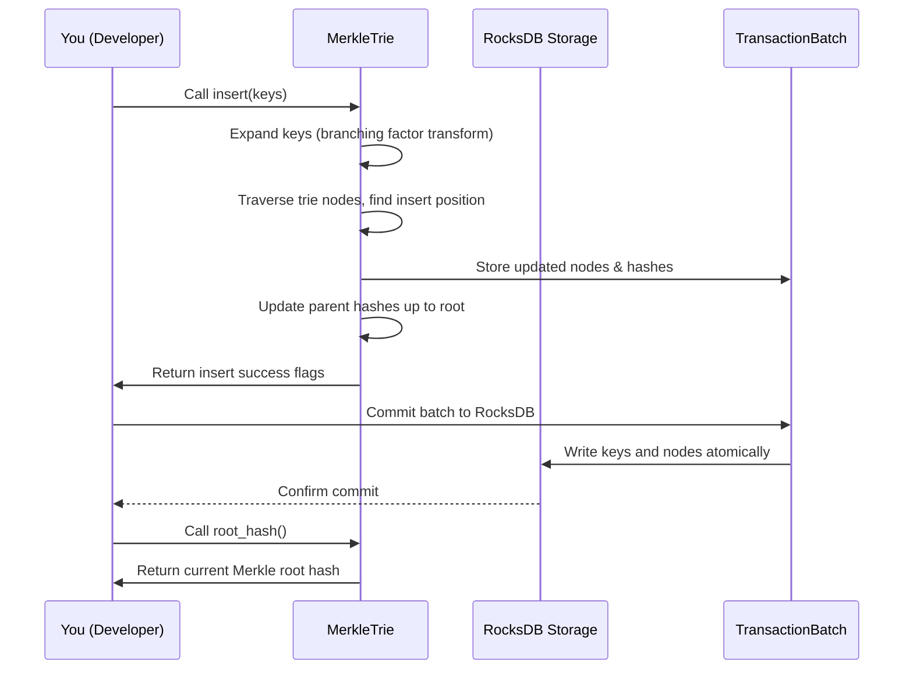

# Chapter 8: Storage Trie and RocksDB Abstractions

Welcome back! In the previous chapter, you learned about how Snapchain organizes different types of user data with **[Stores and the Store Trait (e.g., CastStore, LinkStore, ReactionStore)](07_stores_and_store_trait__e_g___caststore__linkstore__reactionstore__.md)**. Now that we have a solid understanding of *what* data we store and *how* it’s organized, it's time to explore *how* Snapchain stores this data **efficiently and securely on disk**.

This chapter introduces you to the **Storage Trie and RocksDB Abstractions** — the powerful “archive vault” systems that Snapchain uses to keep your blockchain state safely stored, easy to verify, and quick to access.

---

## Why Do We Need Storage Trie and RocksDB?

Imagine you’re running a big library with millions of books. You want to:

- Store books in a way that lets you find any book fast.
- Keep track of all changes and versions so none is lost.
- Make sure no one sneaks in fake or broken books.
- Compress shelves and organize books neatly.
- Have a digital fingerprint of all books to prove authenticity.

Just like this library, **Snapchain needs a way to store vast amounts of blockchain data (like messages, blocks, shards) reliably and verifiably**.

This is where **RocksDB** and the **Merkle Storage Trie** come in:

- **RocksDB** is the robust "hard drive" under the hood — a key-value database optimized for fast reads/writes.
- **Storage Trie (Merkle Trie)** organizes this data into a tree where each node hashes its children, creating a tamper-proof fingerprint (Merkle root). This helps with data verification, snapshots, and pruning.

---

## Central Use Case: Storing and Verifying Messages Efficiently

Let's say your Snapchain node just **received a batch of new messages** that need to be stored in the blockchain state.

You want to:

1. Store these messages safely on disk.
2. Quickly verify what messages exist without scanning everything.
3. Compute a compact **root hash** that proves the entire data set.
4. Update the storage when messages are removed (e.g., after pruning).
5. Take snapshots of the current state for backups or sync.
6. Load the data efficiently when the node restarts.

The **Storage Trie and RocksDB Abstractions** enable you to do all of this seamlessly.

---

## Key Concepts Explained

Let’s break this down into beginner-friendly concepts.

### 1. RocksDB: The Efficient Key-Value Store

- Think of RocksDB as a **fast digital filing cabinet** that stores pairs of **keys and values**.
- It is designed for **quick lookups**, batch writes, and iterating over data in sorted order.
- Snapchain uses a RocksDB instance for **each shard or block state** (shards are like sections of data).
- RocksDB supports **transactional batches**: you can write multiple changes atomically together.

---

### 2. Storage Trie (Merkle Trie): The "Fingerprinted Filing System"

- A **Merkle Trie** is a kind of **tree structure** where:
  - Each **leaf node** holds data (e.g., stored messages).
  - Each **parent node** holds a hash calculated from its children's hashes.
- This forms a **tree of hashes**, ending in one root hash, called the **Merkle root**.
- The Merkle root is a **fingerprint** of *all* the data — if any data changes, the root hash changes.
- This helps:
  - **Verify data integrity** quickly.
  - Take **snapshots** by storing root hashes.
  - Support **pruning** safely (removing old data but validating what's left).
- The trie in Snapchain is a **256-branching trie** (each node can have 256 children).

---

### 3. Keys and Shards in the Trie

- Data is stored by **keys** that include user IDs and message types.
- The trie divides user IDs (called `fid`) into **256 virtual shards** internally.
- This virtual sharding helps Snapchain **scale** and migrate shards without moving all data.
- Messages are inserted or deleted from the trie as keys.

---

### 4. Snapshots and Pruning

- A **snapshot** captures the current state of the trie along with hashes of excluded parts.
- Snapshots can be used to:
  - Quickly sync new nodes.
  - Verify the data without visiting everything.
- **Pruning** removes old or no longer needed messages while maintaining the trie’s integrity.

---

## Using Storage Trie and RocksDB: A Beginner-friendly Example

Here’s a simplified example to help you understand how to insert and query data in the trie.

```rust
// Create a new MerkleTrie with branching factor 256
let mut trie = MerkleTrie::new(256).unwrap();

// Open your RocksDB instance for shard 1
let db = RocksDB::open_shard_db("/path/to/rocksdb", 1);
trie.initialize(&db).unwrap();

// Create a batch for atomic write operations
let mut txn_batch = RocksDbTransactionBatch::new();

// Define a key representing a message (this would use your message's fid & type)
let message_key: Vec<u8> = vec![ /* some bytes representing the key */ ];

// Insert the key into the trie and DB batch
let insert_results = trie.insert(&Context::new(), &db, &mut txn_batch, vec![&message_key]).unwrap();

// Commit the batch to RocksDB
db.commit(txn_batch).unwrap();

// Now you can get the Merkle root of the trie as proof of your data's integrity
let root_hash = trie.root_hash().unwrap();

println!("Merkle root hash: {:?}", root_hash);
```

**Explanation:**

- We create a new Merkle Trie and initialize it with the RocksDB instance.
- Keys representing messages are inserted into the trie using `insert`.
- All operations are batched together in a transaction.
- Commit the transaction to save all changes atomically.
- The `root_hash()` computes the current Merkle root: the overall fingerprint.

---

## What Happens Under the Hood? Step-by-step Flow

Let's see what happens when you insert a key into the Storage Trie backed by RocksDB.



- Your insert request is expanded internally based on trie branching.
- The trie traverses or creates nodes recursively.
- Updates hashes bottom-up to keep integrity.
- All changes are collected in a batch transaction.
- The transaction commits atomically to RocksDB.
- Merkle root can be fetched anytime to verify data state.

---

## Diving Deeper into Code: Important Parts Explained

### 1. Creating and Initializing the Trie (src/storage/trie/merkle_trie.rs)

```rust
pub struct MerkleTrie {
    branch_xform: BranchingFactorTransform,
    root: Option<TrieNode>,
    branching_factor: u32,
}

impl MerkleTrie {
    pub fn new(branching_factor: u32) -> Result<Self, TrieError> {
        let branch_xform = get_transform_functions(branching_factor)
            .ok_or(TrieError::UnknownBranchingFactor)?;

        Ok(MerkleTrie {
            root: None,
            branch_xform,
            branching_factor,
        })
    }

    pub fn initialize(&mut self, db: &RocksDB) -> Result<(), TrieError> {
        let loaded = self.load_root(db)?;
        if let Some(root_node) = loaded {
            self.root.replace(root_node);
        } else {
            self.create_empty_root_and_commit(db)?;
        }
        Ok(())
    }
}
```

**Explanation:**

- The trie is created with a branching factor (256 for Snapchain).
- It tries to load the root node from the database; if none exists, it creates an empty root.
- This ensures the trie is ready to store keys.

---

### 2. Inserting Keys in the Trie

```rust
pub fn insert(
    &mut self,
    ctx: &Context,
    db: &RocksDB,
    txn_batch: &mut RocksDbTransactionBatch,
    keys: Vec<&[u8]>,
) -> Result<Vec<bool>, TrieError> {
    let expanded_keys: Vec<Vec<u8>> = keys.into_iter().map(self.branch_xform.expand).collect();

    if let Some(root) = self.root.as_mut() {
        let mut child_hashes = HashMap::new();
        let results = root.insert(ctx, &mut child_hashes, db, txn_batch, expanded_keys, 0)?;
        Ok(results)
    } else {
        Err(TrieError::TrieNotInitialized)
    }
}
```

**Explanation:**

- Keys are expanded according to the branching transform to fit the trie structure.
- The root node recursively inserts keys, updating hashes and nodes.
- Changes are recorded in the transaction batch (`txn_batch`).
- The method returns which keys were successfully inserted.

---

### 3. Committing Changes to RocksDB

```rust
db.commit(txn_batch).unwrap();
```

- `txn_batch` holds all the changes in one batch.
- RocksDB applies all changes atomically, ensuring no partial writes.
- This guarantees data consistency even if the node crashes mid-write.

---

### 4. Computing the Merkle Root

```rust
pub fn root_hash(&self) -> Result<Vec<u8>, TrieError> {
    if let Some(root) = self.root.as_ref() {
        Ok(root.hash())
    } else {
        Err(TrieError::TrieNotInitialized)
    }
}
```

- The root node's hash is the Merkle root.
- This root is the single **cryptographic fingerprint** summarizing all keys.

---

### 5. Trie Nodes and Hashing (src/storage/trie/trie_node.rs)

Each node in the trie:

- May be a **leaf** (holding a key).
- Or an **internal node** (with children).
- Stores cached **child hashes** to compute its own hash efficiently.
- Recursively serializes/deserializes from RocksDB.

This recursive structure makes querying and updating fast and safe.

---

## Why This Matters — Summary

- **Storage Trie + RocksDB** together form the backbone storage system for snapshots, state, and messages.
- The trie’s Merkle root lets Snapchain create **cryptographic proofs** of data integrity.
- RocksDB ensures data is saved efficiently with fast reads/writes and transactions.
- The trie’s virtual sharding organizes data nicely for scaling and shard migration.
- Snapshots and pruning become easy and safe with the Merkle Trie’s structure.

---

## What’s Next?

Now that you understand the **Storage Trie and RocksDB Abstractions**, you are ready to learn about how Snapchain manages its **storage engines for shards and blocks** in the upcoming chapter: **[ShardEngine and BlockEngine (Storage Engines)](09_shardengine_and_blockengine__storage_engines__.md)**.

---

## Wrap-Up

In this chapter, you learned:

- RocksDB is the high-performance key-value storage system Snapchain uses as its storage backend.
- The Storage Trie (Merkle Trie) creates a cryptographically verifiable hierarchical structure over your data.
- Data is stored by keys based on user IDs and message types, divided into 256 virtual shards internally.
- Inserting data involves updating trie nodes’ hashes and writing data atomically to RocksDB.
- The Merkle root hash acts as a fingerprint of *all* data.
- Snapshots and pruning use the trie structure for efficient state management.

Together, these abstractions let Snapchain maintain a **fast, secure, and verifiable archive of blockchain data** — so your node can serve queries, validate data, and sync effortlessly.

---

> Great job finishing Chapter 8! You’ve unlocked the hidden vault where Snapchain’s blockchain state lives. Keep going — next up is **[ShardEngine and BlockEngine (Storage Engines)](09_shardengine_and_blockengine__storage_engines__.md)**!

---

Generated by [AI Codebase Knowledge Builder](https://github.com/The-Pocket/Tutorial-Codebase-Knowledge)