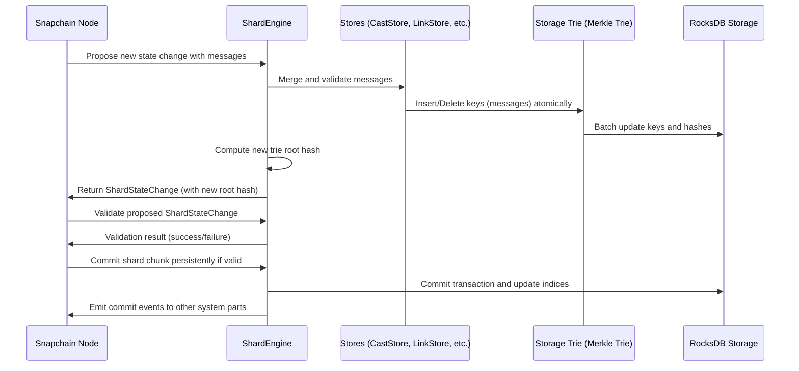

# Chapter 9: ShardEngine and BlockEngine (Storage Engines)

Welcome back! In the previous chapter, you learned about the **[Storage Trie and RocksDB Abstractions](08_storage_trie_and_rocksdb_abstractions_.md)** — the powerful underlying systems Snapchain uses to store and verify its data securely and efficiently.

Now, it’s time to explore the next building block in Snapchain’s storage system: the **ShardEngine** and **BlockEngine**. These are the “vaults” where your blockchain’s data lives and gets validated before becoming a permanent part of the chain.

---

## Why Do We Need ShardEngine and BlockEngine?

Imagine managing a busy bank vault:

- There are **multiple safes (shards)**, each holding its own set of valuables (data, messages).
- A **main vault (block storage)** oversees the big picture, containing entire blocks that summarize shard data.
- The vault managers must ensure **everything is stored safely, correctly, and atomically** — no valuables get lost or mixed up.
- They also check all deposits and withdrawals to keep accounts consistent and accurate.

In Snapchain, **ShardEngine** and **BlockEngine** act as these vaults, managing the storage and state transitions of shard and block data, **ensuring consistency and full validation** before committing anything permanently to disk.

---

## Central Use Case: Committing New Blockchain Data Atomically

Let’s say your Snapchain node is ready to finalize a new block or shard chunk:

1. It gathers all new messages collected from the mempool.
2. It validates and applies these messages to the current shard or block state.
3. It updates the storage trie to include these messages.
4. It computes a new root hash (a cryptographic fingerprint).
5. It commits all changes atomically—either *all* changes go through, or *none* do.
6. It stores the new block or shard chunk in RocksDB.
7. It broadcasts events about this new data to the rest of the node components.

**How can you manage all this carefully, safely, and efficiently?**

That is exactly what **ShardEngine** and **BlockEngine** do.

---

## Key Concepts Explained — What Are ShardEngine and BlockEngine?

Let’s break down these two engines so you can understand what each of them does:

### 1. ShardEngine: The Keeper of Shard Data

- Manages **shard-specific data**, which means the smaller “pieces” of the whole blockchain.
- Takes user and system messages related to a shard, **applies them atomically** (all or nothing).
- Uses the **Storage Trie** to keep track of message insertions and removals.
- Validates that state changes are correct before committing.
- Handles **applying transactions**, pruning old messages, and updating internal storage.
- Sends out events about data updates so other parts of the node know what changed.

### 2. BlockEngine: The Block-Level Vault

- Handles storage of **block-level data**, which summarizes the whole blockchain state.
- Stores finalized blocks in RocksDB.
- Keeps track of block heights, timestamps, and shard witnesses.
- Supports **retrieving blocks** by height or timestamp.
- Handles **pruning old blocks** and maintains overall block consistency.

---

## How Do You Use These Engines? A Beginner-Friendly Example

Here is a simplified example showing how you might create and use a `ShardEngine` and `BlockEngine` for storing and committing data.

### Creating the engines:

```rust
// Create RocksDB instance for a shard or block storage
let shard_db = RocksDB::open_shard_db("/path/to/db", shard_id);
let block_db = RocksDB::open_block_db("/path/to/db");

// Create the Merkle Trie (storage trie) with branching factor 256
let trie = MerkleTrie::new(256).unwrap();
trie.initialize(&shard_db).unwrap();

// Create the ShardEngine with storage trie and other parameters
let mut shard_engine = ShardEngine::new(
    shard_db.clone(),
    proto::FarcasterNetwork::Devnet,
    trie,
    shard_id,
    store_limits,
    statsd_client.clone(),
    max_messages_per_block,
    messages_request_tx.clone(),
);

// Create the BlockEngine
let block_store = BlockStore::new(block_db.clone());
let mut block_engine = BlockEngine::new(block_store, statsd_client.clone());
```

**Explanation:**

- You open RocksDB databases for both the shards and blocks.
- Create a Merkle Trie for managing the shard's data.
- Initialize the `ShardEngine` with the RocksDB instance, trie, shard id, and some limits.
- Also create the `BlockEngine` with the block store.

---

### Committing a New Shard State Change (Simplified)

```rust
// Assume we have a batch of messages from the mempool ready to propose
let messages: Vec<MempoolMessage> = get_messages_for_shard(shard_id);

// Propose the new state change for the shard
let shard_state_change = shard_engine.propose_state_change(shard_id, messages);

// Validate the proposed state change before committing
let is_valid = shard_engine.validate_state_change(&shard_state_change);

if is_valid {
    // Commit the new shard chunk and emit related events
    shard_engine.commit_shard_chunk(&shard_state_change_to_shard_chunk(&shard_state_change));
} else {
    println!("State change validation failed, not committing.");
}
```

**Explanation:**

- The engine receives new messages to apply to the shard.
- It processes them internally, updating the storage trie atomically.
- It validates that the new state (including root hash) matches expectations.
- If everything checks out, it commits the changes permanently.
- Otherwise, it refuses to commit, maintaining data consistency.

---

### Storing a New Block (Simplified)

```rust
// Assume we received or created a new block with header and shard witnesses
let new_block = get_new_block();

// Commit the block to disk
block_engine.commit_block(&new_block);

// Retrieve the latest block for syncing or querying
let latest_block = block_engine.get_last_block();

println!("Latest block height: {:?}", latest_block.header.unwrap().height);
```

**Explanation:**

- The block engine saves the block in RocksDB.
- You can query blocks by height, range, or timestamp.
- The block engine manages pruning and indexes blocks efficiently for quick access.

---

## Under the Hood: How Does ShardEngine Commit Data Step-by-Step?



---

## Diving Deeper: How ShardEngine Merges Messages and Updates Trie

The `ShardEngine.merge_message` function figures out which store should handle each message (like `CastStore`, `LinkStore`, etc.) and calls their `merge()` method. The process:

```rust
fn merge_message(&mut self, msg: &proto::Message, txn_batch: &mut RocksDbTransactionBatch) -> Result<proto::HubEvent, MessageValidationError> {
    // Determine message type
    match msg.msg_type() {
        MessageType::CastAdd | MessageType::CastRemove => self.stores.cast_store.merge(msg, txn_batch),
        MessageType::LinkAdd | MessageType::LinkRemove => self.stores.link_store.merge(msg, txn_batch),
        // ... other message types
        _ => Err(MessageValidationError::InvalidMessageType(msg.msg_type())),
    }
}
```

- Each store manages message-specific logic, e.g., deduplication, conflict resolution, indexing.
- Changes are made into a `RocksDbTransactionBatch`, meaning all changes will be committed atomically.
- The trie indexes keys representing messages, evictions, and proofs to efficiently prove presence or absence.

---

## What Happens When a Proposal Is Validated or Committed?

- On **validation**, the engine **replays** the transactions in a dry-run mode, ensuring the resulting trie root hash matches the proposal.
- On **commit**, the engine **writes the batch to RocksDB**, updates block or shard chunk storage, and reloads the trie state.
- The engine also **emits events** so other parts of the nodes (like consensus or networking actors) know about new data.

---

## A Quick Look at BlockEngine Internals

BlockEngine is simpler: it mainly wraps the `BlockStore` which manages:

- Inserting blocks by block height.
- Querying blocks by height or timestamp.
- Pruning old blocks to keep storage manageable.
- Tracking min/max block heights stored.

For example, storing a block:

```rust
pub fn commit_block(&mut self, block: &Block) {
    // Store block using BlockStore (RocksDB wrapper)
    if let Err(e) = self.block_store.put_block(block) {
        error!("Failed to store block: {:?}", e);
    }
    
    // Update stats or metrics here...
}
```

---

## Summary: What Did You Learn?

- **ShardEngine and BlockEngine** are Snapchain's **storage engines** managing shard and block data respectively.
- They handle **applying messages atomically**, updating storage tries, validating state changes, and committing data securely to RocksDB.
- **ShardEngine** manages complex shard data with message merging, pruning, and state root hash computations.
- **BlockEngine** wraps block storage, managing blocks by height, timestamp, and pruning old data.
- Together, these engines are the **vaults of the blockchain**, ensuring data consistency, correctness, and performance.
- These engines sit **on top of RocksDB and the Storage Trie**, building powerful abstractions for managing blockchain state.

---

## What’s Next?

With the knowledge of storage engines behind you, you're ready to continue exploring Snapchain by understanding **[ShardEngine and BlockEngine (Storage Engines)](09_shardengine_and_blockengine__storage_engines__.md)** in practical use — or you can look forward to more advanced internals or configuration topics.

In Snapchain’s tutorial order, this is currently the last detailed core storage engine chapter — from here, you might want to revisit networking or consensus topics to see how storage ties in.

---

> Congratulations! You now understand the crucial roles of **ShardEngine** and **BlockEngine** — the safekeepers of Snapchain's data. You're one step closer to mastering the internals of Snapchain! Keep exploring and building!

---

Generated by [AI Codebase Knowledge Builder](https://github.com/The-Pocket/Tutorial-Codebase-Knowledge)