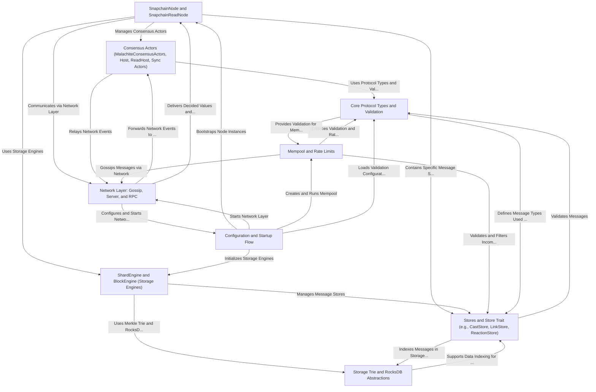

# Tutorial: snapchain

**Snapchain** is a *sharded blockchain project* that manages distributed consensus, state storage, and network communication to maintain a *decentralized and scalable ledger*.  
It implements a *consensus protocol* (Malachite) for agreement on blocks and shards, manages *specialized stores* that handle various message types with *eventual consistency*, and includes *mempool and rate limiters* to handle incoming messages efficiently.  
The system exposes *network layers* for peer-to-peer gossiping and RPC servers for client interactions, along with *configuration and startup routines* for initializing all subsystems.  
The architecture neatly separates concerns with distinct *node actors*, *consensus actors*, and *storage engines*, ensuring robust coordination between validating, syncing, and reading nodes in the network.

**Source Repository:** [None](None)

## Chapters

1. [SnapchainNode and SnapchainReadNode](./01_snapchainnode_and_snapchainreadnode_.md)
2. [Configuration and Startup Flow](./02_configuration_and_startup_flow_.md)
3. [Network Layer: Gossip, Server, and RPC](./03_network_layer__gossip__server__and_rpc_.md)
4. [Mempool and Rate Limits](./04_mempool_and_rate_limits_.md)
5. [Consensus Actors (MalachiteConsensusActors, Host, ReadHost, Sync Actors)](./05_consensus_actors__malachiteconsensusactors__host__readhost__sync_actors__.md)
6. [Core Protocol Types and Validation](./06_core_protocol_types_and_validation_.md)
7. [Stores and Store Trait (e.g., CastStore, LinkStore, ReactionStore)](./07_stores_and_store_trait__e_g___caststore__linkstore__reactionstore__.md)
8. [Storage Trie and RocksDB Abstractions](./08_storage_trie_and_rocksdb_abstractions_.md)
9. [ShardEngine and BlockEngine (Storage Engines)](./09_shardengine_and_blockengine__storage_engines__.md)

---

Generated by [AI Codebase Knowledge Builder](https://github.com/The-Pocket/Tutorial-Codebase-Knowledge)